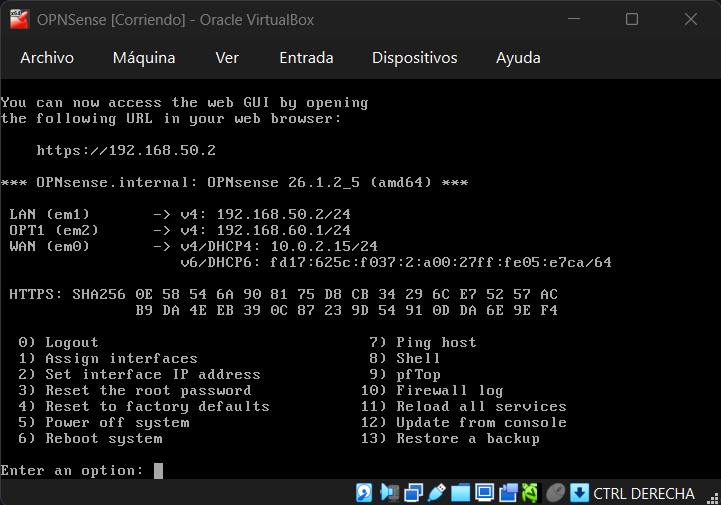
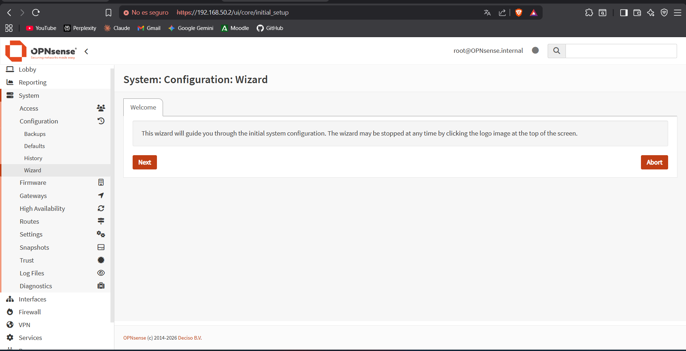
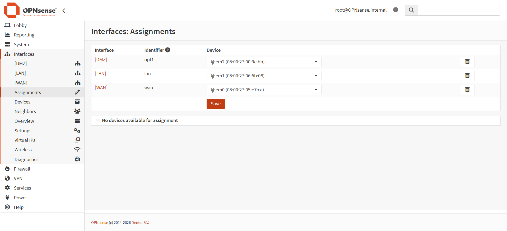
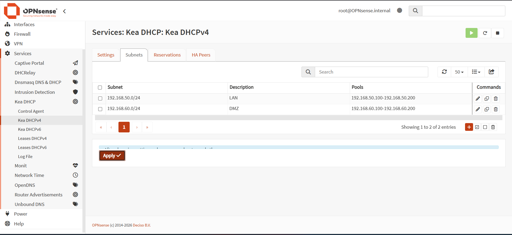
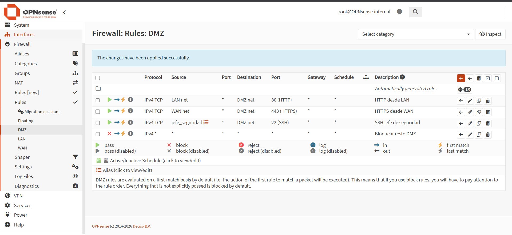
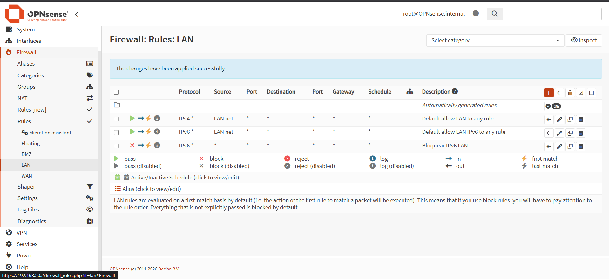
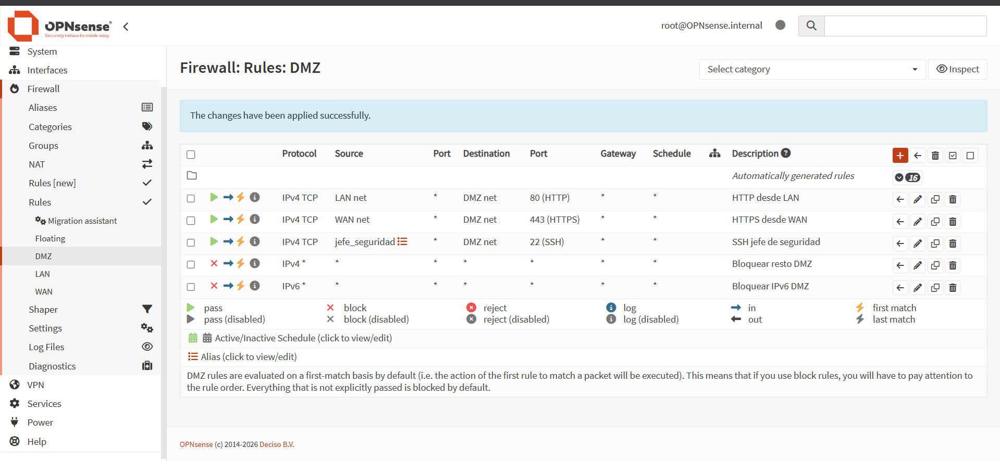
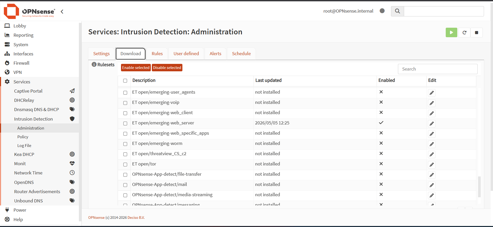
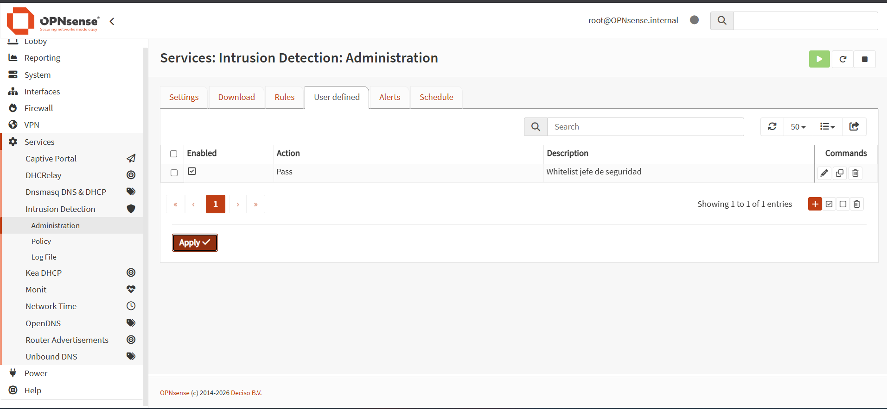

# CONFIGURACIÓN DE NGFW CON OPNSENSE
### Fase 1 – Prueba de Habilidad
**OPNsense 26.1.2 sobre VirtualBox**

---

## Punto 1 – Zonas LAN y DMZ

Se ha configurado un NGFW OPNsense con tres zonas diferenciadas: WAN (salida a Internet), LAN (red interna de usuarios) y DMZ (zona desmilitarizada para el servidor web). Cada zona tiene sus propias políticas de acceso y restricciones de tráfico.

| Interfaz | Zona | Red | Gateway |
|---|---|---|---|
| em0 (Adaptador 1) | WAN | DHCP (NAT) | VirtualBox NAT |
| em1 (Adaptador 2) | LAN | 192.168.50.0/24 | 192.168.50.1 |
| em2 (Adaptador 3) | DMZ | 192.168.60.0/24 | 192.168.60.1 |

*Captura 1 – Consola de OPNsense mostrando las tres interfaces asignadas (WAN, LAN, OPT1/DMZ)*

*Captura 2 – Acceso a la WebGUI de OPNsense en https://192.168.50.2*

*Captura 3 – Interfaces > Assignments mostrando DMZ, LAN y WAN asignadas*

---

## Punto 2 – Servidores DHCP

Se han configurado dos servidores DHCP independientes usando Kea DHCP: uno para la red LAN (192.168.50.0/24) y otro para la red DMZ (192.168.60.0/24).

| Red | Subnet | Rango DHCP |
|---|---|---|
| LAN | 192.168.50.0/24 | 192.168.50.100 – 192.168.50.200 |
| DMZ | 192.168.60.0/24 | 192.168.60.100 – 192.168.60.200 |

*Captura 4 – Services > Kea DHCP > Subnets mostrando las dos subnets configuradas*

---

## Punto 3 – Política restrictiva en la DMZ

El servidor web ubicado en la DMZ tiene una política de acceso restrictiva. Reglas en Firewall > Rules > DMZ:

| Regla | Protocolo | Origen | Destino | Puerto | Descripción |
|---|---|---|---|---|---|
| Pass | TCP | LAN net | DMZ net | 80 (HTTP) | HTTP desde LAN |
| Pass | TCP | WAN net | DMZ net | 443 (HTTPS) | HTTPS desde WAN |
| Pass | TCP | jefe_seguridad | DMZ net | 22 (SSH) | SSH jefe de seguridad |
| Block | any | any | any | any | Bloquear resto DMZ |

*Captura 5 – Firewall > Rules > DMZ con las cuatro reglas configuradas*

---

## Punto 4 – Bloqueo de tráfico IPv6

Se ha bloqueado todo el tráfico IPv6 tanto en la LAN como en la DMZ mediante reglas de firewall específicas.

*Captura 6 – Firewall > Rules > LAN con la regla de bloqueo IPv6*

*Captura 7 – Firewall > Rules > DMZ con la regla de bloqueo IPv6*

---

## Punto 5 – Sistema de Detección de Intrusos (IDS/IPS)

Se ha configurado Suricata en modo IPS activo:

- Modo IPS activado — bloquea tráfico sospechoso
- Rulesets de Emerging Threats descargados e instalados
- El equipo del jefe de seguridad (192.168.50.10) está en lista blanca y nunca es bloqueado

*Captura 8 – Services > Intrusion Detection > Download con los rulesets instalados*

*Captura 9 – Services > Intrusion Detection > User defined con la IP del jefe en lista blanca*
