# Manual de Instalación: Servidor de Backups con Bacula

**Entorno:** Servidor Debian 11 · Baculum 11.0.6 · Clientes Linux y Windows 11  

---

## FASE 1 — Instalación del servidor base

Lo primero es preparar el sistema, instalar PostgreSQL (que actúa como base de datos de Bacula) y los paquetes principales de Bacula.

### Preparación del sistema

Actualizamos el sistema y configuramos el hostname:

```bash
sudo apt update && sudo apt upgrade -y
sudo hostnamectl set-hostname bacula-srv
echo "192.168.1.91  bacula-srv" | sudo tee -a /etc/hosts
```

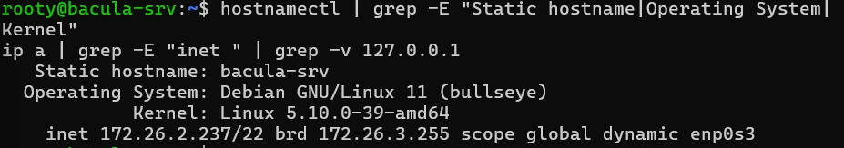

Instalamos las dependencias base:

```bash
sudo apt install -y curl gnupg2 apt-transport-https ca-certificates lsb-release openssl libreadline-dev
```

Creamos el directorio donde Bacula guardará los backups:

```bash
sudo mkdir -p /backup/bacula
```

### Instalación de PostgreSQL

```bash
sudo apt install -y postgresql postgresql-contrib
sudo systemctl enable postgresql
sudo systemctl status postgresql
```

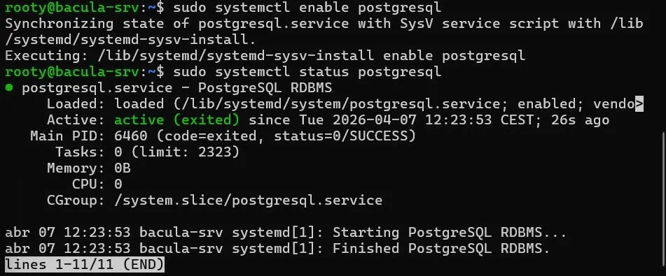

### Instalación de paquetes Bacula

```bash
sudo apt install -y bacula-director-pgsql bacula-sd bacula-fd bacula-console bacula-common bacula-director
```

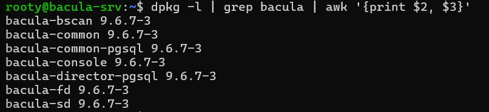

### Creación de la base de datos

```bash
sudo -u postgres psql << 'EOF'
CREATE USER bacula WITH PASSWORD 'HhgGI76CLITYkDlAhqtHIDlL87AAmurd';
CREATE DATABASE bacula OWNER bacula ENCODING 'SQL_ASCII' LC_COLLATE='C' LC_CTYPE='C' TEMPLATE template0;
GRANT ALL PRIVILEGES ON DATABASE bacula TO bacula;
\q
EOF

sudo -u postgres env db_name=bacula /usr/share/bacula-director/make_postgresql_tables
sudo -u postgres env db_name=bacula /usr/share/bacula-director/grant_postgresql_privileges
```

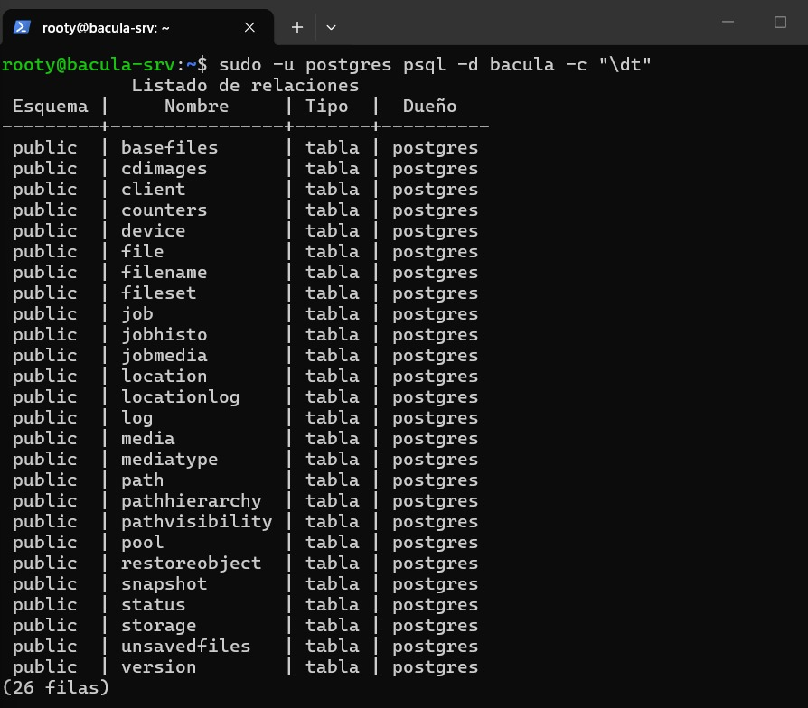

### Arranque de servicios y validación

```bash
sudo systemctl enable bacula-fd bacula-sd bacula-dir
sudo systemctl start bacula-fd bacula-sd bacula-dir
sudo /usr/sbin/bacula-dir -t -c /etc/bacula/bacula-dir.conf
sudo bconsole
```

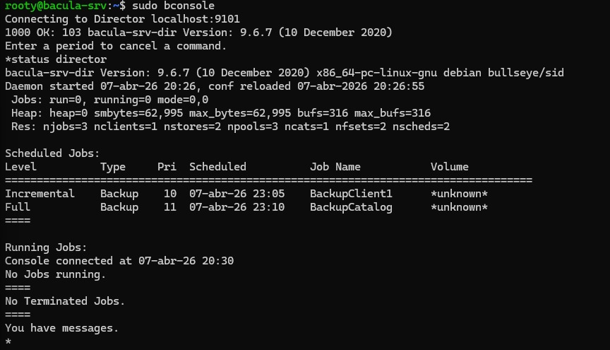

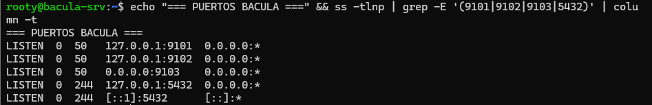

---

## FASE 2 — Configuración del Director

Configuramos los Pools, FileSet, Schedule y Jobs para el primer backup real.

### Preparar el directorio de volúmenes

```bash
sudo chown -R bacula:bacula /backup/bacula
sudo chmod 750 /backup/bacula
```

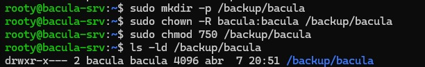

### Configurar el Storage Daemon

```bash
sudo sed -i 's|Archive Device = /nonexistant/path/to/file/archive/dir|Archive Device = /backup/bacula|g' /etc/bacula/bacula-sd.conf
```

### Añadir Pools, FileSet y Schedule al Director

Añadimos al final de `/etc/bacula/bacula-dir.conf` los bloques de configuración para dos pools (Full e Incremental), el FileSet con los directorios a respaldar y el Schedule con backups Full los domingos e Incrementales de lunes a sábado a las 23:00.

Tras aplicar los cambios, validamos y reiniciamos:

```bash
sudo /usr/sbin/bacula-dir -t -c /etc/bacula/bacula-dir.conf
sudo systemctl restart bacula-sd bacula-dir
```

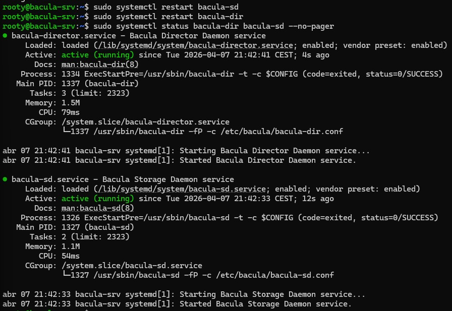

### Primer backup de prueba

Desde bconsole lanzamos el primer backup del propio servidor para verificar que el pipeline funciona:

```
run job=BackupClient1
yes
messages
```

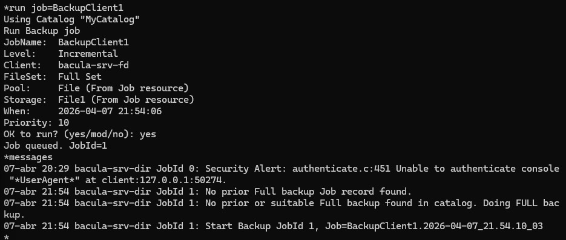

### Capturas de la estrategia de backup configurada

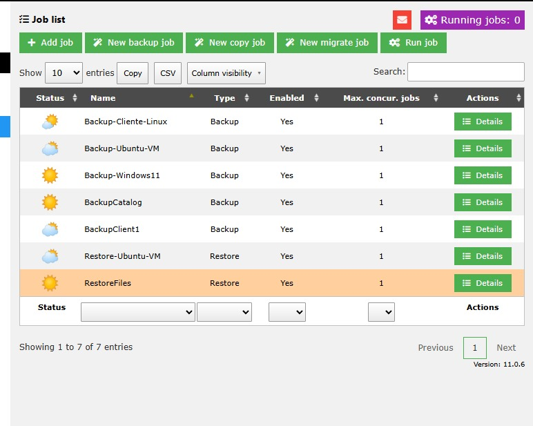

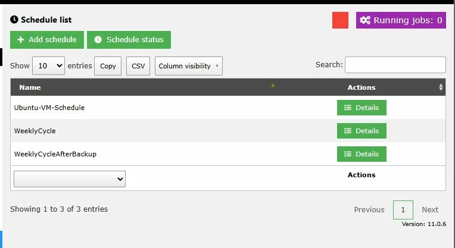

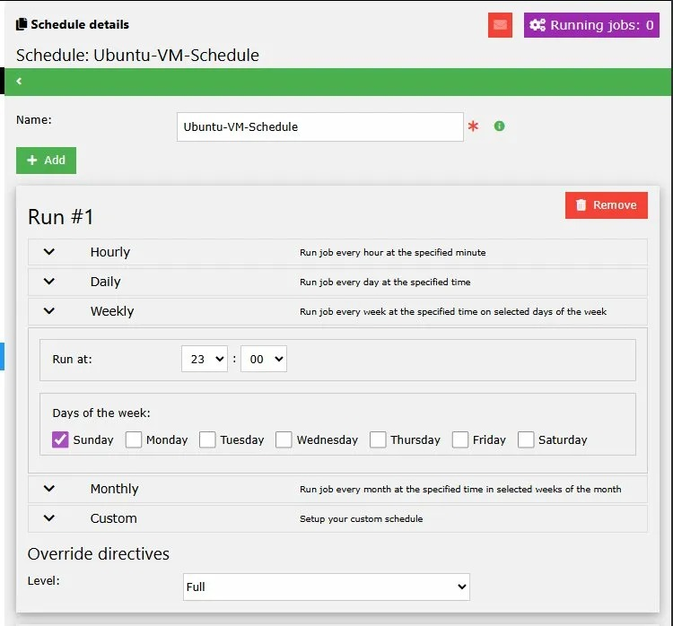

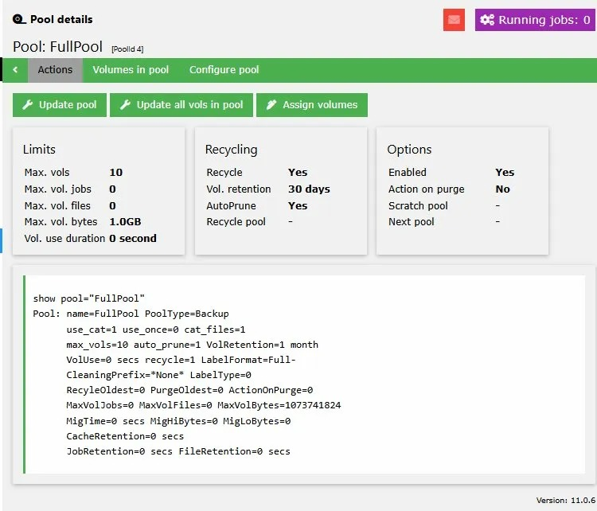

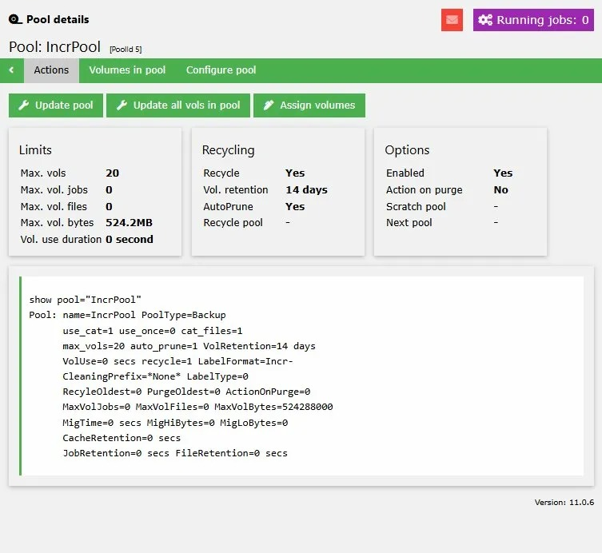

---

## FASE 3 — Instalación de Baculum (Interfaz Web)

Baculum es la interfaz web oficial de Bacula. Se compone de una API (puerto 9096) y una Web (puerto 9095).

### Añadir repositorio e instalar

```bash
wget -qO - https://bacula.org/downloads/baculum/baculum.pub | sudo apt-key add -
echo "deb [ arch=amd64 ] https://bacula.org/downloads/baculum/stable-11/debian bullseye main" | sudo tee /etc/apt/sources.list.d/baculum.list
sudo apt update
sudo apt install -y baculum-common baculum-api baculum-web baculum-api-lighttpd baculum-web-lighttpd
```

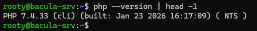

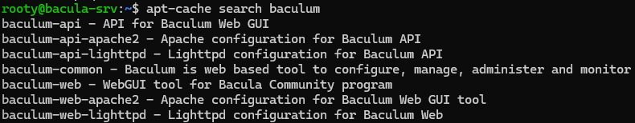

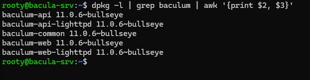

### Configurar Lighttpd y sudoers

```bash
sudo lighttpd-enable-mod fastcgi fastcgi-php
sudo systemctl restart lighttpd
sudo tee /etc/sudoers.d/baculum << 'EOF'
www-data ALL=(root) NOPASSWD: /usr/bin/bconsole
www-data ALL=(root) NOPASSWD: /usr/sbin/bacula-dir
www-data ALL=(root) NOPASSWD: /usr/sbin/bdirjson
www-data ALL=(root) NOPASSWD: /usr/sbin/bsdjson
www-data ALL=(root) NOPASSWD: /usr/sbin/bfdjson
www-data ALL=(root) NOPASSWD: /usr/sbin/bbconsjson
EOF
sudo chmod 0440 /etc/sudoers.d/baculum
sudo usermod -aG bacula www-data
```

### Configuración mediante el asistente web

Accedemos al asistente de la API en `http://192.168.1.91:9096/` y completamos los 6 pasos:
- **Step 1:** Idioma English
- **Step 2:** PostgreSQL · base de datos `bacula` · usuario `bacula` · IP `127.0.0.1` · puerto `5432`
- **Step 3:** bconsole en `/usr/bin/bconsole` · config `/etc/bacula/bconsole.conf` · Use sudo activado
- **Step 4:** Binaries `/usr/sbin` · Configs `/etc/bacula` · Use sudo activado
- **Step 5:** Usuario `admin` · Contraseña `admin`
- **Step 6:** Guardar

Luego accedemos a la Web en `http://192.168.1.91:9095/` y conectamos con la API local en `localhost:9096`.

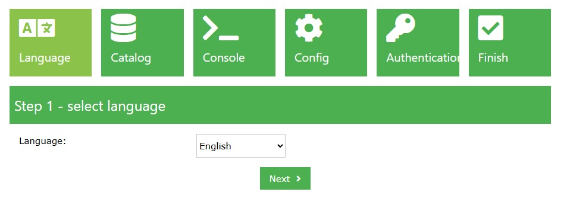

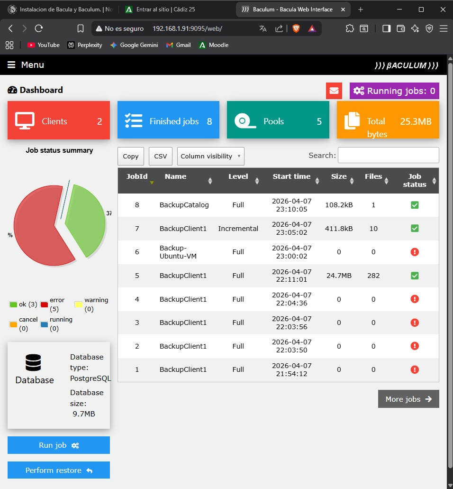

---

## FASE 4 — Cliente Linux (Debian 11)

Instalamos el File Daemon en una VM Debian 11 y lo registramos en el Director.

**Datos del cliente:**
- IP: `192.168.1.92`
- Hostname: `cliente-linux`
- Contraseña FD: `Ef5Z4bQDt7uH1rG0VKovQphww/j7engv`

### Instalación en el cliente

```bash
sudo apt update && sudo apt install -y bacula-fd
```

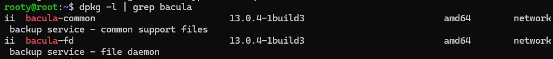

Configuramos `/etc/bacula/bacula-fd.conf` con el nombre `cliente-linux-fd` y las contraseñas correctas, y reiniciamos el servicio:

```bash
sudo systemctl restart bacula-fd && sudo systemctl enable bacula-fd
```

### Registro en el Director

En el servidor Debian añadimos el bloque `Client` y el `Job` correspondiente a `bacula-dir.conf`, validamos y reiniciamos el Director.

### Verificación de conectividad

```bash
sudo bconsole
status client=cliente-linux-fd
```

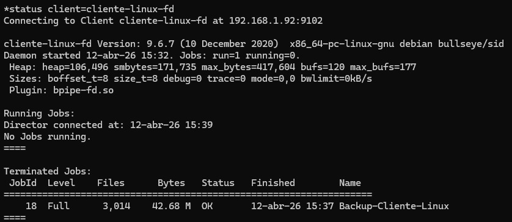


### Primer backup desde Baculum Web

Desde `http://192.168.1.91:9095/web/` ejecutamos:  
**Run job → Backup-Cliente-Linux → Full → FullPool → Run job**


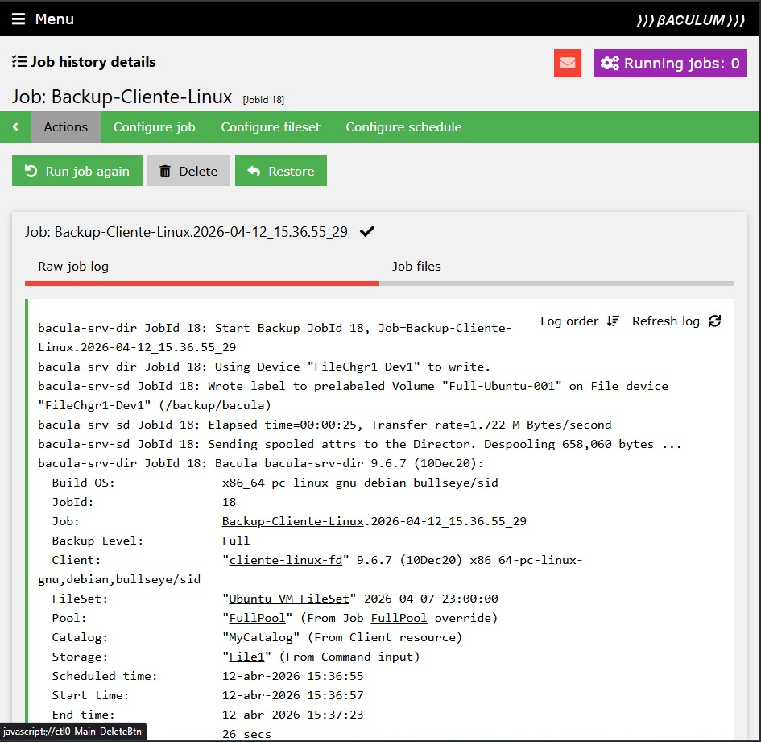

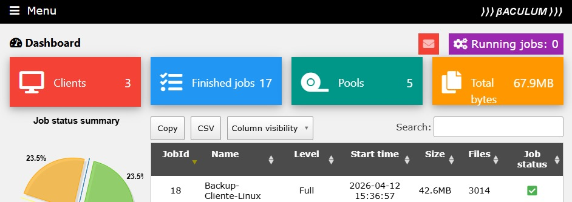


---

## FASE 5 — Cliente Windows 11 con VSS

Instalamos el File Daemon en Windows 11 con soporte VSS para backups consistentes.

**Datos del cliente:**
- IP: `192.168.1.34`
- Nombre: `windows11-fd`
- Contraseña FD: `+DEGOHBnR3EyR10+mu4HFwmiIXwQ49rD`

### Descarga e instalación

Descargamos `bacula-win64-9.6.7.exe` desde `https://sourceforge.net/projects/bacula/files/bacula/9.6.7/` y lo ejecutamos como administrador.

En el asistente seleccionamos **Custom → Client only** e introducimos:
- Nombre del cliente: `windows11-fd`
- Puerto: `9102`
- Contraseña: `+DEGOHBnR3EyR10+mu4HFwmiIXwQ49rD`
- DIR Name: `bacula-srv-dir` · DIR Port: `9101` · DIR Password: `8fx3LT/Dfnj/SukWpv4GkcSEaX01EcpY` · DIR Address: `192.168.1.91`

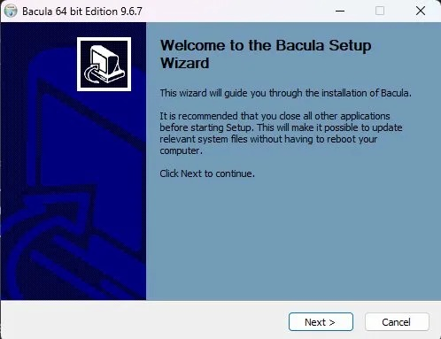

Arrancamos el servicio desde PowerShell como administrador:

```powershell
Start-Service "Bacula-fd"
Get-Service -Name "Bacula*"
```

> 📸 **CAPTURA F5-2:** PowerShell mostrando el servicio `Bacula-fd` con estado `Running`.

### Abrir el firewall

```powershell
New-NetFirewallRule -DisplayName "Bacula File Daemon" -Direction Inbound -Protocol TCP -LocalPort 9102 -Action Allow -Profile Any
```

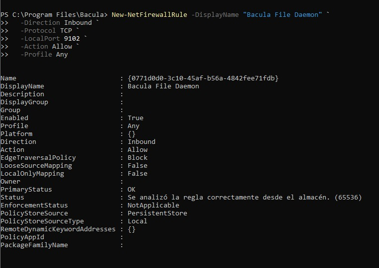

### Verificación de conectividad

```bash
sudo bconsole
status client=windows11-fd
```

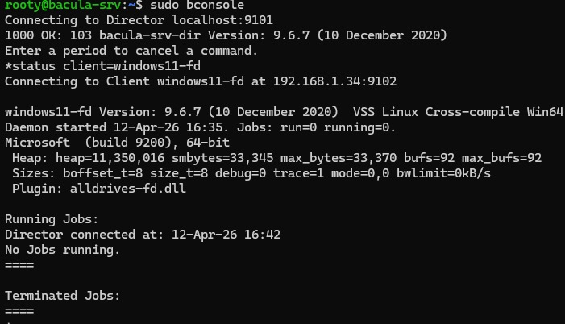

### Backup con VSS desde Baculum Web

Desde `http://192.168.1.91:9095/web/` ejecutamos:  
**Run job → Backup-Windows11 → Full → FullPool → Run job**

El log confirma que VSS se activó correctamente:
```
windows11-fd JobId 20: Generate VSS snapshots. Driver="Win64 VSS"
windows11-fd JobId 20: Snapshot mount point: C:\
```

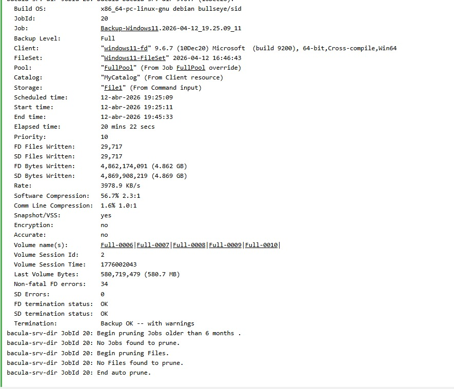

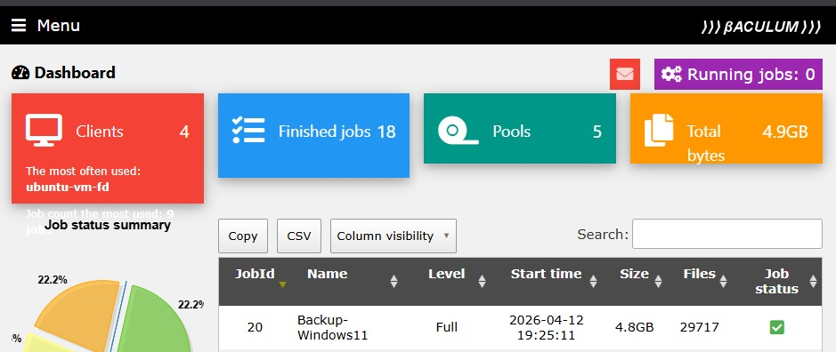
---

## Tabla de referencia rápida

| Servicio | Puerto | Comando para reiniciar |
|---|---|---|
| Bacula Director | 9101 | `sudo systemctl restart bacula-dir` |
| Bacula File Daemon | 9102 | `sudo systemctl restart bacula-fd` |
| Bacula Storage Daemon | 9103 | `sudo systemctl restart bacula-sd` |
| PostgreSQL | 5432 | `sudo systemctl restart postgresql` |
| Baculum API | 9096 | `sudo systemctl restart lighttpd` |
| Baculum Web | 9095 | `sudo systemctl restart lighttpd` |

**Archivos de configuración clave:**

| Componente | Ruta |
|---|---|
| Director | `/etc/bacula/bacula-dir.conf` |
| Storage Daemon | `/etc/bacula/bacula-sd.conf` |
| File Daemon | `/etc/bacula/bacula-fd.conf` |
| Consola CLI | `/etc/bacula/bconsole.conf` |
| Volúmenes | `/backup/bacula/` |

**Acceso a la interfaz web:**
- Baculum Web: `http://<IP_SERVIDOR>:9095/web/`
- Baculum API: `http://<IP_SERVIDOR>:9096/`
- Usuario: `admin` · Contraseña: `admin`