# Seguridad en Conexiones Inalámbricas

## Parte 1: Guía de Hardening del Router TP-Link Archer C6

### Introducción/Eleccion router

Una de las razones principales para elegir el TP-Link Archer C6 es su interfaz de usuario intuitiva y su precio accesible, lo que lo convierte en una opción popular para usuarios domésticos que buscan mejorar la seguridad de su red inalámbrica.

### Pasos de Hardening (con evidencia visual)

| Paso | Configuración | Imagen |
|------|---|---|
| 0 | **Dashboard inicial** | 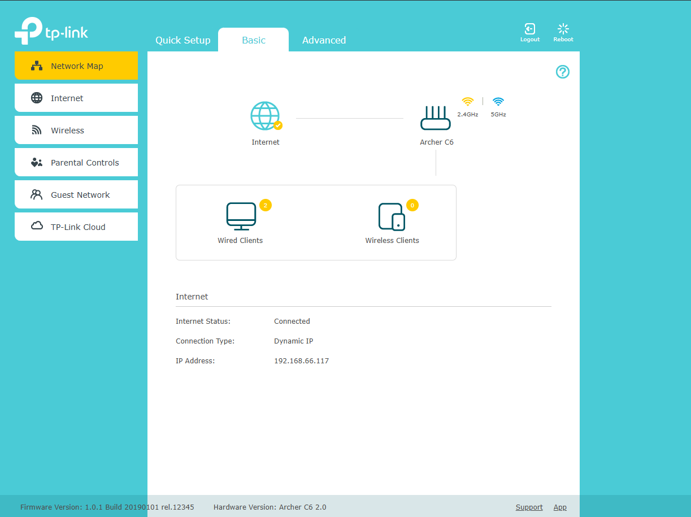 |
| 1 | **Acceso y contraseña:** Advanced > System Tools > Administration. Cambiar admin/admin por contraseña fuerte (15+ caracteres, mayúsc, minúsc, números, símbolos). Las credenciales por defecto son públicas y lo primero que prueba un atacante | 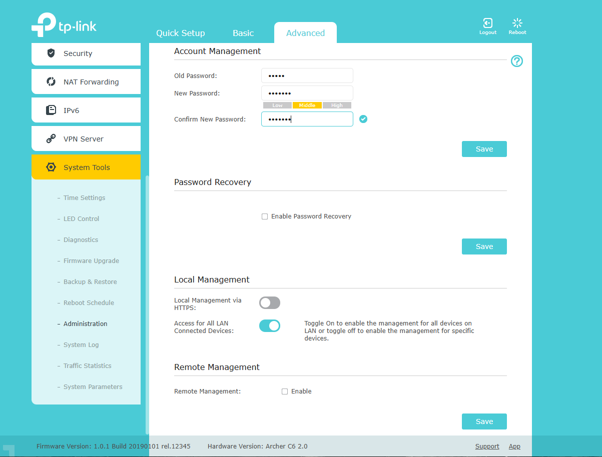 |
| 2 | **SSID:** Wireless > Wireless Settings. Cambiar de TP-Link_XXXX a nombre genérico (RED_SEGURA_2024). No ocultar SSID, ya que herramientas como Airodump-ng lo detectan igualmente y ocultarlo causa problemas de reconexión en clientes | 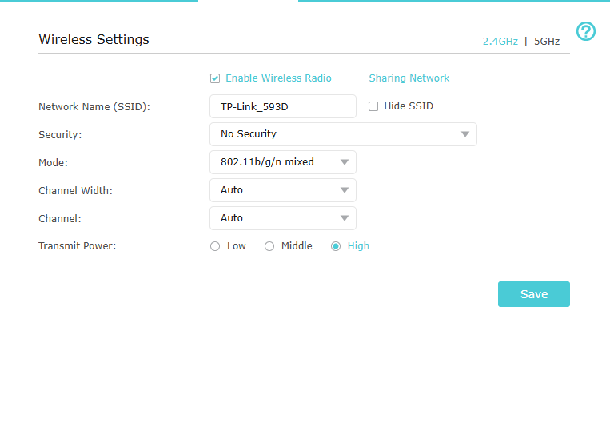 |
| 3 | **Cifrado WiFi:** Wireless > Wireless Security. Usar WPA3 Personal o WPA2-PSK [AES]. Contraseña 20+ caracteres. NUNCA WEP/Open, ya que WEP se rompe en minutos y una red abierta expone todo el tráfico | 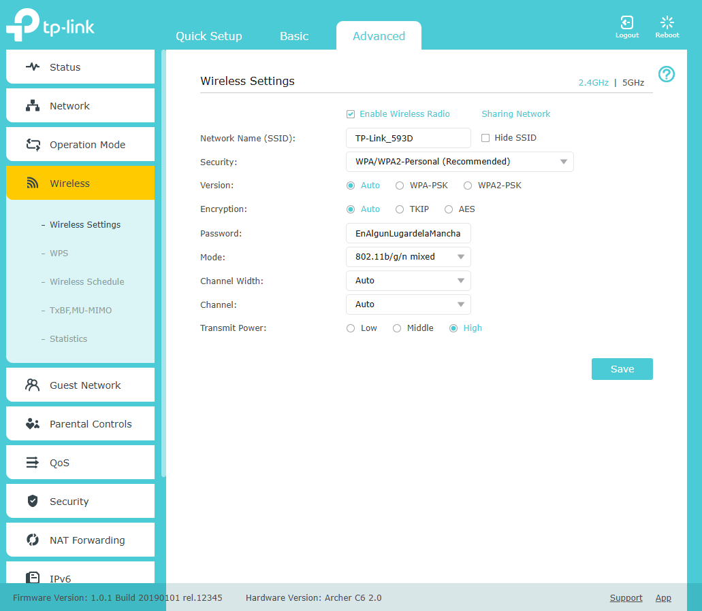 |
| 4 | **Deshabilitar WPS:** Wireless > Wireless Settings > WPS > Disable. Su PIN de 8 dígitos se puede romper por fuerza bruta en pocas horas con herramientas como Reaver | 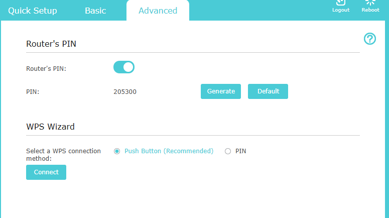 |
| 5 | **Red de Invitados:** Wireless > Guest Network > Enable. Disable "Access Intranet" y "Access between Guests". Aísla dispositivos no confiables de la red principal, evitando movimiento lateral | 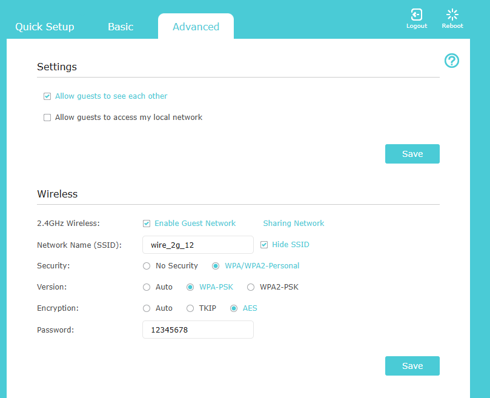 |
| 6 | **Firewall:** Advanced > Security > Firewall > Enable. Habilitar SPI y NAT-PT. SPI inspecciona el estado de las conexiones y bloquea paquetes que no pertenezcan a una sesión legítima | 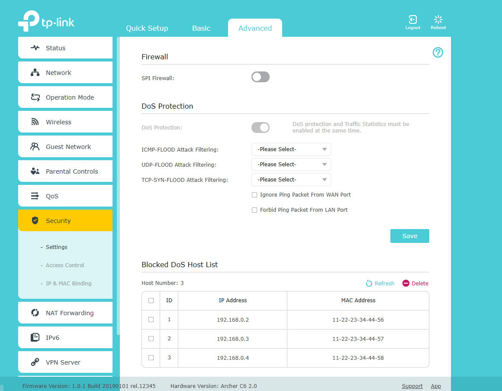 |
| 7 | **Remote Management:** Advanced > System Tools > Remote Management. Disable HTTP y HTTPS. Evita que el panel de administración sea accesible desde internet | 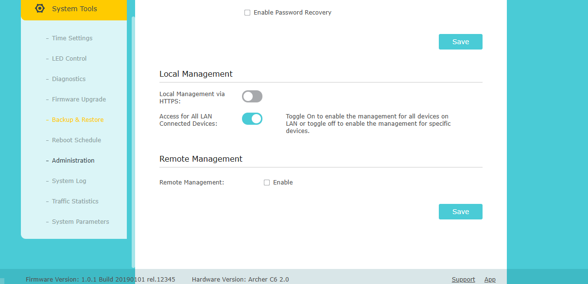 |
| 8 | **Firmware:** Advanced > System Tools > Firmware Upgrade. Check for upgrades regularmente. Las actualizaciones corrigen vulnerabilidades conocidas (CVEs) del dispositivo | 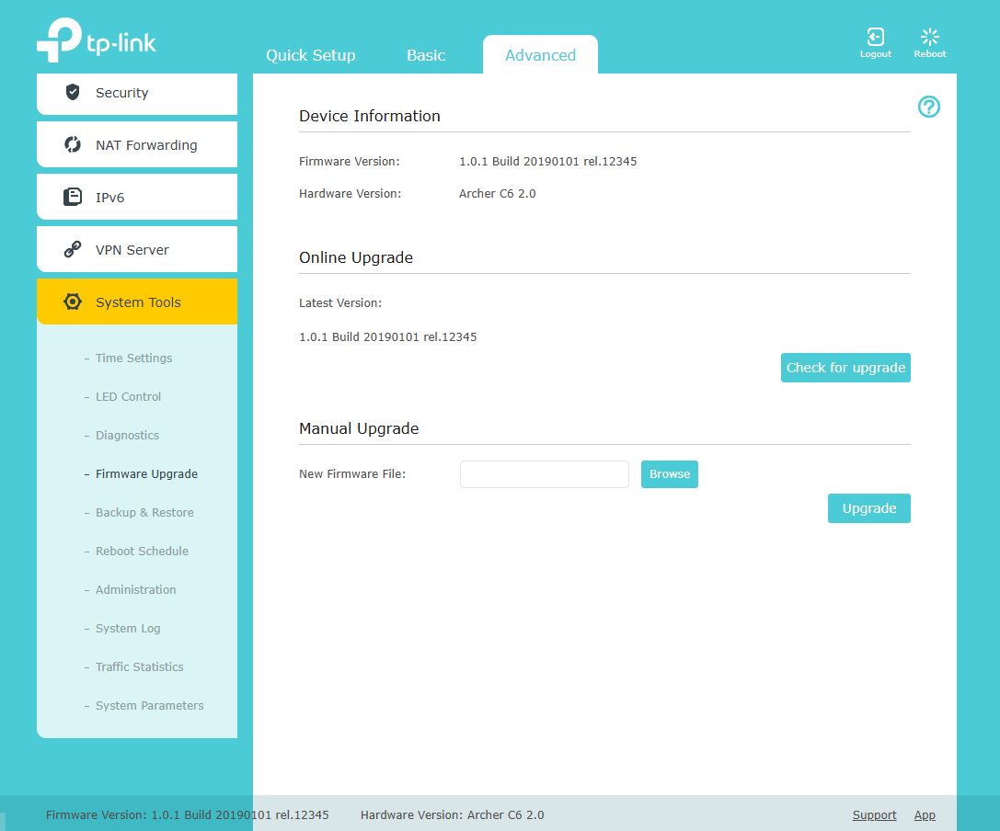 |
| 9 | **DNS Seguros:** Advanced > Network > DHCP Settings. Primary: 1.1.1.1, Secondary: 1.0.0.1 (Cloudflare). Más rápidos y privados que los del ISP, y filtran dominios maliciosos | 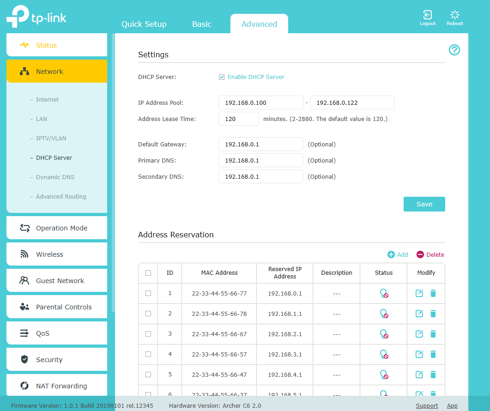 |
| 10 | **Monitoreo:** Status dashboard muestra dispositivos conectados, IPs, MACs. Revisar regularmente para detectar dispositivos no autorizados en la red | 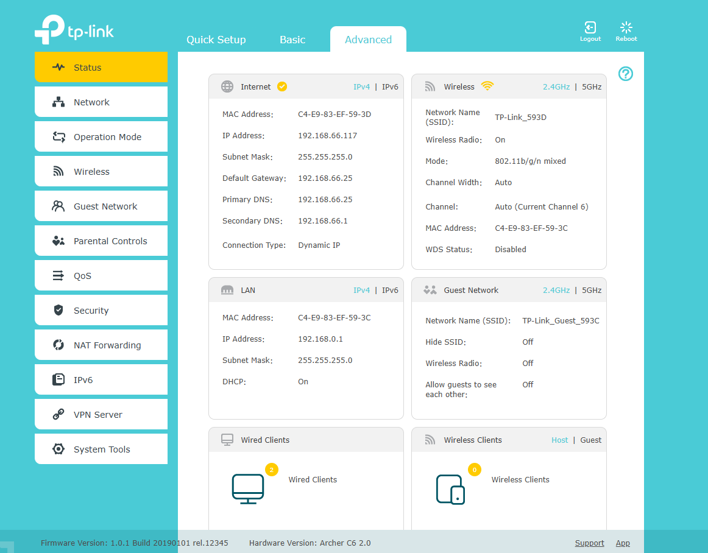 |
| 11 | **IP & MAC Binding:** Advanced > Security > IP & MAC Binding. Vincula IPs a MACs conocidas, limitando el acceso solo a dispositivos autorizados | 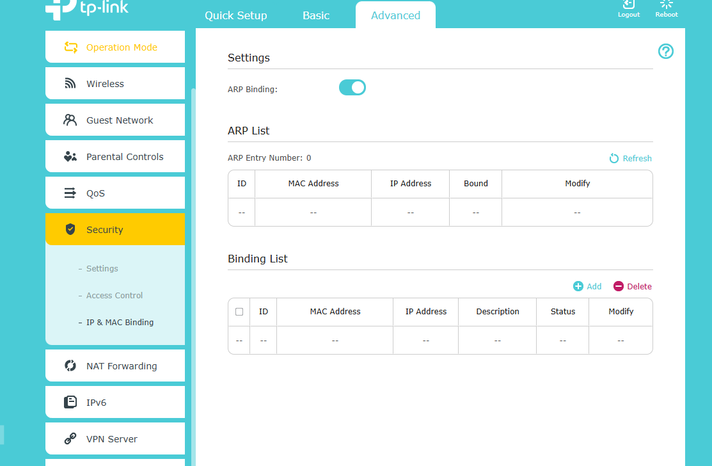 |
| 12 | **System Log:** Advanced > System Tools > System Log. Enable para auditoría. Los logs permiten detectar intentos de acceso fallidos y comportamiento anómalo | 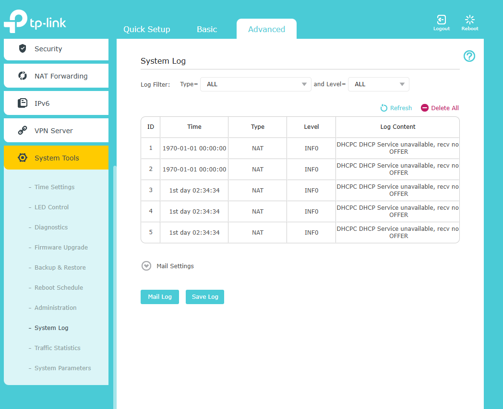 |

### Medidas Críticas
- ✓ Contraseña admin fuerte (15+ caracteres)
- ✓ Cifrado WPA2/WPA3 con AES
- ✓ Firewall habilitado + SPI
- ✓ Acceso remoto deshabilitado
- ✓ Firmware actualizado
- ✓ DNS seguros (Cloudflare 1.1.1.1)
- ✓ Monitoreo de dispositivos
- ✓ Logging habilitado

### Mantenimiento
- **Mensual:** Revisar dispositivos conectados, logs, firmware updates
- **Trimestral:** Cambiar contraseñas, revisión de seguridad
- **Emergencia:** Factory reset (botón RESET 10s) si compromiso sospechado

### Conclusión

Con los 12 pasos aplicados, el TP-Link Archer C6 pasa de su configuración de fábrica (vulnerable por defecto) a un estado bastionado que cubre los principales vectores de ataque en redes inalámbricas: acceso no autorizado, cifrado débil, servicios innecesarios expuestos y falta de visibilidad. Ninguna configuración es infalible, pero combinando estas medidas con un mantenimiento periódico se reduce drásticamente la superficie de ataque del router.

