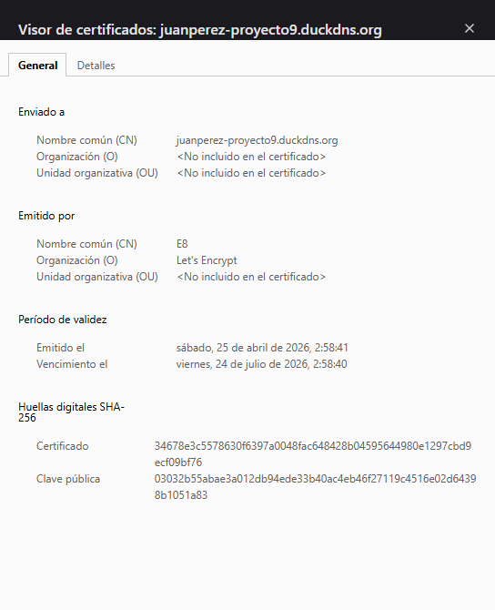
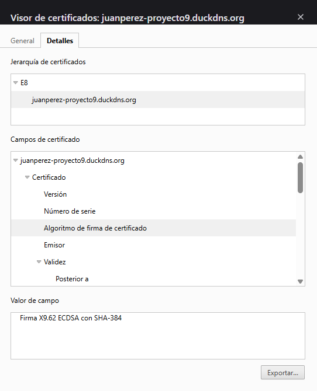
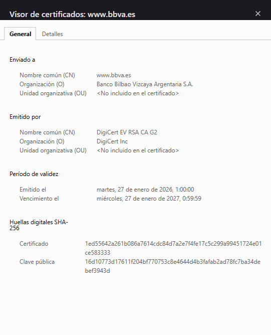
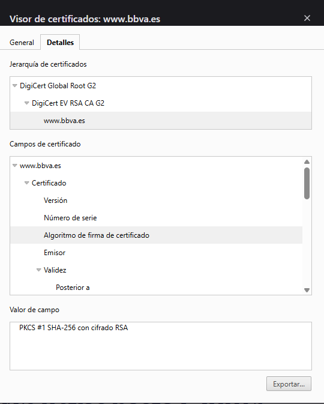

# Parte 2 — Servidor web HTTPS y comparativa de certificados

## 1. Configuración del entorno

Para esta parte se ha desplegado un servidor web sobre el VPS creado en la Parte 1 (AWS EC2, Ubuntu 24.04 LTS), siguiendo la **vía realista**:

- **Dominio:** `juanperez-proyecto9.duckdns.org` (subdominio gratuito de DuckDNS apuntando a la IP pública del VPS).
- **Servidor web:** Nginx instalado vía `apt install nginx`.
- **Certificado HTTPS:** emitido por **Let's Encrypt** mediante Certbot (`sudo certbot --nginx -d juanperez-proyecto9.duckdns.org`).
- **Puertos abiertos en AWS Security Group:** 22 (SSH), 80 (HTTP) y 443 (HTTPS).

El navegador muestra la conexión como **segura (candado cerrado)** sin ningún aviso, ya que el certificado emitido por Let's Encrypt está firmado por una CA reconocida por todos los navegadores actuales.

---

## 2. Mi certificado — `juanperez-proyecto9.duckdns.org`

### Pestaña General

### Pestaña Detalles

### Datos clave

| Campo | Valor |
|---|---|
| **Sujeto (CN)** | `juanperez-proyecto9.duckdns.org` |
| **Organización del sujeto** | *No incluida* |
| **Emisor (CN)** | `E8` |
| **Organización del emisor** | Let's Encrypt |
| **Emitido el** | 25 de abril de 2026 |
| **Vencimiento** | 24 de julio de 2026 |
| **Duración total** | ~90 días |
| **Algoritmo de firma** | X9.62 ECDSA con SHA-384 |
| **Cadena visible** | E8 → juanperez-proyecto9.duckdns.org |
| **Tipo de validación** | DV (Domain Validation) |
| **Coste** | Gratuito |

---

## 3. Certificado de sitio web verificado — `www.bbva.es`

Para la comparación se ha elegido la web del **Banco Bilbao Vizcaya Argentaria (BBVA)**, una entidad bancaria española que requiere el máximo nivel de confianza por su naturaleza financiera.

### Pestaña General

### Pestaña Detalles

### Datos clave

| Campo | Valor |
|---|---|
| **Sujeto (CN)** | `www.bbva.es` |
| **Organización del sujeto** | Banco Bilbao Vizcaya Argentaria S.A. |
| **Emisor (CN)** | DigiCert EV RSA CA G2 |
| **Organización del emisor** | DigiCert Inc |
| **Emitido el** | 27 de enero de 2026 |
| **Vencimiento** | 27 de enero de 2027 |
| **Duración total** | ~365 días (1 año) |
| **Algoritmo de firma** | PKCS #1 SHA-256 con cifrado RSA |
| **Cadena visible** | DigiCert Global Root G2 → DigiCert EV RSA CA G2 → www.bbva.es |
| **Tipo de validación** | EV (Extended Validation) |
| **Coste** | Comercial (pago anual) |

---

## 4. Análisis comparativo

### 4.1 Tabla resumen

| Aspecto | Mi certificado (Let's Encrypt) | BBVA (DigiCert) |
|---|---|---|
| Autoridad de Certificación | Let's Encrypt (ISRG) | DigiCert Inc |
| Tipo de validación | **DV** — Domain Validation | **EV** — Extended Validation |
| Modelo de negocio | Sin ánimo de lucro, gratuito | Comercial, de pago |
| Validez | 90 días | 365 días |
| Algoritmo de firma | ECDSA SHA-384 | RSA SHA-256 |
| Niveles visibles en la cadena | 2 (intermedio + final) | 3 (raíz + intermedio + final) |
| Datos de la organización | Solo dominio (CN) | Razón social completa incluida |
| Renovación | Automática (Certbot, cron) | Manual o gestionada por la entidad |

### 4.2 Diferencias detalladas

**1. Tipo de validación (la diferencia más relevante)**

- Mi certificado es **DV (Domain Validation)**: Let's Encrypt solo comprueba que el solicitante controla el dominio (lo verifica colocando un fichero o un registro DNS). No se valida ninguna identidad real. Por eso el campo *Organización del sujeto* aparece vacío.
- El certificado de BBVA es **EV (Extended Validation)**: DigiCert ha verificado jurídicamente que la entidad solicitante es realmente *Banco Bilbao Vizcaya Argentaria S.A.*, comprobando documentación mercantil, dirección física y poderes del solicitante. Por eso aparece la razón social completa en el campo *Organización*.

**2. Autoridad de Certificación**

- **Let's Encrypt** es una iniciativa sin ánimo de lucro (ISRG) que ofrece certificados gratuitos para democratizar el HTTPS. Sus intermedios actuales se llaman `E5`–`E9` (ECDSA) y `R10`–`R14` (RSA).
- **DigiCert** es una de las CA comerciales más grandes del mundo. Sus certificados EV están específicamente pensados para entidades financieras, gobiernos y comercios donde la confianza visible es crítica.

**3. Duración del certificado**

- 90 días (mío) frente a 365 días (BBVA). La duración corta de Let's Encrypt es **una decisión de seguridad deliberada**: si una clave privada se ve comprometida, el daño máximo está limitado a los días restantes, en lugar de un año entero. Para que sea sostenible se diseñó con renovación automática (`certbot renew`, programado en una *systemd timer*).
- BBVA no necesita la rotación tan frecuente porque maneja sus claves con HSM y procedimientos auditados, y la renovación anual es práctica habitual del sector.

**4. Algoritmo de firma**

- Mi certificado usa **ECDSA con SHA-384** (criptografía de curva elíptica). Es el algoritmo moderno: claves mucho más cortas (~256-384 bits) con seguridad equivalente a RSA de 3072-7680 bits. Mejor rendimiento en handshake TLS y menor consumo de CPU/red.
- BBVA usa **RSA con SHA-256**. Es más tradicional y compatible con clientes antiguos (banca electrónica con dispositivos heredados, cajeros, etc.), de ahí que muchas entidades financieras sigan apostando por RSA pese a ser menos eficiente.

**5. Cadena de confianza (jerarquía)**

- En mi certificado solo se aprecian dos eslabones (intermedio `E8` + entidad final). La raíz `ISRG Root X1/X2` está implícita en el almacén de raíces del sistema operativo y del navegador.
- En BBVA se aprecia la cadena completa: **DigiCert Global Root G2** (raíz) → **DigiCert EV RSA CA G2** (intermedio EV) → `www.bbva.es` (final). La presencia de un intermedio específico para certificados EV refuerza el modelo de confianza segregada que usan las CA comerciales.

**6. Coste y barrera de entrada**

- Let's Encrypt es **gratis y automatizado**: cualquier estudiante o particular puede obtener un certificado válido en segundos. Esto hizo que el HTTPS pasara del ~30% al ~95% de la web entre 2015 y 2024.
- DigiCert EV cuesta del orden de **cientos a miles de euros al año** y requiere documentación corporativa. No es viable para particulares, pero para entidades financieras es un coste asumido por la confianza explícita que aporta.

---

## 5. Conclusiones

Ambos certificados son **igualmente válidos a efectos criptográficos**: cifran el tráfico, garantizan integridad y los navegadores los aceptan sin advertencias. La diferencia fundamental no está en la criptografía, sino en **el nivel de identidad que respaldan**:

- Un **DV** confirma "estás hablando con quien dice ser dueño de este dominio".
- Un **EV** confirma además "esa organización ha sido jurídicamente verificada como X S.A.".

Para una página personal, un blog o un proyecto formativo, **DV con Let's Encrypt es la opción correcta**: gratis, automática y suficiente. Para una banca electrónica, una pasarela de pagos o un servicio donde el usuario debe tener garantías legales sobre la identidad de la otra parte, **EV con una CA comercial sigue siendo el estándar**.

La adopción masiva de Let's Encrypt en los últimos años ha cambiado el significado del candado en el navegador: hoy en día indica únicamente "conexión cifrada", no "entidad verificada". Por eso los navegadores ya no muestran de forma especial los certificados EV frente a los DV (Chrome y Firefox eliminaron la barra verde con el nombre de la organización en 2019), trasladando la decisión sobre la legitimidad de la web al propio usuario y a otras señales (URL, contenido, etc.).
