# Parte 3 — Análisis de certificados con SSL Labs

En esta parte se analiza el certificado válido del sitio desplegado en la Parte 2 y se contrastan **tres certificados inválidos de tipos distintos** localizados en el portal `badssl.com`, mantenido por ingenieros de Google como banco de pruebas público para configuraciones SSL/TLS rotas.

El servicio de análisis utilizado es **Qualys SSL Labs** (https://www.ssllabs.com/ssltest/), que evalúa la cadena completa, los protocolos soportados, las suites de cifrado y vulnerabilidades conocidas, otorgando una calificación entre **A+** (excelente) y **F** (catastrófico), reservando la letra **T** para certificados con problemas de confianza (*trust issues*).

---

## 1. Certificado válido — `juanperez-proyecto9.duckdns.org`

### 1.1 Calificación SSL Labs

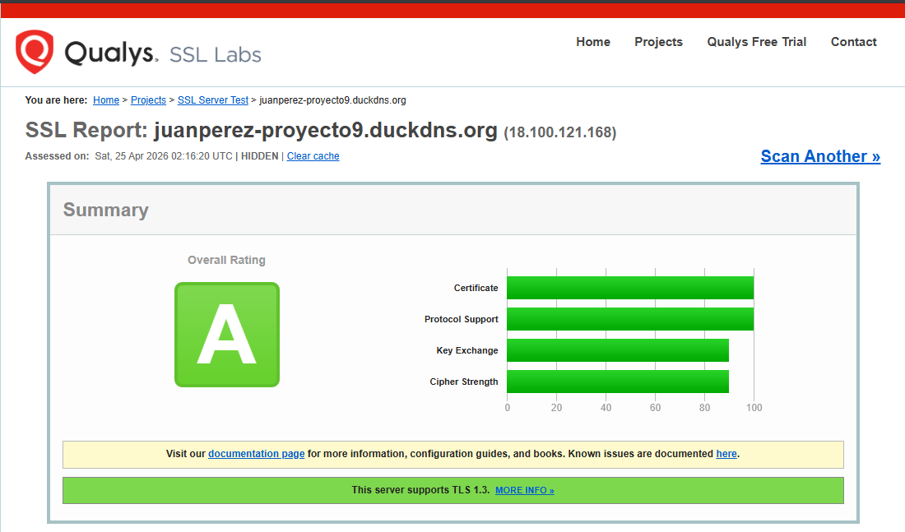

**Calificación: A**

| Indicador | Puntuación |
|---|---|
| Certificate | 100/100 |
| Protocol Support | 100/100 |
| Key Exchange | ~90/100 |
| Cipher Strength | ~90/100 |
| Soporta TLS 1.3 | Sí |

### 1.2 Datos del certificado

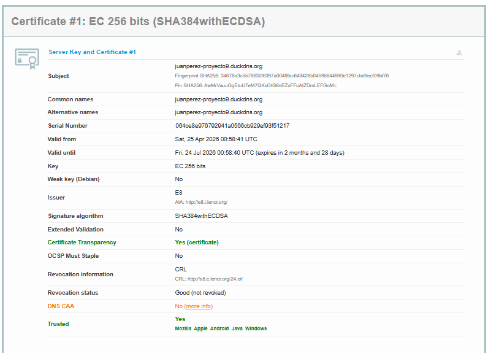
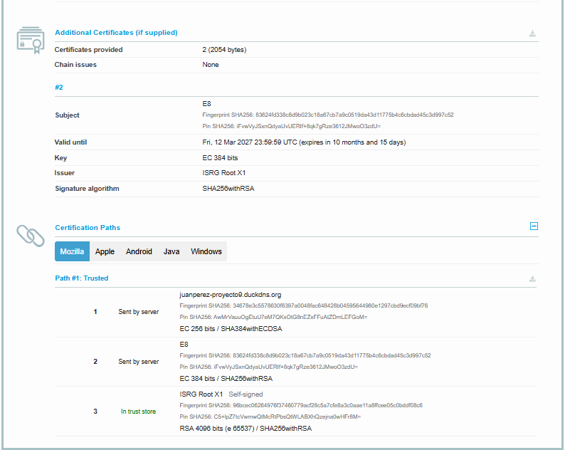

| Campo | Valor |
|---|---|
| Subject | `juanperez-proyecto9.duckdns.org` |
| Common Name | `juanperez-proyecto9.duckdns.org` |
| Alternative Names | `juanperez-proyecto9.duckdns.org` |
| Issuer | E8 (Let's Encrypt) |
| Valid from | 25 abril 2026 |
| Valid until | 24 julio 2026 (~90 días) |
| Key | EC 256 bits |
| Signature | SHA384withECDSA |
| Trusted | **Sí** — Mozilla, Apple, Android, Java, Windows |
| Revocation status | Good (not revoked) |
| Certificate Transparency | Sí |
| Chain issues | Ninguno |

### 1.3 Configuración de protocolos y cipher suites

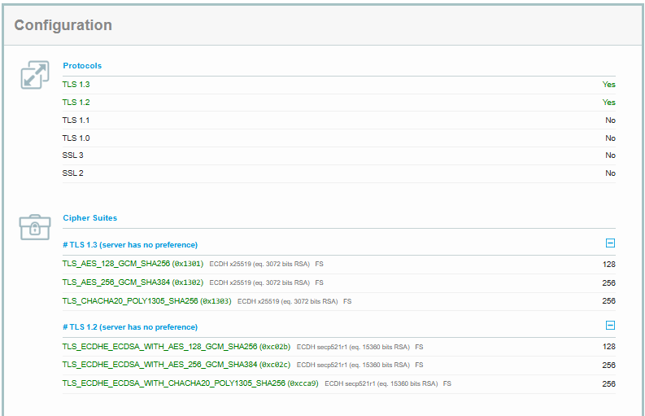

- **Protocolos habilitados:** TLS 1.3 y TLS 1.2 únicamente.
- **Protocolos deshabilitados:** TLS 1.1, TLS 1.0, SSL 3, SSL 2 (todos obsoletos y vulnerables).
- **Cipher suites TLS 1.3:** AES-128-GCM, AES-256-GCM, ChaCha20-Poly1305 — todas con Forward Secrecy.
- **Cipher suites TLS 1.2:** ECDHE-ECDSA con AES-GCM y ChaCha20-Poly1305 — todas con Forward Secrecy.

### 1.4 Análisis de vulnerabilidades

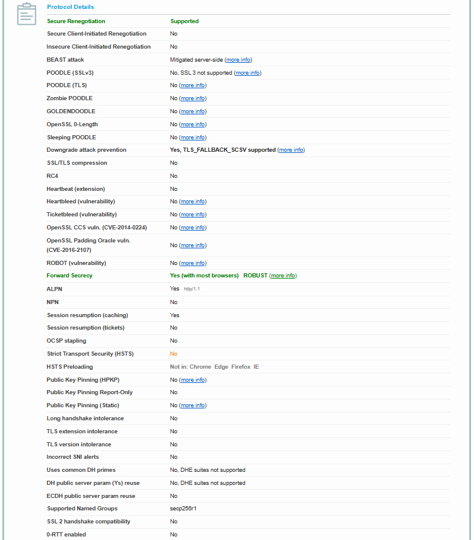

| Vulnerabilidad | Estado |
|---|---|
| Heartbleed | No vulnerable |
| POODLE (SSLv3 y TLS) | No vulnerable |
| ROBOT | No vulnerable |
| BEAST | Mitigado en servidor |
| Goldendoodle / Zombie POODLE | No vulnerable |
| Forward Secrecy | Sí — ROBUST |
| Compresión SSL/TLS | Deshabilitada |
| RC4 | No soportado |

### 1.5 Por qué es válido

El certificado obtiene **A** por las siguientes razones, todas verificables en las capturas:

1. **Cadena de confianza completa y reconocida.** El servidor envía el certificado de entidad final + el intermedio `E8`, y el navegador completa la cadena hasta `ISRG Root X1`, que está en el almacén de raíces de todos los sistemas operativos y navegadores principales.
2. **Vigencia activa.** Emitido el 25/04/2026, válido hasta el 24/07/2026. SSL Labs lo verifica en su escaneo del 25/04/2026.
3. **No revocado.** Se consulta la CRL de Let's Encrypt (`http://e8.c.lencr.org/24.crl`) y devuelve estado *Good*.
4. **CN/SAN coincide con el dominio servido.** El campo `Subject Alternative Name` contiene exactamente `juanperez-proyecto9.duckdns.org`, que es el dominio por el que el cliente accede.
5. **Algoritmos modernos.** Firma ECDSA con SHA-384 sobre clave de curva elíptica de 256 bits — equivalente en seguridad a RSA-3072 pero mucho más eficiente.
6. **Sin protocolos inseguros.** Solo TLS 1.2 y TLS 1.3, los únicos considerados seguros actualmente.
7. **Sin vulnerabilidades conocidas.** Supera los chequeos de Heartbleed, POODLE, ROBOT, etc.
8. **Forward Secrecy obligatoria.** Todas las suites usan ECDHE, garantizando que comprometer la clave del servidor no permite descifrar tráfico capturado en el pasado.
9. **Certificate Transparency.** El certificado está incluido en logs públicos auditables, lo que añade trazabilidad ante emisiones fraudulentas.

> **Por qué no llega a A+:** SSL Labs penaliza la falta de **HSTS** (Strict Transport Security), de **OCSP stapling** y de un registro **DNS CAA**. Son endurecimientos opcionales que no afectan a la validez del certificado en sí, sino al hardening del servidor.

---

## 2. Certificados inválidos

### 2.1 Certificado expirado — `expired.badssl.com`

#### Aviso del navegador

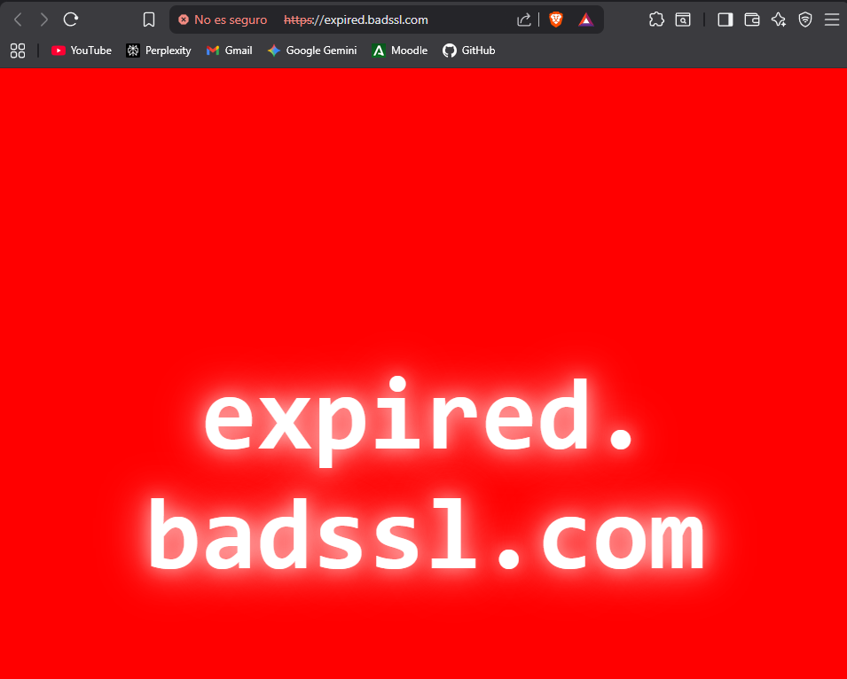

El navegador muestra una página completamente roja con la URL `expired.badssl.com` y la marca *"No es seguro"* en la barra de direcciones. El error subyacente del navegador es `NET::ERR_CERT_DATE_INVALID`.

#### Análisis SSL Labs

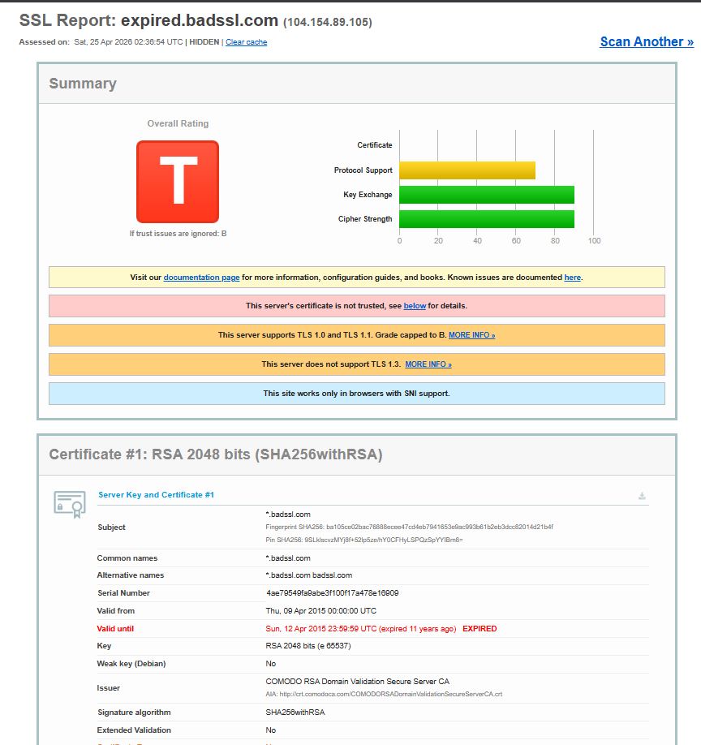

**Calificación: T** (Trust issues). Si se ignoran los problemas de confianza, sería B.

| Campo | Valor |
|---|---|
| Subject | `*.badssl.com` |
| Issuer | COMODO RSA Domain Validation Secure Server CA |
| Valid from | 09 abril 2015 |
| Valid until | **12 abril 2015 — EXPIRED hace 11 años** |
| Key | RSA 2048 bits |
| Signature | SHA256withRSA |

#### Por qué no es válido

1. **El certificado está caducado desde abril de 2015.** La fecha actual del análisis (25/04/2026) está más de 11 años fuera del periodo de validez. Cuando el navegador valida el certificado, comprueba que `notBefore <= ahora <= notAfter`, y aquí esa condición falla.
2. **El emisor (COMODO) sí es una CA confiable**, por lo que el problema NO es la cadena, sino exclusivamente la fecha. Esto demuestra que un certificado puede haber sido emitido legítimamente en su día y dejar de ser válido por simple paso del tiempo.
3. SSL Labs además marca **TLS 1.0 y 1.1 habilitados** (capping a B) y la ausencia de TLS 1.3 — síntomas adicionales de servidor desactualizado, pero el motivo principal de la T es la expiración.

> La caducidad existe precisamente para forzar la rotación periódica de claves: si la clave privada hubiera sido robada en 2015, la ventana de explotación se cerró al expirar el certificado. Por eso Let's Encrypt usa solo 90 días.

---

### 2.2 Certificado autofirmado — `self-signed.badssl.com`

#### Aviso del navegador

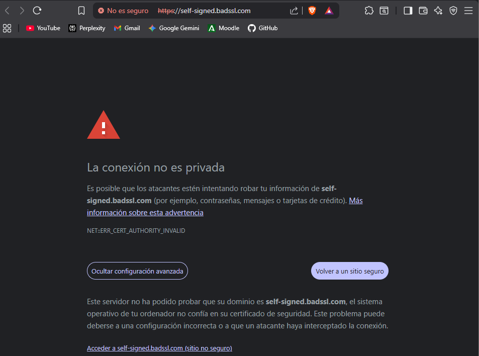

El navegador muestra el aviso *"La conexión no es privada"* con el código `NET::ERR_CERT_AUTHORITY_INVALID` y el mensaje:

> *"Este servidor no ha podido probar que su dominio es self-signed.badssl.com, el sistema operativo de tu ordenador no confía en su certificado de seguridad."*

#### Análisis SSL Labs

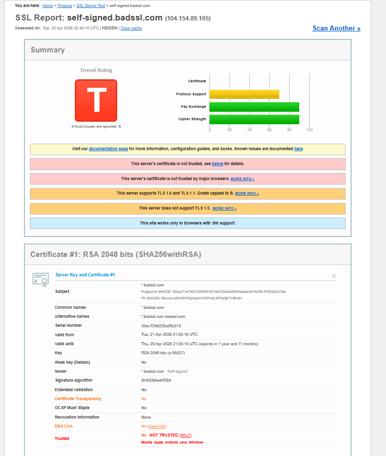

**Calificación: T**. Si se ignoran los problemas de confianza, sería B.

| Campo | Valor |
|---|---|
| Subject | `*.badssl.com` |
| Issuer | **`*.badssl.com` Self-signed** |
| Valid from | 21 abril 2026 |
| Valid until | 20 abril 2028 |
| Key | RSA 2048 bits |
| Signature | SHA256withRSA |
| Trusted | **NO — NOT TRUSTED** (Mozilla, Apple, Android, Java, Windows) |
| Certificate Transparency | No |

#### Por qué no es válido

1. **El certificado se firma a sí mismo.** En la cadena no hay una CA externa: el campo `Issuer` es idéntico al campo `Subject`, ambos `*.badssl.com`. SSL Labs lo etiqueta literalmente como **"Self-signed"**.
2. **No existe ninguna raíz en el almacén de confianza** del sistema operativo o del navegador que avale ese certificado. Cualquier persona puede generar un certificado autofirmado en segundos con `openssl`, así que aceptarlo equivaldría a confiar en un desconocido sin ninguna verificación de identidad.
3. Por eso ningún navegador principal lo marca como confiable — la columna *Trusted* aparece **NOT TRUSTED** en las cinco plataformas analizadas.
4. Las fechas y los algoritmos son correctos: el problema NO es técnico ni temporal, es de **modelo de confianza**. La PKI pública se basa en una jerarquía de CAs auditadas; un autofirmado salta ese modelo por completo.

> Los certificados autofirmados sí tienen usos legítimos: entornos internos, desarrollo local, pruebas. Pero nunca deben servirse a usuarios finales por internet, porque rompen toda garantía de identidad.

---

### 2.3 Certificado con nombre de host incorrecto — `wrong.host.badssl.com`

#### Aviso del navegador

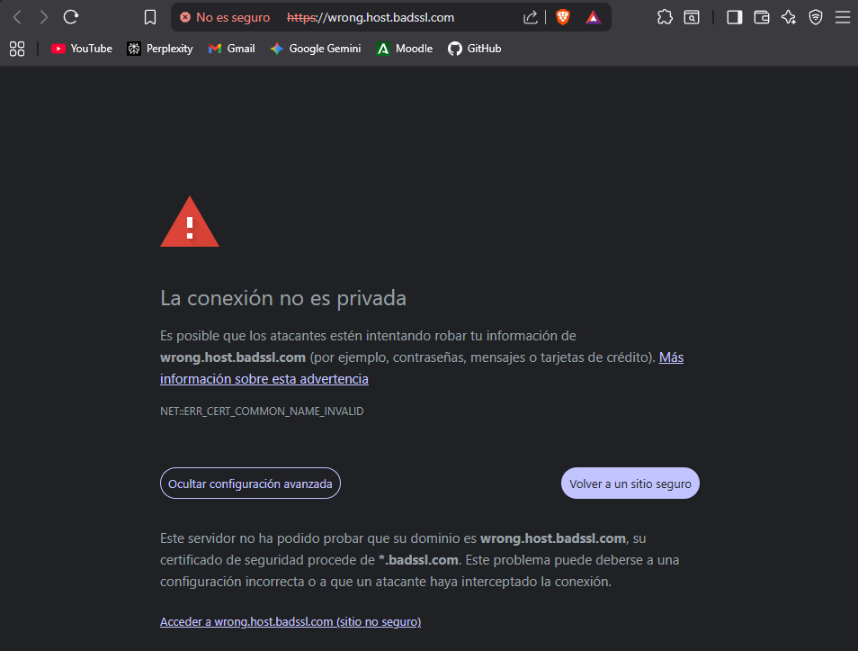

El navegador muestra *"La conexión no es privada"* con el código `NET::ERR_CERT_COMMON_NAME_INVALID` y el mensaje:

> *"Este servidor no ha podido probar que su dominio es wrong.host.badssl.com, su certificado de seguridad procede de \*.badssl.com."*

#### Análisis SSL Labs

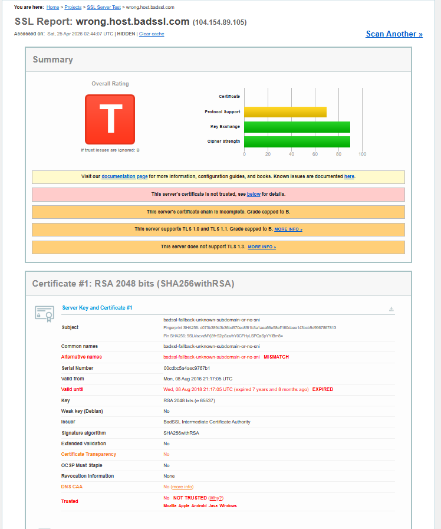

**Calificación: T**. Si se ignoran los problemas de confianza, sería B.

| Campo | Valor |
|---|---|
| Subject | `badssl-fallback-unknown-subdomain-or-no-sni` |
| Common Name | `badssl-fallback-unknown-subdomain-or-no-sni` |
| Alternative Names | `badssl-fallback-unknown-subdomain-or-no-sni` **MISMATCH** |
| Issuer | BadSSL Intermediate Certificate Authority |
| Valid from | 08 agosto 2016 |
| Valid until | 08 agosto 2018 — **EXPIRED hace 7 años** |
| Trusted | **NO — NOT TRUSTED** |

#### Por qué no es válido

1. **El nombre del certificado NO coincide con el dominio solicitado.** El usuario accede a `wrong.host.badssl.com`, pero el campo SAN del certificado solo contiene `badssl-fallback-unknown-subdomain-or-no-sni`. SSL Labs lo etiqueta explícitamente como **MISMATCH**.
2. El navegador comprueba este match precisamente para evitar ataques **Man-in-the-Middle**: si un atacante interceptara la conexión y presentara un certificado válido para *otro* dominio, el navegador debe rechazarlo.
3. Adicionalmente este certificado tiene **dos problemas más**: está caducado desde agosto de 2018 y la cadena está incompleta (falta el intermedio para llegar a una raíz reconocida). Es un caso de **acumulación de defectos**, lo que lo hace especialmente didáctico.

---

## 3. Tabla comparativa final

| Sitio | Calificación SSL Labs | Tipo de error | Causa raíz | Código error navegador |
|---|---|---|---|---|
| **juanperez-proyecto9.duckdns.org** | **A** | — | Certificado válido, cadena completa, algoritmos modernos | (sin error, candado cerrado) |
| **expired.badssl.com** | T (B sin trust) | Caducado | Fecha actual fuera del periodo `notBefore..notAfter` | `NET::ERR_CERT_DATE_INVALID` |
| **self-signed.badssl.com** | T (B sin trust) | Autofirmado | Issuer = Subject, sin CA reconocida en la cadena | `NET::ERR_CERT_AUTHORITY_INVALID` |
| **wrong.host.badssl.com** | T (B sin trust) | Hostname mismatch | El SAN/CN no coincide con el dominio accedido | `NET::ERR_CERT_COMMON_NAME_INVALID` |

---

## 4. Conclusiones

Los tres certificados inválidos analizados ilustran tres mecanismos distintos por los que un certificado puede dejar de cumplir su función:

- **Por tiempo** (expirado): la confianza tiene caducidad para limitar la ventana de exposición ante una clave comprometida.
- **Por origen** (autofirmado): la confianza requiere un tercero auditado; un certificado que se autovalida no aporta garantía de identidad.
- **Por identidad** (hostname mismatch): la confianza está ligada a un dominio concreto; presentar un certificado correcto pero ajeno permite ataques de suplantación.

En los tres casos SSL Labs emite la calificación **T** (*Trust issues*) y aclara que, si se ignorasen los problemas de confianza, la nota subiría a **B** — porque la criptografía subyacente no está rota, solo el modelo de confianza. Esto es importante: **un certificado puede usar AES-256 perfectamente y aun así ser inservible** si no se cumplen las propiedades de validez, autoría e identidad.

Mi certificado, en contraste, obtiene **A** porque cumple las tres propiedades simultáneamente y además se sirve sobre una configuración TLS moderna (solo 1.2 y 1.3, Forward Secrecy obligatoria, sin vulnerabilidades). La diferencia entre A y A+ es puramente de hardening del servidor (HSTS, OCSP stapling, DNS CAA), no del certificado en sí.

La principal lección práctica del análisis es que **la validez de un certificado HTTPS depende de tres componentes independientes** —fecha, cadena de confianza e identidad del dominio— y que cualquiera de los tres, fallando por separado, basta para que el navegador rechace la conexión. Por eso los procesos automatizados de emisión y renovación (Let's Encrypt + Certbot) son tan importantes: minimizan el riesgo humano de provocar un fallo en cualquiera de esos tres ejes.
