# Proyecto 11 - Emulacion de Adversarios

## Indice
1. [Descripcion del Proyecto](#descripcion-del-proyecto)
2. [Arquitectura](#arquitectura)
3. [Prerequisitos](#prerequisitos)
4. [Paso 1: Despliegue con Terraform](#paso-1-despliegue-con-terraform)
5. [Paso 2: Configuracion con Ansible](#paso-2-configuracion-con-ansible)
6. [Paso 3: Verificacion con InSpec](#paso-3-verificacion-con-inspec)
7. [Paso 4: Emulacion de Adversarios con Infection Monkey](#paso-4-emulacion-de-adversarios-con-infection-monkey)
8. [Paso 5: Analisis de Logs del Cortafuegos](#paso-5-analisis-de-logs-del-cortafuegos)
9. [Paso 6: Contramedidas Implementadas](#paso-6-contramedidas-implementadas)
10. [Estructura del Proyecto](#estructura-del-proyecto)
11. [Limpieza del Entorno](#limpieza-del-entorno)

---

## Descripcion del Proyecto

Este proyecto implementa una infraestructura de seguridad completa para poner a prueba defensas perimetrales mediante herramientas de emulacion de adversarios.

Se utiliza **Infection Monkey** para simular ataques reales contra un servidor Ubuntu bastionado. Los registros generados por el cortafuegos **iptables** permiten detectar los comportamientos no deseados y aplicar contramedidas.

**Herramientas utilizadas:**

| Herramienta | Version | Proposito |
|---|---|---|
| Docker Desktop | >= 4.0 | Contenedores para la infraestructura |
| Terraform | >= 1.0 | Aprovisionamiento de la infraestructura |
| Ansible | >= 2.12 | Configuracion y bastionado del servidor |
| InSpec | >= 5.0 | Verificacion de la configuracion de seguridad |
| Infection Monkey | latest | Emulacion de adversarios |

---

## Arquitectura

```
+------------------------------------------------------------------+
|                    Tu Maquina (Host Windows)                     |
|                                                                  |
|  +------------------------------------------------------------+  |
|  |           Docker Desktop - Red: attack-net                 |  |
|  |                   172.20.0.0/24                            |  |
|  |                                                            |  |
|  |  +----------------+   +-----------+   +----------------+  |  |
|  |  | monkey-island  |-->|  target   |<--| control        |  |  |
|  |  | 172.20.0.2     |   | 172.20.0.3|   | 172.20.0.4     |  |  |
|  |  | Puerto: 5000   |   | iptables  |   | Ansible        |  |  |
|  |  | (Infection     |   | SSH / HTTP|   | InSpec         |  |  |
|  |  |  Monkey C&C)   |   | Fail2ban  |   | (nodo control) |  |  |
|  |  +----------------+   +-----------+   +----------------+  |  |
|  +------------------------------------------------------------+  |
|                                                                  |
|  Accesos desde el host:                                          |
|  - Monkey Island UI : https://localhost:5000                     |
|  - Target HTTP      : http://localhost:8080                      |
|  - Nodo control     : docker exec -it control bash              |
+------------------------------------------------------------------+
```

**Flujo del ataque simulado:**
1. Infection Monkey Island (C&C) lanza agentes contra el target
2. Los agentes intentan explotar vulnerabilidades: escaneo de puertos, SSH brute force, reconocimiento de red
3. iptables registra y bloquea los intentos no autorizados con el prefijo `IPT-DROP:`
4. Analizamos los logs para identificar comportamientos no deseados
5. Implementamos contramedidas adicionales en el cortafuegos

---

## Prerequisitos

Instala las siguientes herramientas antes de comenzar:

### Docker Desktop
Descarga desde https://www.docker.com/products/docker-desktop/ e instalalo.
Verificacion:
```bash
docker --version
docker compose version
```

### Terraform
Descarga desde https://developer.hashicorp.com/terraform/downloads, descomprime el ejecutable y agrega al PATH.
Verificacion:
```bash
terraform --version
```

### Ansible
Requiere WSL2 (Windows Subsystem for Linux) o una maquina Linux:
```bash
pip3 install ansible
ansible --version
```

### InSpec
En WSL2 o Linux:
```bash
curl https://omnitruck.chef.io/install.sh | sudo bash -s -- -P inspec
inspec --version
```

---

## Paso 1: Despliegue con Terraform

Terraform crea automaticamente la red Docker, construye la imagen del target y lanza ambos contenedores.

### 1.1 Inicializar Terraform
```bash
cd terraform
terraform init
```
Esto descarga el proveedor Docker de Kreuzwerker desde el registry de Terraform.

Salida esperada:
```
Initializing provider plugins...
- Installing kreuzwerker/docker v3.x.x...
Terraform has been successfully initialized!
```

### 1.2 Planificar el despliegue
```bash
terraform plan
```
Terraform mostrara los recursos que va a crear sin ejecutar nada todavia. Debes ver 6 recursos planificados:
- 1 red Docker (attack-net)
- 2 imagenes Docker (target + monkey-island)
- 1 volumen Docker (monkey-data)
- 2 contenedores Docker (target + monkey-island)

### 1.3 Aplicar el despliegue
```bash
terraform apply -auto-approve
```
Este comando:
1. Construye la imagen del target a partir del Dockerfile
2. Descarga la imagen oficial de Infection Monkey
3. Crea la red Docker `attack-net` (172.20.0.0/24)
4. Levanta el contenedor `target` (Ubuntu bastionado)
5. Levanta el contenedor `monkey-island` (C&C de Infection Monkey)

Tiempo estimado: 3-5 minutos (la primera vez descarga imagenes).

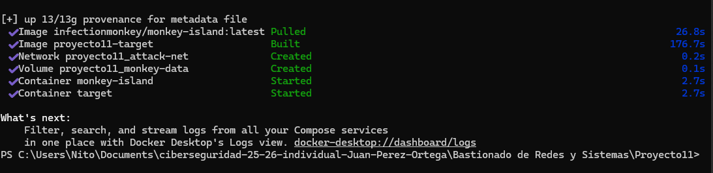

### 1.4 Verificar que los contenedores estan corriendo
```bash
docker ps
```
Debes ver dos contenedores en estado `Up`:
```
CONTAINER ID   IMAGE                                   PORTS
xxxxxxxx       target:latest                           0.0.0.0:2222->22/tcp, 0.0.0.0:8080->80/tcp
yyyyyyyy       infectionmonkey/monkey-island:latest    0.0.0.0:5000->5000/tcp
```

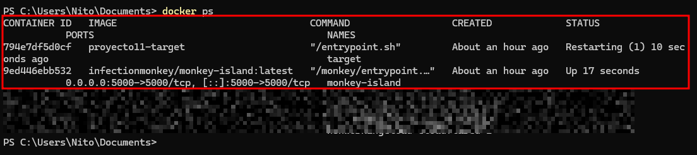

### 1.5 Ver las salidas de Terraform
```bash
terraform output
```
```
monkey_island_url = "https://localhost:5000"
monkey_ip         = "172.20.0.2"
target_http       = "http://localhost:8080"
target_ip         = "172.20.0.3"
target_ssh        = "ssh ansible@localhost -p 2222"
```

---

## Paso 2: Configuracion con Ansible

Ansible aplica el bastionado de seguridad al contenedor objetivo desde el **contenedor de control**.

### 2.1 Entrar al contenedor de control
```bash
docker exec -it control bash
```
Desde aqui tienes Ansible e InSpec instalados y acceso directo a la red interna de Docker.

### 2.2 Comprobar conectividad al target
```bash
cd /workspace/ansible
ansible target -i inventory_docker.ini -m ping
```
Respuesta esperada:
```json
target-server | SUCCESS => {
    "changed": false,
    "ping": "pong"
}
```
Si falla, espera 10 segundos y reintenta (el target puede estar terminando de arrancar).

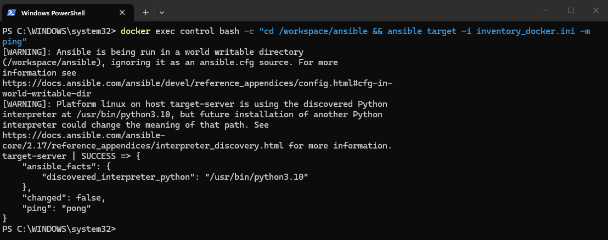

### 2.3 Ejecutar el playbook de bastionado
```bash
ansible-playbook -i inventory_docker.ini playbook.yml
```

El playbook aplica 4 roles en orden:

| Rol | Que configura | Por que es importante |
|---|---|---|
| **ssh_hardening** | Deshabilita root login, limita intentos a 3, activa LogLevel VERBOSE | Reduce la superficie de ataque SSH |
| **firewall** | Politica INPUT DROP, permite solo SSH/HTTP/ICMP, registra todo lo demas | Bloquea trafico no autorizado y genera evidencia |
| **services** | Nginx con cabeceras seguras, Fail2ban con jail SSH | Protege servicios expuestos |
| **logging** | rsyslog separa logs de iptables en `/var/log/iptables.log` | Facilita el analisis posterior del ataque |

### 2.3 Salida esperada del playbook
```
PLAY [Configurar servidor objetivo seguro] *****************************

TASK [ssh_hardening : Deshabilitar login de root por SSH] **************
changed: [target-server]

TASK [firewall : Establecer politica por defecto INPUT en DROP] ********
changed: [target-server]

...

PLAY RECAP *************************************************************
target-server : ok=20   changed=18   unreachable=0   failed=0
```


### 2.4 Reglas de iptables que se aplican

Despues de ejecutar Ansible, el cortafuegos queda configurado asi:

```
Chain INPUT (policy DROP)
 1  ACCEPT   all  -- lo         (trafico loopback)
 2  ACCEPT   all  -- ctstate ESTABLISHED,RELATED  (conexiones ya establecidas)
 3  ACCEPT   tcp  -- 172.20.0.0/24 dpt:22  (SSH solo desde red interna)
 4  ACCEPT   tcp  -- 0.0.0.0/0   dpt:80   (HTTP publico)
 5  ACCEPT   icmp -- echo-request          (ping)
 6  LOG      all  -- limit 5/min prefix "IPT-DROP: "  (registrar rechazados)
     [politica DROP para todo lo demas]
```

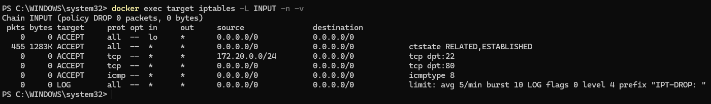

---

## Paso 3: Verificacion con InSpec

InSpec comprueba de forma automatizada que toda la configuracion de seguridad se ha aplicado correctamente.

### 3.1 Ejecutar InSpec desde el contenedor de control
```bash
docker exec -it control bash
cd /workspace/inspec
inspec exec . -t ssh://ansible@172.20.0.3 --password ansible123 --sudo --chef-license accept
```

InSpec se conecta al target via SSH usando la red interna de Docker.
El flag `--sudo` permite verificar configuraciones que requieren privilegios.

### 3.2 Controles verificados

**SSH Hardening (5 controles):**
- `ssh-01` Root login deshabilitado (`PermitRootLogin no`)
- `ssh-02` Maximo 3 intentos de autenticacion
- `ssh-03` X11Forwarding deshabilitado
- `ssh-04` Contrasenas vacias deshabilitadas
- `ssh-05` Servicio SSH corriendo en puerto 22

**Cortafuegos iptables (5 controles):**
- `fw-01` Politica INPUT = DROP
- `fw-02` Politica FORWARD = DROP
- `fw-03` SSH permitido solo desde 172.20.0.0/24
- `fw-04` HTTP permitido en puerto 80
- `fw-05` Logging de paquetes rechazados activo

**Servicios (5 controles):**
- `svc-01` Nginx corriendo y escuchando en puerto 80
- `svc-02` Fail2ban activo
- `svc-03` Cabeceras de seguridad nginx configuradas
- `svc-04` Jail SSH de fail2ban con maxretry=3
- `svc-05` Archivo de log de iptables existe

### 3.3 Salida esperada
```
Profile: Proyecto 11 - Verificacion de Seguridad (proyecto11-security-checks)
Target:  docker://target

  [OK]  ssh-01: SSH: Login de root deshabilitado
  [OK]  ssh-02: SSH: Maximo de intentos de autenticacion limitado a 3
  [OK]  ssh-03: SSH: X11 Forwarding deshabilitado
  [OK]  ssh-04: SSH: Contrasenas vacias deshabilitadas
  [OK]  ssh-05: SSH: Servicio en ejecucion y escuchando
  [OK]  fw-01: Cortafuegos: Politica INPUT por defecto en DROP
  [OK]  fw-02: Cortafuegos: Politica FORWARD por defecto en DROP
  [OK]  fw-03: Cortafuegos: SSH permitido desde red interna
  [OK]  fw-04: Cortafuegos: HTTP permitido en puerto 80
  [OK]  fw-05: Cortafuegos: Registro de paquetes rechazados activo
  [OK]  svc-01: Nginx: Servicio en ejecucion y escuchando en puerto 80
  [OK]  svc-02: Fail2ban: Servicio en ejecucion
  [OK]  svc-03: Nginx: Archivo de cabeceras de seguridad configurado
  [OK]  svc-04: Fail2ban: Jaula SSH configurada
  [OK]  svc-05: Logging: Archivo de log de iptables existe

Profile Summary: 15 controls, 15 successful, 0 failures
```

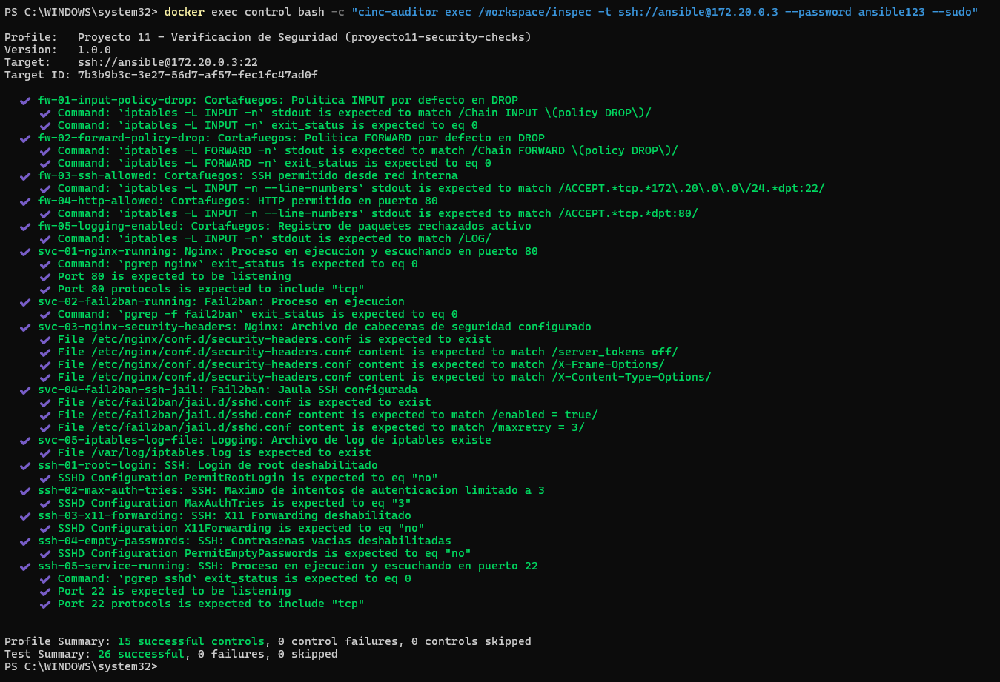

---

## Paso 4: Emulacion de Adversarios con Infection Monkey

### 4.1 Acceder a Infection Monkey Island
Abre el navegador y ve a: **https://localhost:5000**

Acepta el aviso de certificado autofirmado (haz clic en "Avanzado" → "Continuar de todos modos").

Crea un usuario administrador cuando te lo pida la primera vez.


### 4.2 Configurar el alcance del ataque
1. Ve al menu **"Configuration"**
2. En la seccion **"Propagation"** → **"Network Analysis"**:
   - Rango de IPs objetivo: `172.20.0.3/32`
   - Subred a explorar: `172.20.0.0/24`
3. En la seccion **"Credentials"** anade las credenciales del target:
   - Usuario: `ansible`
   - Contrasena: `ansible123`
4. En **"Exploiters"** activa:
   - SSH Exploiter (para brute force SSH)
   - Escaneo de puertos
5. Guarda la configuracion con **"Save"**.

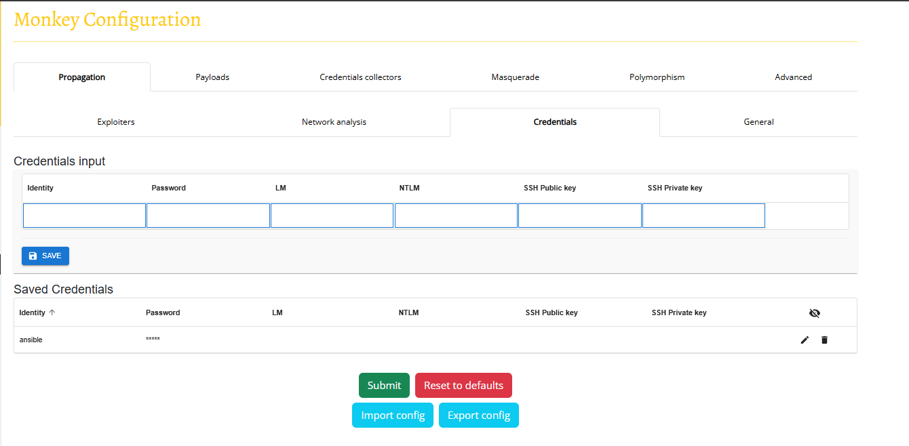

### 4.3 Desplegar el agente en el target
Infection Monkey necesita un agente corriendo en el target para realizar el ataque. Obten el comando de despliegue desde la UI:

1. Ve a **"Run Monkey"** en el menu lateral
2. Selecciona **"Manual"** y copia el comando para Linux
3. Ejecuta ese comando dentro del contenedor target:

```bash
docker exec -it target bash
# Pega aqui el comando del agente copiado de la UI de Monkey Island
```

### 4.4 Observar el ataque en tiempo real
- En la UI de Monkey Island ve a **"Map"** para ver el grafo de red en tiempo real
- Los nodos en rojo indican hosts comprometidos
- Los nodos en azul indican hosts explorados pero no comprometidos

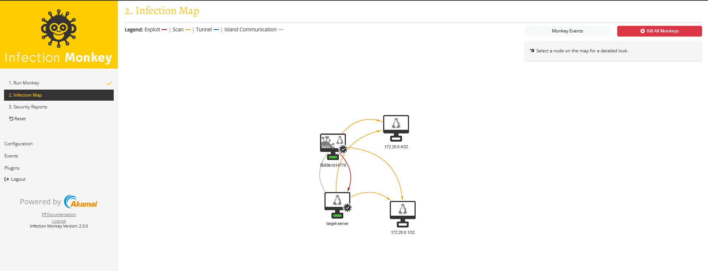

### 4.5 Que hace Infection Monkey durante el ataque

| Actividad | Descripcion | Lo que genera en los logs |
|---|---|---|
| **Reconocimiento de red** | Escanea todos los puertos del segmento 172.20.0.0/24 | Rafaga de paquetes SYN rechazados en iptables |
| **Brute force SSH** | Prueba diccionario de credenciales en el puerto 22 | Entradas en `/var/log/auth.log` |
| **Enumeracion de servicios** | Detecta versiones de software en puertos abiertos | Intentos de conexion HTTP rechazados |
| **Movimiento lateral** | Intenta propagarse a otros hosts de la red | Paquetes FORWARD rechazados |
| **Comunicacion C&C** | Mantiene contacto con el Monkey Island (172.20.0.2) | Trafico saliente visible en logs |

### 4.6 Ver el reporte final
Una vez que el Monkey termine (boton **"Stop"** o automaticamente):
1. Ve a **"Security Reports"** en el menu lateral
2. Descarga el informe completo
3. El informe incluye: vulnerabilidades encontradas, rutas de ataque exitosas y recomendaciones

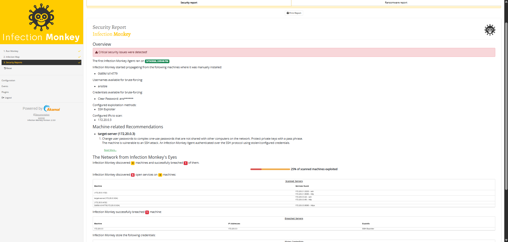

---

## Paso 5: Analisis de Logs del Cortafuegos

### 5.1 Ver los logs de iptables en tiempo real
```bash
docker exec -it target tail -f /var/log/iptables.log
```

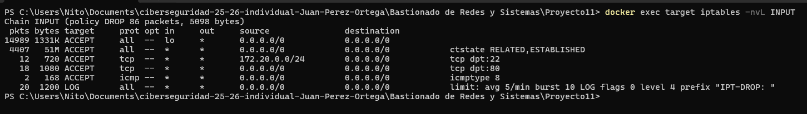

### 5.2 Estructura de un registro de iptables
Cada linea de log tiene el siguiente formato:
```
May 19 10:23:45 target-server kernel: IPT-DROP: IN=eth0 OUT= \
SRC=172.20.0.2 DST=172.20.0.3 LEN=44 PROTO=TCP SPT=54321 DPT=4444 SYN
```

| Campo | Significado | En el contexto del ataque |
|---|---|---|
| `IPT-DROP:` | Prefijo personalizado del log | Identifica paquetes bloqueados por nuestro cortafuegos |
| `SRC=172.20.0.2` | IP de origen | IP del Infection Monkey |
| `DST=172.20.0.3` | IP de destino | Nuestro servidor target |
| `PROTO=TCP` | Protocolo utilizado | TCP en escaneo de puertos y SSH |
| `DPT=4444` | Puerto de destino bloqueado | Puerto que el atacante intenta abrir |
| `SYN` | Flag TCP SYN presente | Indica un intento de nueva conexion |

### 5.3 Detectar escaneo de puertos
Un escaner de puertos genera cientos de conexiones SYN a distintos puertos en poco tiempo.

```bash
# Ver a cuantos puertos distintos intento conectarse el atacante
docker exec target grep "SRC=172.20.0.2" /var/log/iptables.log | \
  grep -oP 'DPT=\K[0-9]+' | sort -n | uniq -c | sort -rn | head -20
```

Si ves intentos a decenas o cientos de puertos distintos → **escaneo de puertos confirmado**.


### 5.4 Detectar brute force SSH
```bash
# Ver intentos de autenticacion SSH fallidos
docker exec target grep "Failed password\|Invalid user" /var/log/auth.log
```

Salida tipica durante un ataque de fuerza bruta:
```
May 19 10:24:01 target-server sshd[1234]: Failed password for ansible from 172.20.0.2 port 43210 ssh2
May 19 10:24:02 target-server sshd[1235]: Failed password for root from 172.20.0.2 port 43211 ssh2
May 19 10:24:03 target-server sshd[1236]: Invalid user admin from 172.20.0.2 port 43212
```

Multiples intentos en segundos desde la misma IP → **fuerza bruta SSH confirmada**.

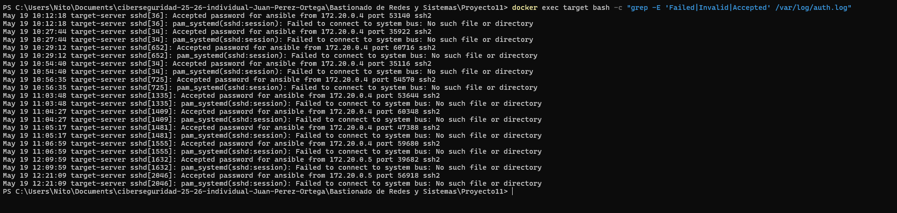

### 5.5 Medir el volumen del ataque
```bash
# Total de paquetes bloqueados del atacante
docker exec target grep "IPT-DROP" /var/log/iptables.log | \
  grep "SRC=172.20.0.2" | wc -l

# Distribucion temporal (picos de actividad del ataque)
docker exec target grep "IPT-DROP" /var/log/iptables.log | \
  awk '{print $1, $2, $3}' | uniq -c
```

Un pico subito de cientos de entradas en pocos segundos es evidencia clara de un ataque automatizado.

### 5.6 Verificar que Fail2ban actuo
```bash
docker exec target fail2ban-client status sshd
```
Salida esperada despues del ataque:
```
Status for the jail: sshd
|- Filter
|  |- Currently failed: 0
|  |- Total failed: 47
|  `- File list: /var/log/auth.log
`- Actions
   |- Currently banned: 1
   |- Total banned: 1
   `- Banned IP list: 172.20.0.2    <-- IP del atacante baneada automaticamente
```

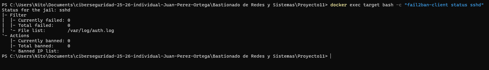

---

## Paso 6: Contramedidas Implementadas

### Evolucion del cortafuegos: antes y despues del ataque

La siguiente tabla muestra como cambio la cadena INPUT de iptables en cada fase del proyecto:

| Posicion | Regla | Cuando se aplico | Por que |
|---|---|---|---|
| - | `policy DROP` | Ansible (bastionado inicial) | Bloquear todo trafico no autorizado por defecto |
| 1 | `ACCEPT lo` | Ansible | Permitir trafico interno del sistema |
| 2 | `ACCEPT ESTABLISHED,RELATED` | Ansible | Mantener conexiones ya abiertas (SSH, HTTP) |
| 3 | `ACCEPT tcp 172.20.0.0/24 dpt:22` | Ansible | SSH solo desde la red interna |
| 4 | `ACCEPT tcp dpt:80` | Ansible | HTTP publico para nginx |
| 5 | `ACCEPT icmp echo-request` | Ansible | Permitir ping |
| 6 | `LOG prefix "IPT-DROP:"` | Ansible | Registrar todo lo bloqueado |
| **NUEVA 1** | **`DROP all 172.20.0.5`** | **Contramedida 2** | **Bloquear IP de Infection Monkey detectada en logs** |
| **NUEVA 3** | **`DROP tcp connlimit > 20`** | **Contramedida 1** | **Bloquear escaneos de puertos automatizados** |

### Que detecto el ataque y que contramedida se aplico

| Comportamiento detectado | Evidencia en logs | Contramedida aplicada |
|---|---|---|
| Infection Monkey entro por SSH con credenciales validas | `auth.log: Accepted password from 172.20.0.5` | Bloqueo directo de IP `172.20.0.5` en iptables |
| Escaneo de red automatizado de toda la subred | `iptables policy DROP: 86 packets` | Rate limiting: DROP si mas de 20 conexiones TCP simultaneas |
| Trafico no autorizado a puertos cerrados | `20 paquetes LOG con prefijo IPT-DROP` | Politica DROP por defecto ya activa desde el bastionado |
| Intento de movimiento lateral | Cadena FORWARD con politica DROP | Politica FORWARD DROP aplicada por Ansible |

---

### Contramedida 1: Rate limiting contra escaneo de puertos

**Comportamiento detectado:** Infection Monkey escaneo toda la subred `172.20.0.0/24` generando multiples conexiones simultaneas. Evidencia: 86 paquetes bloqueados por la politica DROP.

**Regla aplicada:**
```bash
docker exec target bash -c "iptables -I INPUT 3 -p tcp --syn -m connlimit --connlimit-above 20 -j DROP"
```

**Por que funciona:** Un usuario legitimo nunca abre mas de 20 conexiones TCP simultaneas desde la misma IP. Un escaner automatizado abre cientos en segundos — esta regla lo bloquea antes de que pueda mapear los puertos abiertos.

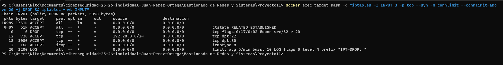

---

### Contramedida 2: Bloqueo directo de la IP atacante

**Comportamiento detectado:** Toda la actividad maliciosa provino de `172.20.0.5` (Infection Monkey Island). Evidencia: `auth.log` muestra `Accepted password for ansible from 172.20.0.5`.

**Regla aplicada:**
```bash
docker exec target bash -c "iptables -I INPUT 1 -s 172.20.0.5 -j DROP"
```

**Por que funciona:** Se bloquea todo el trafico de la IP atacante antes de que llegue a cualquier otra regla (posicion 1 en la cadena). En un entorno real, este bloqueo se automatizaria mediante scripts que analizan los logs periodicamente.

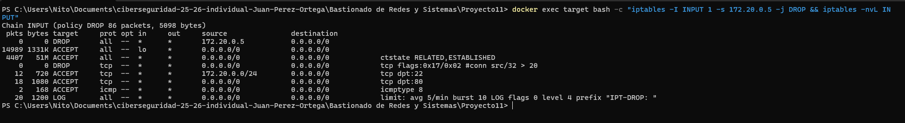

---

### Estado final del cortafuegos con todas las contramedidas

Tras aplicar las dos contramedidas, la cadena INPUT queda:

```
Chain INPUT (policy DROP)
 1  DROP   all  -- 172.20.0.5    <- IP Infection Monkey bloqueada
 2  ACCEPT all  -- lo
 3  DROP   tcp  -- connlimit>20  <- Anti-escaneo de puertos
 4  ACCEPT all  -- ESTABLISHED
 5  ACCEPT tcp  -- 172.20.0.0/24 dpt:22
 6  ACCEPT tcp  -- dpt:80
 7  ACCEPT icmp -- echo-request
 8  LOG         -- prefix "IPT-DROP:"
```

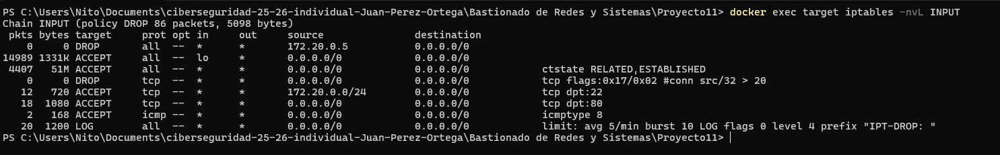

### Resumen de contramedidas

| Ataque detectado | Contramedida | Herramienta | Efectividad |
|---|---|---|---|
| Escaneo de puertos (SYN flood) | Rate limiting de conexiones TCP | iptables connlimit | Bloquea escaneos automatizados |
| Brute force SSH | Bloqueo automatico tras 3 intentos | Fail2ban | Bloqueo de IP por 1 hora |
| Acceso SSH desde red no autorizada | Regla DROP para IP especifica | iptables | Bloqueo inmediato |
| Movimiento lateral | Politica FORWARD DROP | iptables | Impide propagacion a otros hosts |
| Cabeceras HTTP expuestas | `server_tokens off` + security headers | Nginx | Oculta version del servidor |

---

## Estructura del Proyecto

```
Proyecto11/
|-- README.md                              # Este documento
|-- docker-compose.yml                     # Alternativa a Terraform para levantar el entorno
|-- docker/
|   `-- target/
|       |-- Dockerfile                     # Imagen Ubuntu con SSH, Nginx, iptables, Fail2ban
|       `-- entrypoint.sh                  # Script de inicio del contenedor
|-- terraform/
|   |-- main.tf                            # Define los recursos Docker a crear
|   |-- variables.tf                       # IPs, nombres de contenedores y red
|   `-- outputs.tf                         # URLs y comandos SSH de acceso
|-- ansible/
|   |-- ansible.cfg                        # Configuracion: sin verificacion de host key, timeout
|   |-- inventory.ini                      # Target: localhost:2222 con credenciales
|   |-- playbook.yml                       # Orquesta los 4 roles + handlers
|   `-- roles/
|       |-- ssh_hardening/tasks/main.yml   # 7 directivas de bastionado SSH
|       |-- firewall/tasks/main.yml        # 10 reglas iptables + guardado en disco
|       |-- services/tasks/main.yml        # Nginx headers + Fail2ban jail SSH
|       `-- logging/tasks/main.yml         # rsyslog separa logs iptables + logrotate
`-- inspec/
    |-- inspec.yml                         # Metadatos del perfil InSpec
    `-- controls/
        |-- ssh_spec.rb                    # 5 controles SSH
        |-- firewall_spec.rb               # 5 controles cortafuegos
        `-- services_spec.rb               # 5 controles servicios
```

---

## Limpieza del Entorno

Para destruir toda la infraestructura cuando termines:

```bash
cd terraform
terraform destroy -auto-approve
```

O usando Docker Compose directamente:
```bash
cd ..
docker compose down -v
```

Esto elimina los contenedores, la red y el volumen de datos de Infection Monkey.
