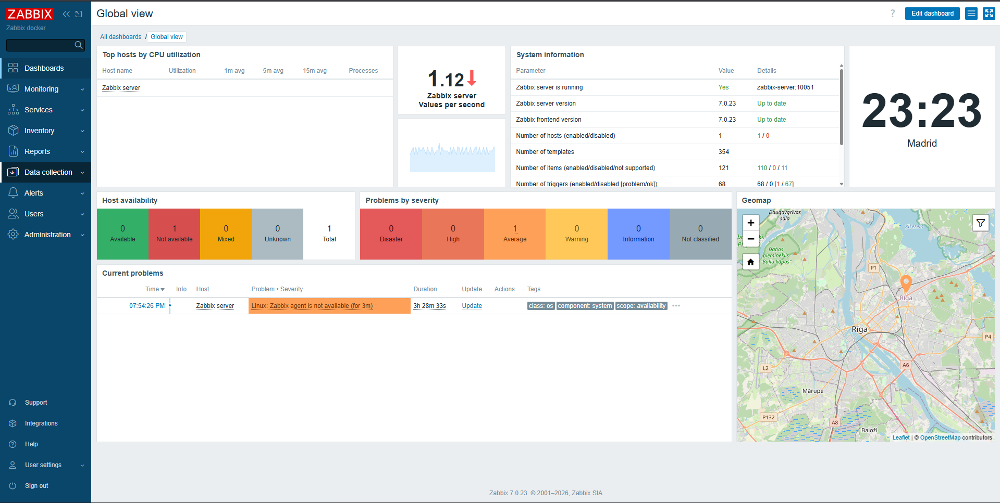
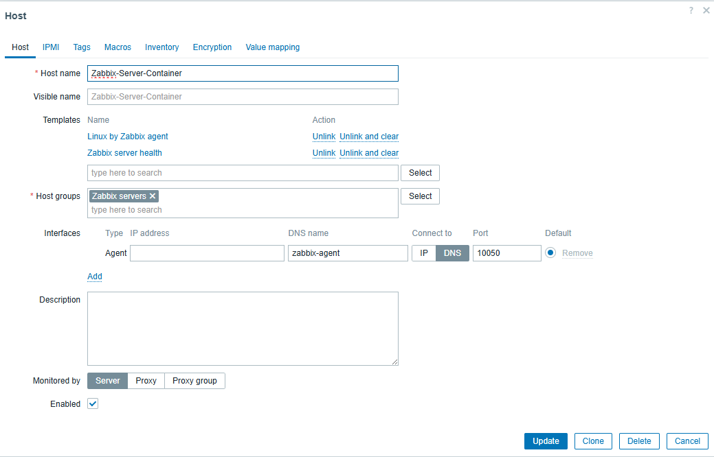
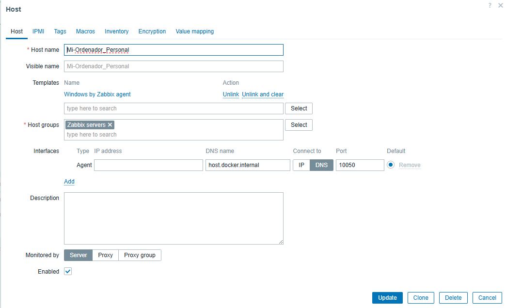
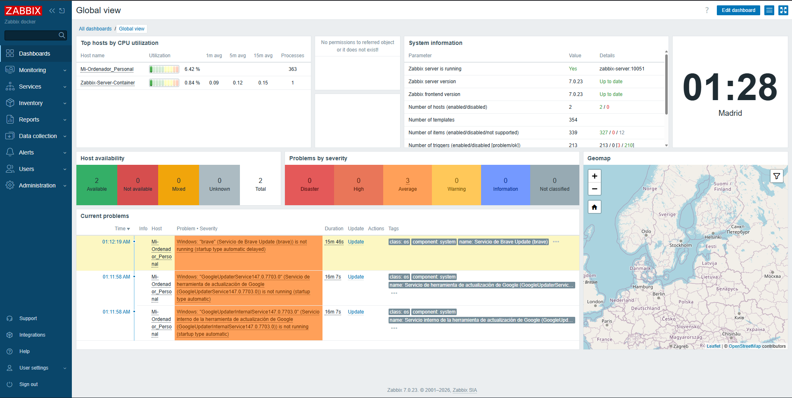
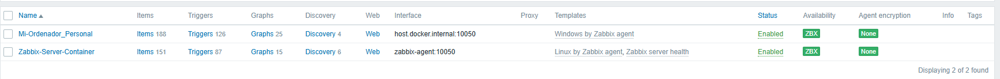
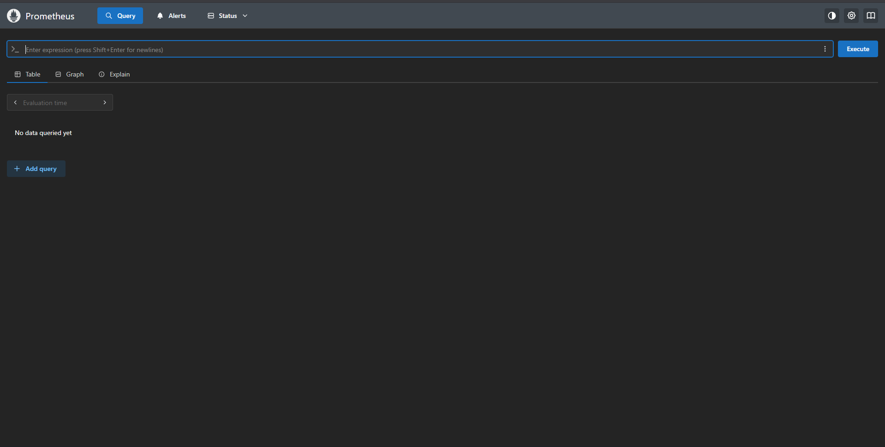
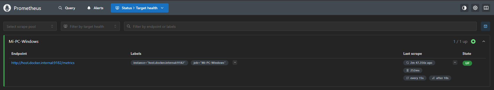

# Proyecto 6: Un dashboard imprescindible en el SOC
**Asignatura:** Bastionado de Redes y Sistemas
**Herramientas seleccionadas:** Zabbix & Prometheus
**Entorno de despliegue:** Docker Containers

--- 

## 1. Introducción a los Entornos.

Para esta comparativa, se han seleccionado dos de las herramientas más potentes y utilizadas en la industria actual, ambas desplegadas sobre contenedores Docker para garantizar portabilidad y eficiencia.


### **Zabbix (El Enfoque Integral)**

Está diseñado para monitorizar y registrar el estado de varios servicios de red, Servidores, y hardware de red.

* **Arquitectura**: Basada en servidor central con base de datos relacional.

* **Método**: Utiliza agentes, SNMP y chequeos sin agente.

### **Prometheus (El Enfoque Cloud-Native)**

Prometheus es un sistema de monitoreo y alerta de código abierto originalmente construido por SoundCloud. Es la herramienta estándar para entornos de microservicios y Kubernetes.

* **Arquitectura:** Basada en el almacenamiento de series temporales (TSDB).

* **Método:** Modelo "Pull" mediante la exposición de métricas en puntos finales HTTP.

---

## 2. Comparativa Técnica de Características 

A continuación, se comparan 7 características clave para determinar las capacidades de cada sistema:

| Característica | Zabbix (v6.4+) | Prometheus (v2.x) |
| :--- | :--- | :--- |
| **Arquitectura de Datos** | Relacional (Basada en MySQL/PostgreSQL). | Basada en Series Temporales (TSDB). |
| **Modelo de Captura** | Principalmente **Push** (Agente envía datos). | Principalmente **Pull** (Servidor pide datos). |
| **Configuración** | Interfaz Gráfica (GUI) integrada. | Archivos de configuración YAML. |
| **Visualización** | Gráficos, Mapas y Dashboards nativos. | Básica (requiere Grafana para dashboards). |
| **Gestión de Alertas** | Integrada (Acciones, Media Types). | Externa (requiere Alertmanager). |
| **Monitoreo de Red** | Soporte nativo robusto para SNMP e IPMI. | Requiere "SNMP Exporter" adicional. |
| **Detección Automática** | Network Discovery y Auto-registration. | Service Discovery (DNS, Kubernetes, EC2). |

---

## 3. Instalación y configuración de **Zabbix**

La instalación se realizó mediante una infraestructura de microservicios definida en el siguiente archivo docker-compose.yml:

```bash

version: '3.5'

services:
  postgres-server:
    image: postgres:16-alpine
    container_name: postgres-server
    restart: unless-stopped
    environment:
      - POSTGRES_PASSWORD=zabbix
      - POSTGRES_USER=zabbix
      - POSTGRES_DB=zabbix
    volumes:
      - ./zbx_env/var/lib/postgresql/data:/var/lib/postgresql/data:rw
    healthcheck:
      test: [ "CMD-SHELL", "pg_isready -U zabbix" ]
      interval: 10s
      timeout: 5s
      retries: 5

  zabbix-server:
    image: zabbix/zabbix-server-pgsql:alpine-7.0-latest
    container_name: zabbix-server
    restart: unless-stopped
    depends_on:
      postgres-server:
        condition: service_healthy
    ports:
      - "10051:10051"
    environment:
      - POSTGRES_USER=zabbix
      - POSTGRES_PASSWORD=zabbix
      - POSTGRES_DB=zabbix
      - ZBX_DEBUGLEVEL=3

  zabbix-web:
    image: zabbix/zabbix-web-nginx-pgsql:alpine-7.0-latest
    container_name: zabbix-web
    restart: unless-stopped
    depends_on:
      - zabbix-server
    ports:
      - "8080:8080"
    environment:
      - POSTGRES_USER=zabbix
      - POSTGRES_PASSWORD=zabbix
      - POSTGRES_DB=zabbix
      - ZBX_SERVER_HOST=zabbix-server
      - PHP_TZ=Europe/Madrid

  zabbix-agent:
    image: zabbix/zabbix-agent2:alpine-7.0-latest
    container_name: zabbix-agent
    restart: unless-stopped
    depends_on:
      - zabbix-server
    environment:
      - ZBX_SERVER_HOST=zabbix-server

```



---

### 2.2. Configuración de Dispositivos (Hosts)

A continuación, se detallan los parámetros configurados en la interfaz de Zabbix:

#### Host 1: Servidor Zabbix (Contenedor)

**Configuración:** Se definió el nombre Zabbix-Server-Container.

**Interfaz:** Se utiliza la DNS zabbix-agent en el puerto 10050 para que el servidor se monitorice a sí mismo dentro de la red de Docker.

**Plantilla:** Se aplicaron las plantillas "Linux by Zabbix agent" y "Zabbix server health".



#### Host 2: Ordenador Personal (Host Windows)

**Configuración:** Se registró como Mi-Ordenador_Personal.

**Interfaz:** Se configuró la DNS host.docker.internal para permitir que el contenedor se comunique con el agente instalado en el Windows físico.

**Puerto:** Se estableció el puerto estándar del agente 10050.



---

### 2.3. Resultados en el Dashboard

La configuración fue exitosa, tal como muestra la vista global:

**Problemas detectados:** El sistema identificó inmediatamente servicios detenidos en el PC personal, como los servicios de actualización de Brave y Google.



**Disponibilidad:** Ambos hosts aparecen con el icono ZBX en verde, confirmando la conexión.



---
---

## 3. Instalación y Configuración de Prometheus

### 3.1. Infraestructura como Código (YAML)

Prometheus se desplegó bajo el mismo principio de contenedorización. A continuación, los archivos utilizados:

*Archivo docker-compose.yml de Prometheus:*

```bash

version: '3.8'
services:
  prometheus:
    image: prom/prometheus:latest
    container_name: prometheus
    ports:
      - "9090:9090"
    volumes:
      - ./prometheus.yml:/etc/prometheus/prometheus.yml
      - prometheus-data:/prometheus
    command:
      - '--config.file=/etc/prometheus/prometheus.yml'
      - '--storage.tsdb.retention.time=15d'
    restart: unless-stopped

volumes:
  prometheus-data:

```

*Archivo prometheus.yml de configuración:*

```bash

global:
  scrape_interval: 15s

scrape_configs:
  - job_name: 'prometheus'
    static_configs:
      - targets: ['localhost:9090']

  - job_name: 'Mi-PC-Windows'
    static_configs:
      - targets: ['host.docker.internal:9182']

```


### 3.2. Gestión de Errores y Verificación

Aqui como podemos ver la interfaz gráfica de Prometheus:



Verificación final de Target Health. Se observa el host en estado UP, confirmando que Prometheus está recolectando métricas del ordenador personal con éxito.



---

## 4. Conclusiones

La implementación de ambos sistemas permitió monitorizar con éxito dos entornos (Linux/Contenedor y Windows/Físico). Zabbix resultó más eficiente para el control de servicios y alertas visuales, mientras que Prometheus destacó por su rapidez de despliegue y potencia en la recolección de métricas numéricas.