# PROYECTO WAZUH
## Instalación Wazuh Server Completo

---

## 🏗️ ARQUITECTURA

```
SERVIDOR 192.168.1.96
├── Wazuh Manager (1514/1515/55000)
├── Wazuh Indexer (9200/9300)
├── Filebeat (interno)
└── Wazuh Dashboard (443) ← https://192.168.1.96

CLIENTE 192.168.1.97 (FASE 3)
└── Wazuh Agent ← Se conecta al Manager
```

---

## FASE 1: PREPARACIÓN DEL ENTORNO

### Servidor (192.168.1.96)

```bash
# Sistema operativo
uname -a
# Linux wazuhserver 6.8.0-31-generic #31-Ubuntu SMP
# Ubuntu 24.04.4 LTS x86_64

# Actualizar sistema
sudo apt update && sudo apt upgrade -y && sudo apt autoremove -y

# Instalar dependencias
sudo apt install -y curl wget vim net-tools git unzip gnupg \
  apt-transport-https software-properties-common ca-certificates lsb-release

# Instalar Java 11 (requerido)
sudo apt install -y openjdk-11-jdk-headless
java -version
# openjdk version "11.0.30" 2024-01-16 LTS

# Sincronizar hora (NTP)
sudo timedatectl set-timezone UTC
timedatectl status
# System clock synchronized: yes ✓
```

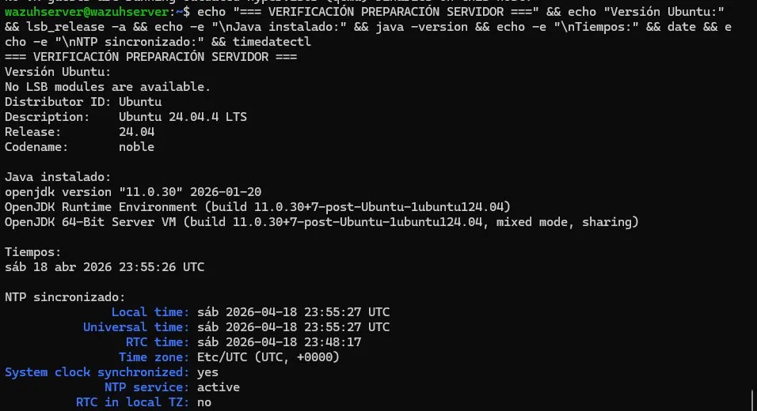

---

### Cliente (192.168.1.97)

```bash
# Actualizar sistema
sudo apt update && sudo apt upgrade -y

# Instalar dependencias básicas
sudo apt install -y curl wget net-tools ca-certificates

# Sincronizar hora (España)
sudo timedatectl set-timezone Europe/Madrid
timedatectl status
# Time zone: Europe/Madrid (CEST, +0200)
# System clock synchronized: yes ✓
```

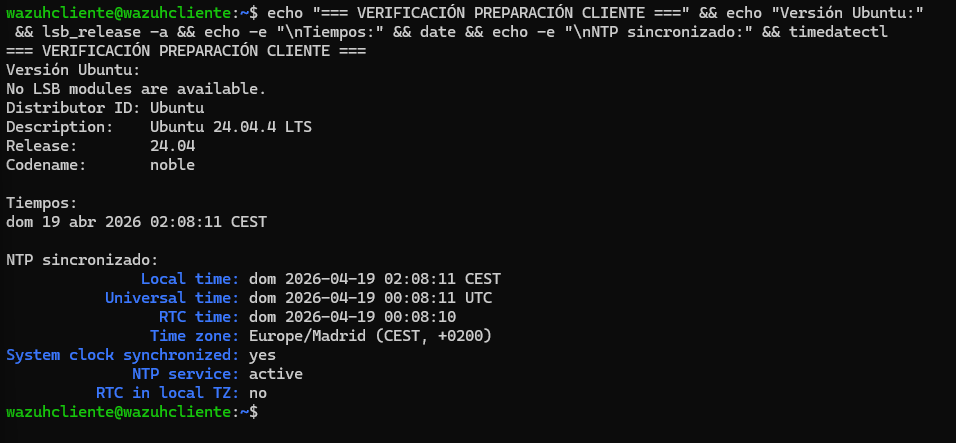

---

### Validar Conectividad

```bash
# Desde servidor a cliente
ping -c 4 192.168.1.97
# 4 packets transmitted, 4 received, 0% packet loss ✓

# Validar acceso a repositorios
curl -I https://packages.wazuh.com
# HTTP/1.1 200 OK ✓
```

---

## FASE 2: INSTALACIÓN WAZUH SERVER

### Paso 1: Generar Certificados SSL/TLS

```bash
# Crear directorio de trabajo
mkdir -p /home/wazuh-certificates-tool
cd /home/wazuh-certificates-tool

# Descargar herramienta
curl -sO https://packages.wazuh.com/4.14/wazuh-certs-tool.sh
chmod +x wazuh-certs-tool.sh

# Crear config.yml
cat > config.yml <<'EOF'
cert_manager.default_days: 3650
nodes:
  indexer:
    - name: node-1
      ip: 192.168.1.96
  server:
    - name: wazuh-server
      ip: 192.168.1.96
  dashboard:
    - name: dashboard
      ip: 192.168.1.96
EOF

# Generar CA
bash wazuh-certs-tool.sh -ca
# ✓ Autoridad certificadora creada

# Generar certificados para todos los nodos
rm -rf wazuh-certificates
bash wazuh-certs-tool.sh -A
# ✓ 10 certificados generados (validez 3650 días)
```

---

### Paso 2: Configurar Repositorio Wazuh

```bash
# Importar GPG key
curl -s https://packages.wazuh.com/key/GPG-KEY-WAZUH | sudo apt-key add -

# Agregar repositorio
echo "deb https://packages.wazuh.com/4.x/apt/ stable main" | \
  sudo tee /etc/apt/sources.list.d/wazuh.list

# Actualizar índice
sudo apt update
```

---

### Paso 3: Instalar Wazuh Indexer

```bash
# Instalar paquete
sudo apt install -y wazuh-indexer

# Crear directorio de certificados
sudo mkdir -p /etc/wazuh-indexer/certs/

# Copiar certificados
sudo cp /home/wazuh-certificates-tool/wazuh-certificates/node-1.pem \
        /etc/wazuh-indexer/certs/indexer.pem
sudo cp /home/wazuh-certificates-tool/wazuh-certificates/node-1-key.pem \
        /etc/wazuh-indexer/certs/indexer-key.pem
sudo cp /home/wazuh-certificates-tool/wazuh-certificates/root-ca.pem \
        /etc/wazuh-indexer/certs/
sudo cp /home/wazuh-certificates-tool/wazuh-certificates/admin.pem \
        /etc/wazuh-indexer/certs/
sudo cp /home/wazuh-certificates-tool/wazuh-certificates/admin-key.pem \
        /etc/wazuh-indexer/certs/

# Fijar permisos
sudo chown -R wazuh-indexer:wazuh-indexer /etc/wazuh-indexer/certs/
sudo chmod -R 500 /etc/wazuh-indexer/certs/

# Iniciar servicio
sudo systemctl daemon-reload
sudo systemctl enable wazuh-indexer
sudo systemctl start wazuh-indexer
sleep 20

# Inicializar seguridad del Indexer
sudo JAVA_HOME="/usr/share/wazuh-indexer/jdk" \
runuser wazuh-indexer --shell="/bin/bash" \
--command="/usr/share/wazuh-indexer/plugins/opensearch-security/tools/securityadmin.sh \
-cd /etc/wazuh-indexer/opensearch-security \
-cacert /etc/wazuh-indexer/certs/root-ca.pem \
-cert /etc/wazuh-indexer/certs/admin.pem \
-key /etc/wazuh-indexer/certs/admin-key.pem \
-h 127.0.0.1 -p 9200 -icl -nhnv"
# ✓ SUCC: Expected 10 config types... Done with success

# Reiniciar Indexer
sudo systemctl restart wazuh-indexer
sleep 15

# Verificar salud
curl -k -u admin:HG3v8*HFdHeV54p7htIjjVUtpZ4SYHj3 \
  https://127.0.0.1:9200/_cluster/health?pretty
# "status": "green" ✓
```

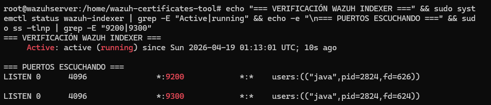

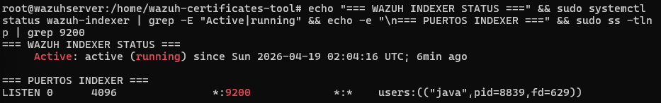

---

### Paso 4: Instalar Wazuh Manager

```bash
# Instalar paquete
sudo apt install -y wazuh-manager

# Iniciar servicio
sudo systemctl daemon-reload
sudo systemctl enable wazuh-manager
sudo systemctl start wazuh-manager
sleep 30

# Verificar estado
sudo systemctl status wazuh-manager | grep Active
# Active: active (running) ✓

# Verificar puertos
sudo ss -tlnp | grep -E ':(1514|1515|55000)'
# 1514 wazuh-remoted ✓
# 1515 wazuh-authd ✓
# 55000 python3 (API) ✓
```

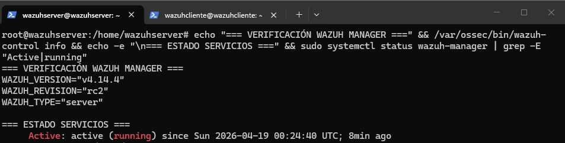

---

### Paso 5: Instalar Filebeat

```bash
# Instalar paquete
sudo apt install -y filebeat

# Descargar configuración
sudo curl -so /etc/filebeat/filebeat.yml \
  https://packages.wazuh.com/4.14/tpl/wazuh/filebeat/filebeat.yml

# Almacenar contraseña en keystore
echo "HG3v8*HFdHeV54p7htIjjVUtpZ4SYHj3" | \
  sudo filebeat keystore add password --stdin --force

# Iniciar servicio
sudo systemctl daemon-reload
sudo systemctl enable filebeat
sudo systemctl start filebeat
sleep 10

# Verificar estado
sudo systemctl status filebeat | grep Active
# Active: active (running) ✓
```

---

### Paso 6: Instalar Wazuh Dashboard

```bash
# Instalar paquete
sudo apt install -y wazuh-dashboard

# Crear directorio de certificados
sudo mkdir -p /etc/wazuh-dashboard/certs/

# Copiar certificados
sudo cp /home/wazuh-certificates-tool/wazuh-certificates/dashboard.pem \
        /etc/wazuh-dashboard/certs/
sudo cp /home/wazuh-certificates-tool/wazuh-certificates/dashboard-key.pem \
        /etc/wazuh-dashboard/certs/
sudo cp /home/wazuh-certificates-tool/wazuh-certificates/root-ca.pem \
        /etc/wazuh-dashboard/certs/

# Fijar permisos
sudo chown -R wazuh-dashboard:wazuh-dashboard /etc/wazuh-dashboard/certs/
sudo chmod -R 500 /etc/wazuh-dashboard/certs/

# Almacenar contraseña en keystore
echo "HG3v8*HFdHeV54p7htIjjVUtpZ4SYHj3" | \
  /usr/share/wazuh-dashboard/bin/opensearch-dashboards-keystore \
  --allow-root add -f --stdin opensearch.password

# Iniciar servicio
sudo systemctl daemon-reload
sudo systemctl enable wazuh-dashboard
sudo systemctl start wazuh-dashboard
sleep 45
```

---

## ✅ VERIFICACIÓN FINAL

### Estado de Servicios

```bash
sudo systemctl status wazuh-manager wazuh-indexer wazuh-dashboard | grep Active
# Active: active (running) ✓ (todos los tres)
```

### Puertos Escuchando

```bash
sudo ss -tlnp | grep -E ':(1514|1515|55000|9200|443)'
# 443 node (Dashboard) ✓
# 1514 wazuh-remoted ✓
# 1515 wazuh-authd ✓
# 55000 python3 ✓
# 9200 java (Indexer) ✓
```

### Salud del Indexer

```bash
curl -k -u admin:HG3v8*HFdHeV54p7htIjjVUtpZ4SYHj3 \
  https://127.0.0.1:9200/_cluster/health?pretty

# "status": "green" ✓
# "number_of_nodes": 1 ✓
# "active_shards": 5 ✓
```

### Índices del Indexer

```bash
curl -k -u admin:HG3v8*HFdHeV54p7htIjjVUtpZ4SYHj3 \
  https://127.0.0.1:9200/_cat/indices/

# green open .plugins-ml-config ✓
# green open .opensearch-observability ✓
# green open .opendistro_security ✓
# green open wazuh-monitoring-2026.16w ✓
# green open .kibana_1 ✓
```

### Dashboard Accesible

```bash
curl -k https://127.0.0.1:443/ -I 2>/dev/null | head -3
# HTTP/1.1 302 Found ✓
# location: /app/login? ✓
```

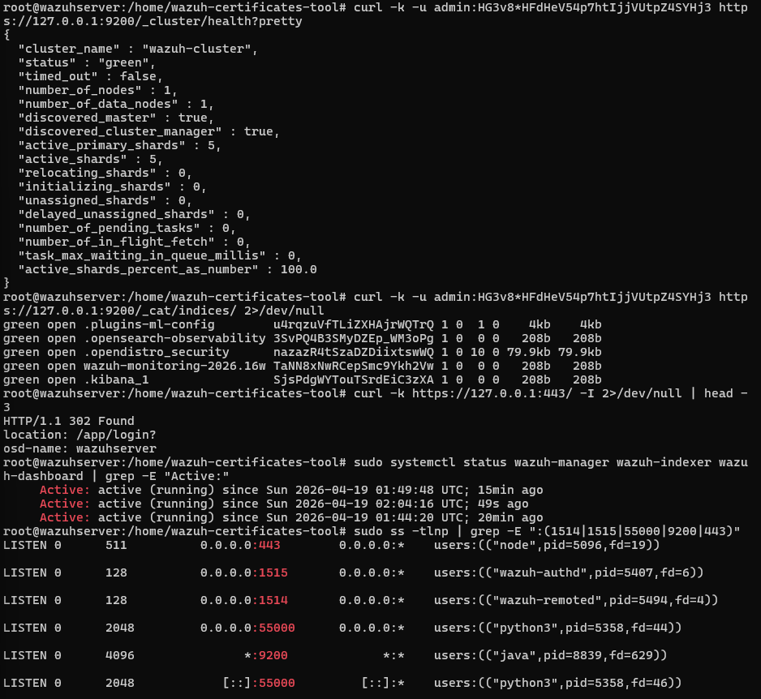

---

## 🌐 ACCESO AL DASHBOARD

### Paso 1: Abrir URL en Navegador

Abrir: `https://192.168.1.96`


### Paso 2: Ingresar Credenciales

```
Usuario: admin
Contraseña: HG3v8*HFdHeV54p7htIjjVUtpZ4SYHj3
```

Hacer clic en **Log in**

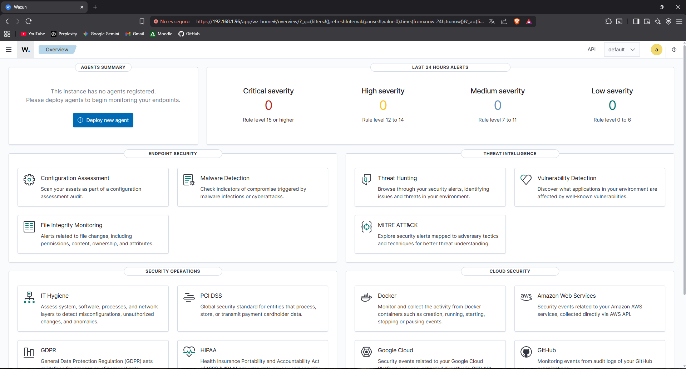

---

# FASE 3
## Instalación y Registro Wazuh Agent en Cliente

**Fecha:** 19 Abril 2026 | **Versión Agent:** 4.14.4 | **Estado:** ✅ Completado

---

## 🎯 OBJETIVO FASE 3

Instalar Wazuh Agent en cliente (192.168.1.97), registrarlo en el Manager (192.168.1.96) y verificar conectividad en el Dashboard.

---

## ENTORNO

| Parámetro | Valor |
|-----------|-------|
| **Cliente Hostname** | wazuhcliente |
| **Cliente IP** | 192.168.1.97 |
| **Manager IP** | 192.168.1.96 |
| **SO Cliente** | Ubuntu 24.04.4 LTS |
| **Versión Agent** | 4.14.4-1 |

---

## Paso 1: Validar Conectividad Cliente → Servidor

```bash
# Probar conectividad al servidor
ping -c 4 192.168.1.96
# 4 packets transmitted, 4 received, 0% packet loss ✓

# Probar puerto 1514 (Manager)
nc -zv 192.168.1.96 1514
# Connection to 192.168.1.96 1514 port [tcp/*] succeeded! ✓
```

---

## Paso 2: Configurar Repositorio Wazuh en Cliente

```bash
# Importar GPG key
curl -s https://packages.wazuh.com/key/GPG-KEY-WAZUH | sudo apt-key add -

# Agregar repositorio
echo "deb https://packages.wazuh.com/4.x/apt/ stable main" | \
  sudo tee /etc/apt/sources.list.d/wazuh.list

# Actualizar índice
sudo apt update
```

---

## Paso 3: Instalar Wazuh Agent

```bash
# Instalar agente con enrollment automático al Manager
sudo WAZUH_MANAGER="192.168.1.96" WAZUH_AGENT_NAME="wazuhcliente" \
  apt install -y wazuh-agent

# Resultado esperado:
# Configurando wazuh-agent (4.14.4-1) ✓
```

---

## Paso 4: Iniciar Wazuh Agent

```bash
# Recargar systemd
sudo systemctl daemon-reload

# Habilitar al inicio
sudo systemctl enable wazuh-agent
# Created symlink .../wazuh-agent.service ✓

# Iniciar servicio
sudo systemctl start wazuh-agent

# Verificar estado
sudo systemctl status wazuh-agent | grep Active
# Active: active (running) ✓
```

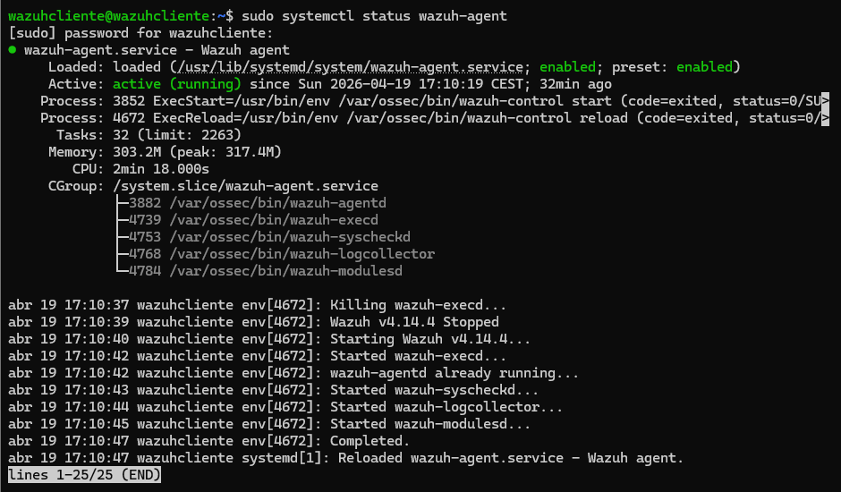

---

## Paso 5: Verificar Logs del Agente

```bash
sudo tail -50 /var/ossec/logs/ossec.log
```

**Resultado esperado:**
```
wazuh-syscheckd: INFO: Monitoring path: '/etc' ✓
sca: INFO: Loaded policy '/var/ossec/ruleset/sca/cis_ubuntu24-04.yml' ✓
sca: INFO: Security Configuration Assessment scan finished ✓
wazuh-agentd: INFO: Buffer agent.conf updated ✓
rootcheck: INFO: Ending rootcheck scan ✓
```

---

## Paso 6: Verificar Agente en el Servidor

**En el servidor (192.168.1.96):**

```bash
/var/ossec/bin/agent_control -l
```

**Resultado esperado:**
```
Wazuh agent_control. List of available agents:
   ID: 000, Name: wazuhserver (server), IP: 127.0.0.1, Active/Local
   ID: 001, Name: wazuhcliente, IP: any, Active ✓
```

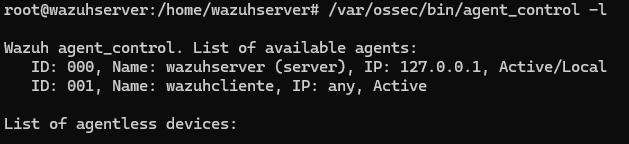

---

## Paso 7: Verificar Agente en Dashboard

Abrir navegador: `https://192.168.1.96`

**Credenciales:**
```
Usuario:    admin
Contraseña: HG3v8*HFdHeV54p7htIjjVUtpZ4SYHj3
```

Navegar a: **Home → Overview**

**Resultado esperado:**
```
AGENTS SUMMARY
● Active (1)      ✓
● Disconnected (0)
```

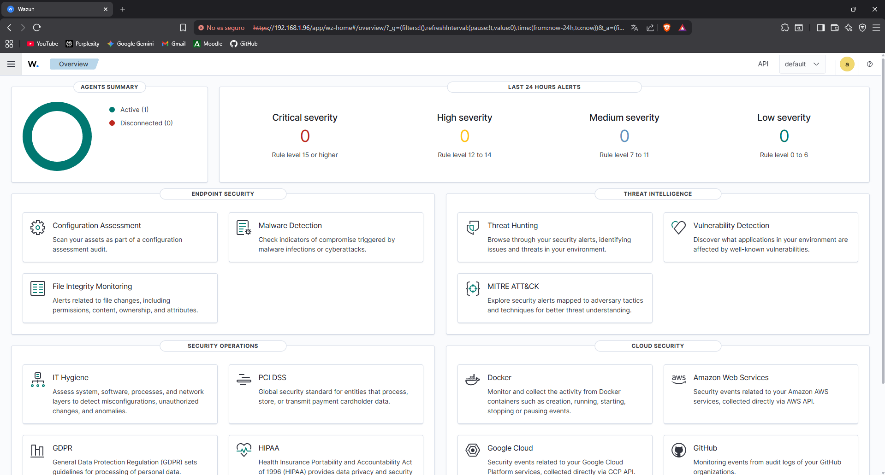

---

## Paso 8: Ver Lista de Agentes en Dashboard

Navegar a: **Agents Management → Agents**

**Resultado esperado:**
```
ID:  001
Name: wazuhcliente
IP:  192.168.1.97
OS:  Ubuntu 24.04.4 LTS
Version: v4.14.4
Status: ● active ✓
```

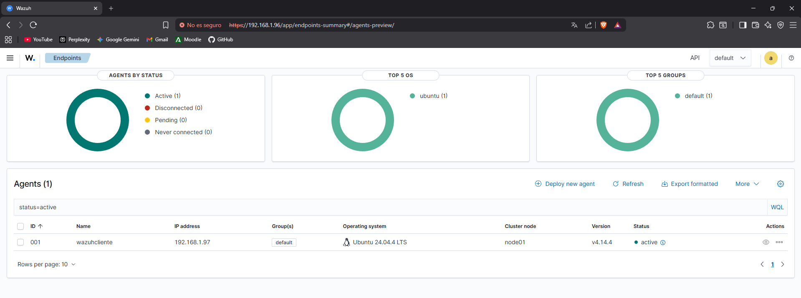

# PROYECTO WAZUH - FASE 4
## Hardening SSH en Cliente

**Fecha:** 19 Abril 2026 | **Cliente:** 192.168.1.97 | **Estado:** ✅ Completado

---

## 🎯 OBJETIVO FASE 4

Instalar y hardenizar el servicio SSH en el cliente (192.168.1.97) y verificar que el servidor Wazuh reconoce los cambios mediante el módulo SCA (Security Configuration Assessment).

---

## ENTORNO

| Parámetro | Valor |
|-----------|-------|
| **Cliente** | wazuhcliente (192.168.1.97) |
| **Servicio** | OpenSSH Server |
| **Benchmark** | CIS Ubuntu Linux 24.04 LTS Benchmark v1.0.0 |
| **Score Inicial** | 45% (109 passed / 128 failed) |
| **Score Final** | 47% (112 passed / 125 failed) |

---

## ESTADO ANTES DEL HARDENING

```bash
sudo sshd -T | grep -E "permitrootlogin|passwordauthentication|port|maxauthtries|x11forwarding"
```

**Resultado:**
```
port 22                          ← Puerto por defecto (inseguro)
maxauthtries 6                   ← Demasiados intentos
permitrootlogin without-password ← Root puede conectar
passwordauthentication yes       ← Autenticación por contraseña activa
x11forwarding yes                ← X11 activo (innecesario)
```

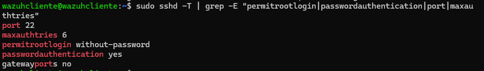

---

## HARDENING SSH

### Paso 1: Backup de Configuración Original

```bash
sudo cp /etc/ssh/sshd_config /etc/ssh/sshd_config.bak
```

---

### Paso 2: Crear Archivo de Hardening

Ubuntu 24.04 usa el directorio `/etc/ssh/sshd_config.d/` para configuraciones adicionales. Se crea un archivo específico de hardening sin modificar el archivo principal.

```bash
sudo nano /etc/ssh/sshd_config.d/hardening.conf
```

Contenido del archivo:

```
Port 2222
PermitRootLogin no
PasswordAuthentication no
MaxAuthTries 3
LoginGraceTime 30
X11Forwarding no
AllowAgentForwarding no
PermitEmptyPasswords no
ClientAliveInterval 300
ClientAliveCountMax 2
```

---

### Paso 3: Corregir Conflicto con cloud-init

Ubuntu 24.04 incluye `/etc/ssh/sshd_config.d/50-cloud-init.conf` con `PasswordAuthentication yes` que sobreescribe la configuración. Se corrige:

```bash
sudo nano /etc/ssh/sshd_config.d/50-cloud-init.conf
```

Cambiar:
```
PasswordAuthentication yes
```
Por:
```
PasswordAuthentication no
```

---

### Paso 4: Verificar Sintaxis

```bash
sudo sshd -t
# Sin errores ✓
```

---

### Paso 5: Reiniciar Servicio SSH

```bash
sudo systemctl daemon-reload
sudo systemctl restart ssh
sudo systemctl status ssh | grep Active
# Active: active (running) ✓
```

---

## ESTADO DESPUÉS DEL HARDENING

```bash
sudo sshd -T | grep -E "passwordauthentication|permitrootlogin|port|maxauthtries|x11forwarding|clientaliveinterval|clientalivecountmax|logingracetime|allowagentforwarding|permitemptypasswords"
```

**Resultado:**
```
port 2222                  ✓ (cambiado de 22)
logingracetime 30          ✓ (reducido de 2m)
maxauthtries 3             ✓ (reducido de 6)
clientaliveinterval 300    ✓ (nuevo)
clientalivecountmax 2      ✓ (nuevo)
permitrootlogin no         ✓ (era without-password)
passwordauthentication no  ✓ (era yes)
x11forwarding no           ✓ (era yes)
permitemptypasswords no    ✓
allowagentforwarding no    ✓ (nuevo)
```

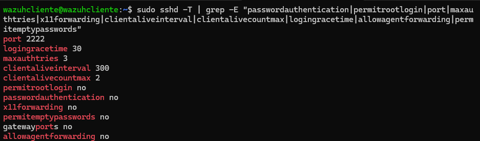

---

## VERIFICACIÓN EN WAZUH DASHBOARD

### SCA - Estado Inicial (Antes del Hardening)

Navegar a: **Endpoint Security → Configuration Assessment → wazuhcliente**

```
CIS Ubuntu Linux 24.04 LTS Benchmark v1.0.0
Passed:         109
Failed:         128
Not applicable:  42
Score:          45%
End scan: Apr 19, 2026 @ 17:10:52
```

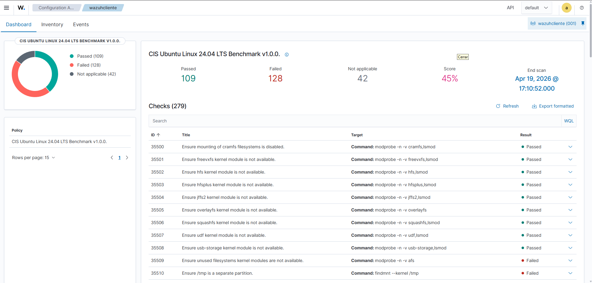

---

### SCA - Checks SSH (Búsqueda)

En el buscador del SCA escribir: `ssh`

Muestra 27 checks relacionados con SSH y seguridad de red.

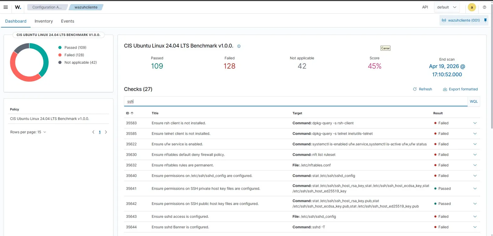

---

### SCA - Estado Final (Después del Hardening)

Reiniciar el agente para forzar nuevo scan:

```bash
sudo /var/ossec/bin/wazuh-control restart
```

Esperar 30 segundos y hacer **Refresh** en el Dashboard.

```
CIS Ubuntu Linux 24.04 LTS Benchmark v1.0.0
Passed:         112    (+3 ✓)
Failed:         125    (-3 ✓)
Not applicable:  42
Score:          47%    (+2% ✓)
End scan: Apr 19, 2026 @ 22:48:29
```

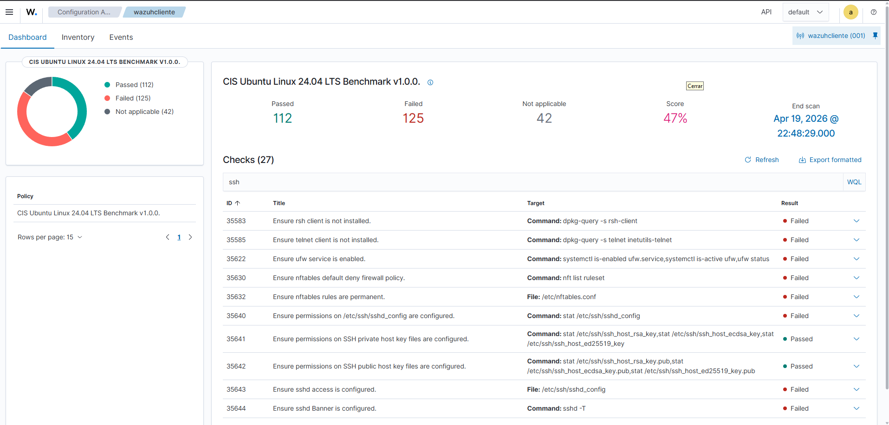

---

## 📊 COMPARATIVA ANTES / DESPUÉS

| Parámetro | Antes | Después | Resultado |
|-----------|-------|---------|-----------|
| Puerto | 22 | 2222 | ✓ Cambiado |
| PermitRootLogin | without-password | no | ✓ Reforzado |
| PasswordAuthentication | yes | no | ✓ Desactivado |
| MaxAuthTries | 6 | 3 | ✓ Reducido |
| LoginGraceTime | 2m | 30s | ✓ Reducido |
| X11Forwarding | yes | no | ✓ Desactivado |
| AllowAgentForwarding | yes | no | ✓ Desactivado |
| PermitEmptyPasswords | no | no | ✓ Mantenido |
| ClientAliveInterval | 0 | 300 | ✓ Configurado |
| ClientAliveCountMax | 3 | 2 | ✓ Reducido |
| **SCA Score** | **45%** | **47%** | **✓ +2%** |
| **SCA Passed** | **109** | **112** | **✓ +3** |
| **SCA Failed** | **128** | **125** | **✓ -3** |
