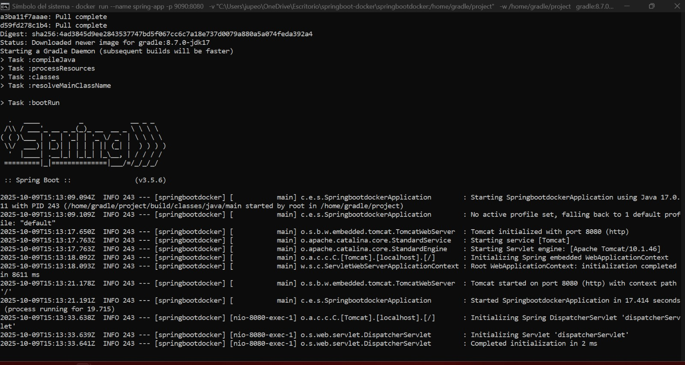
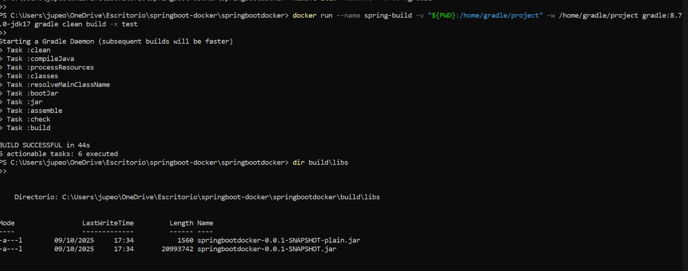
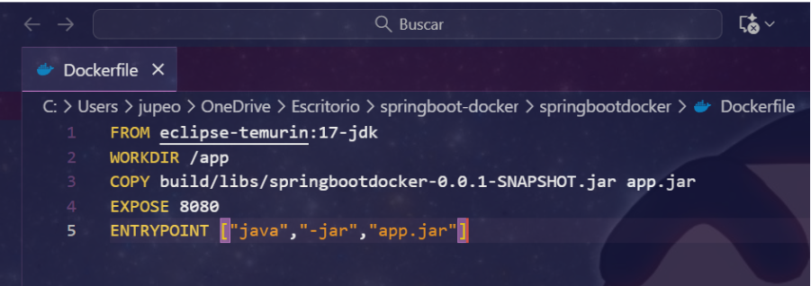
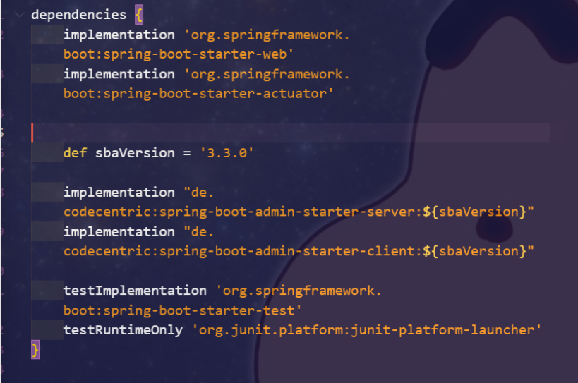
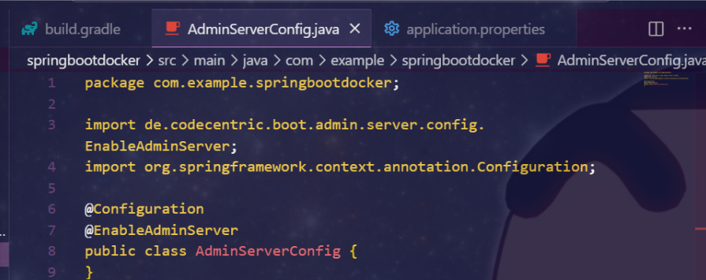
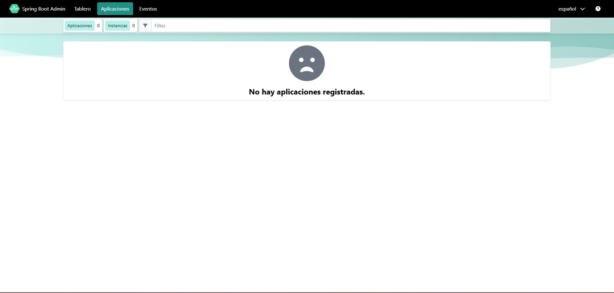
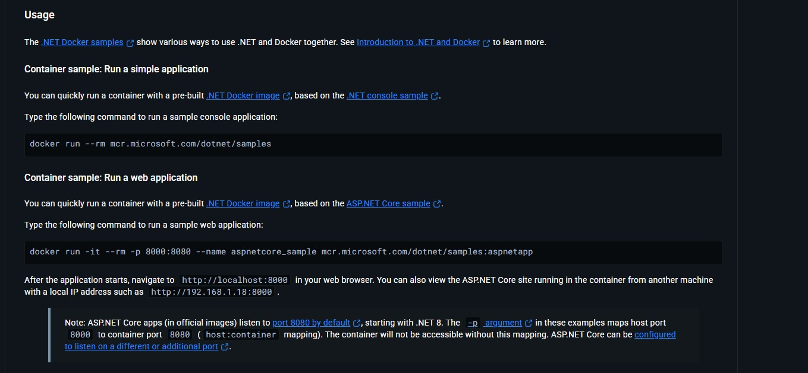
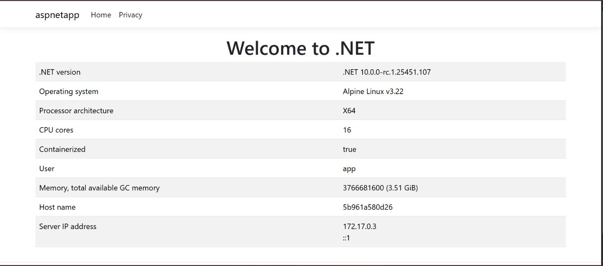

## Despliegue de Java y .NET
# Java: Spring boot

Primero creamos la carpeta principal del proyecto con el nombre que queramos en mi caso springboot-docker.

Una vez creada la carpeta introducimos una imagen que hemos usado desde Docker hub, hemos usado una imagen oficial de gradle con JDK 17 para ejecutarlo.

docker run --name spring-app -p 9090:8080 -v "${PWD}:/home/gradle/project" -w /home/gradle/project gradle:8.7.0-jdk17 gradle bootRun -x test

-Una vez hecho cuando accedemos al puerto veremos un mensaje que nos muestra el error 404 debido a que no tenemos un controlador, pero con esto ya tendríamos spring boot corriendo.

-Una vez hecho generamos el archivo .jar que usaremos para crear la imagen Docker final.

-Terminado de generar el archivo .jar crearemos un archivo Dockerfile en la raíz del proyecto (carpeta springbootdocker).

-Una vez hecho introducimos los comandos para que se ejecuten correctamente dentro del contenedor 

docker build -t springbootdocker .
docker run -d --name spring-run -p 9090:8080 springbootdocker

-Una vez hecho eso haremos una implementación de monitoreo llamada spring Boot Admin, lo que haremos será crear una interfaz para ver su estado los logs etc...

-Accederemos desde Visual Studio code o el propio bloc de notas o el cmd al archivo build.gradle e introduciremos las dependencias necesarias 

Luego de ello lo siguiente que haremos será acceder a la ubicación de la configuración del server del administrador para introducir las librerías necesarias 

-Una vez creado iremos al apartado de application.properties 

-Por último reconstruiremos el proyecto para poder acceder al panel del administrador del servidor como el panel de monitoreo.

docker rm -f spring-build 2>$null
docker run --name spring-build -v "${PWD}:/home/gradle/project" -w /home/gradle/project gradle:8.7.0-jdk17 gradle clean build -x test

docker build -t springbootdocker .
docker rm -f spring-run 2>$null
docker run -d --name spring-run -p 9090:8080 springbootdocker

---

# .NET

Primero de todo accedemos a la página de Docker hub y buscamos el nombre de dotnet, luego de eso nos vamos copiamos copiamos el comando, el que queramos ya sea con interfaz gráfica o simplemente en consola, 

En nuestro caso hemos usado el comando con interfaz gráfica que es el siguiente:

docker run -it --rm -p 8000:8080 --name aspnetcore_sample mcr.microsoft.com/dotnet/samples:aspnetapp

Una vez hecho accedemos mediante la barra del navegador al puerto 8000:8080 o localhost:8080 o la ip de nuestro localhost

