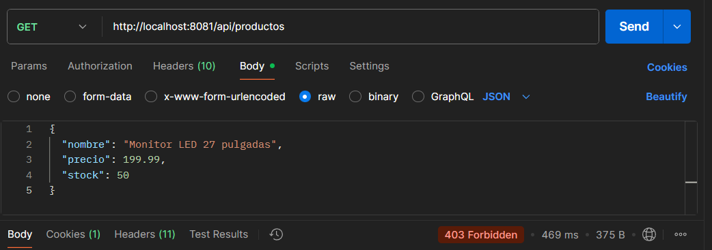
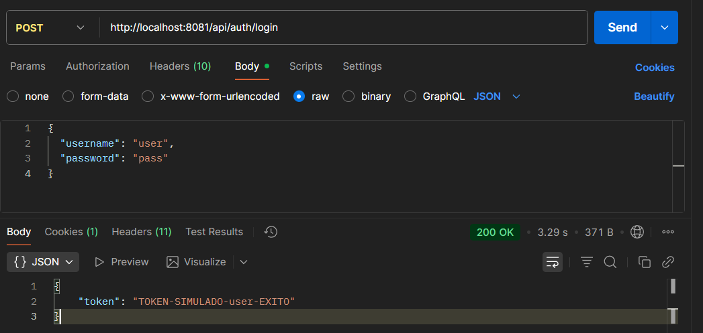
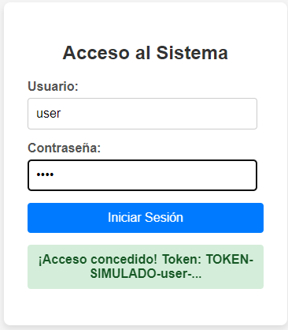
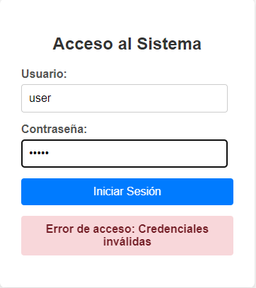
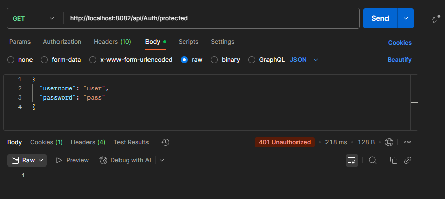
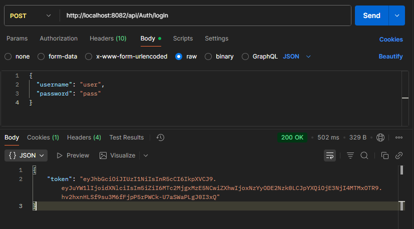
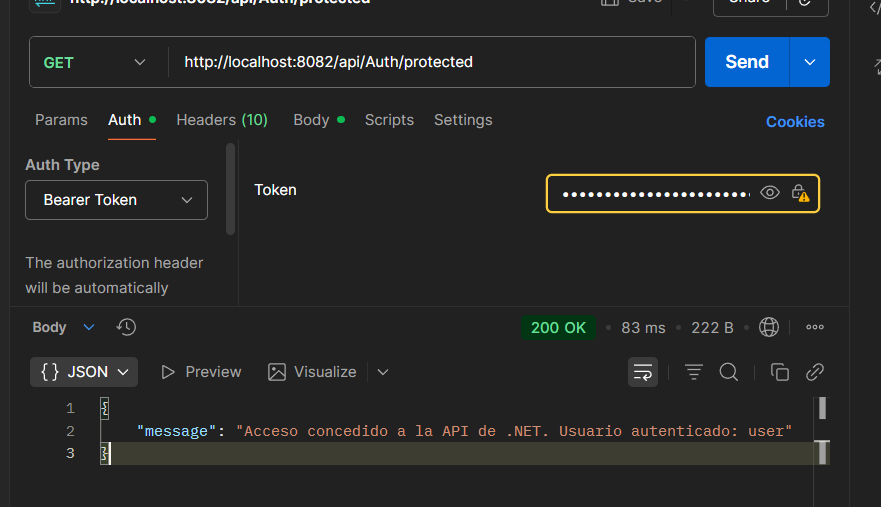

## Crear un Login en Spring Boot 

1º Creamos un archivo llamado SecurityConfig.java

deshabilita la seguridad estándar de Spring para APIs REST y configura dos reglas: permite el acceso libre solo al endpoint de /api/auth/login y protege todas las demás rutas para que requieran un token.

package com.example.demo;

import org.springframework.context.annotation.Bean;  
import org.springframework.context.annotation.Configuration;  
import org.springframework.security.config.annotation.web.builders.HttpSecurity;  
import org.springframework.security.config.annotation.web.configuration.EnableWebSecurity;  
import org.springframework.security.web.SecurityFilterChain;

@Configuration  
@EnableWebSecurity *// Habilita la seguridad a nivel web*  
public class SecurityConfig {

    @Bean  
    public SecurityFilterChain securityFilterChain(HttpSecurity *http*) throws Exception {  
        *http*  
            *// 1\. Deshabilita la protección CSRF*  
            *//    (necesario para APIs REST sin sesiones basadas en cookies)*  
            .csrf(*csrf* \-\> *csrf*.disable())  
             
            *// 2\. Configura las reglas de autorización para los endpoints*  
            .authorizeHttpRequests(*authorize* \-\> *authorize*  
                *// Permite a CUALQUIERA acceder al endpoint de login*  
                .requestMatchers("/api/auth/login").permitAll()  
                *// Todas las demás peticiones deben estar AUTENTICADAS*  
                .anyRequest().authenticated()  
            );

            return *http*.build();  
    }  
}

2º Creamos AuthController.java

Este archivo hace que verifique el usuario y devuelva el token

package com.example.demo;

import org.springframework.http.ResponseEntity;  
import org.springframework.web.bind.annotation.PostMapping;  
import org.springframework.web.bind.annotation.RequestBody;  
import org.springframework.web.bind.annotation.RequestMapping;  
import org.springframework.web.bind.annotation.RestController;

import java.util.Collections;

@RestController  
@RequestMapping("/api/auth") *// Ruta base: /api/auth*  
public class AuthController {

    *// Clase interna simple para modelar la entrada JSON (usuario/contraseña)*  
    public static class LoginRequest {  
        public String username;  
        public String password;  
    }  
     
    *// Endpoint de login*  
    @PostMapping("/login") *// POST a /api/auth/login*  
    public ResponseEntity\<?\> login(@RequestBody LoginRequest *request*) {  
         
        *// \*\* LÓGICA DE AUTENTICACIÓN SIMULADA \*\**  
        *// Verifica si las credenciales son las predefinidas (user/pass)*  
        if ("user".equals(*request*.username) && "pass".equals(*request*.password)) {  
             
            *// Si son válidas, genera un token simple de prueba*  
            String token \= "TOKEN-SIMULADO-" \+ *request*.username \+ "-EXITO";  
             
            *// Devuelve el token con código de respuesta 200 OK*  
            return ResponseEntity.ok(Collections.singletonMap("token", token));  
        } else {  
            *// Credenciales inválidas, devuelve código 401 Unauthorized*  
            return ResponseEntity.status(401).body(Collections.singletonMap("error", "Credenciales inválidas"));  
        }  
    }  
}

3º Reconstruir la imagen

Una vez finalizado debemos de reconstruir la imagen para que se creen los cambios

# 1. Construye el JAR con los nuevos archivos (SecurityConfig y AuthController)  
.\\mvnw.cmd package

# 2. Construye la imagen de Docker (¡Asegúrate de usar la etiqueta V4\!)  
docker build \-t miappspring:v4 .

\# 3\. Detiene el contenedor anterior y ejecuta el nuevo  
docker rm \-f mi-spring-app  
docker run \-d \-p 8081:8080 \--name mi-spring-app miappspring:v4

4º Comprobación

Una vez actualizado veremos que si entramos en la página de Spring Boot tendremos una denegación si queremos probarlo con Postman nos dará un 403

5º Creación de un usuario

Creamos un usuario desde postman para darle acceso

Una vez hecho podemos crear un login simple en html para ver qué funciona el acceso   

En caso de que sea un usuario que no exista no nos permitirá ese acceso

## Crear un login en Node.js

El primer paso es añadir **JWT** para gestionar el token y modificar las **APIs** para que todo funcione correctamente.

Luego habrá que levantar la web para comprobar que todo funcione.

Aquí la demostración de que no funciona la API sin el token:

Una vez registrados, iremos al **login**:

Aquí vemos el token. El siguiente paso es añadir este token a la petición del principio.

Vemos perfectamente cómo ahora que le hemos metido el token, el CRUD sí funciona.

---

# Crear un Login en .NET con JWT

## 1. Configuración de seguridad y JWT en ASP.NET Core
El objetivo es habilitar la capacidad de la API para emitir y validar JSON Web Tokens (JWT) y proteger rutas con autenticación basada en tokens [ASP.NET](http://asp.net).

### 1.1 Instalación de la dependencia
Para habilitar el middleware de JWT, agrega el paquete NuGet al proyecto [ASP.NET](http://asp.net).

dotnet add package Microsoft.AspNetCore.Authentication.JwtBearer

## 2. Configurar el servicio JWT y CORS en Program.cs
Configura CORS para permitir la comunicación con el frontend y agrega la autenticación/autorización con JWT; la clave debe coincidir con la usada al firmar el token en el controlador [ASP.NET](http://asp.net).

using Microsoft.AspNetCore.Authentication.JwtBearer;
using Microsoft.IdentityModel.Tokens;
using System.Text;

var builder = WebApplication.CreateBuilder(args);

// --- 1. CONFIGURACIÓN DE SERVICIOS (builder.Services) ---

// Configuración de CORS: Permite la comunicación con el frontend (necesario por el error que tenías)
builder.Services.AddCors(options =>
{
options.AddPolicy("AllowFrontend",
builder =>
{
builder.AllowAnyOrigin() // Permitido para desarrollo
.AllowAnyMethod()
.AllowAnyHeader();
});
});

// Clave secreta para firmar y validar el token (DEBE ser la misma que en AuthController.cs)
var key = Encoding.ASCII.GetBytes("ESTA_ES_LA_CLAVE_SECRETA_LARGA_DE_256_BITS");

// A. Configuración de Autenticación JWT
builder.Services.AddAuthentication(options =>
{
options.DefaultAuthenticateScheme = JwtBearerDefaults.AuthenticationScheme;
options.DefaultChallengeScheme = JwtBearerDefaults.AuthenticationScheme;
})
.AddJwtBearer(options =>
{
options.TokenValidationParameters = new TokenValidationParameters
{
ValidateIssuerSigningKey = true,
IssuerSigningKey = new SymmetricSecurityKey(key),
ValidateIssuer = false,
ValidateAudience = false
};
});

// B. Servicios de API: Habilita los controladores y la autorización
builder.Services.AddControllers();
builder.Services.AddAuthorization();

// --- 2. CONFIGURACIÓN DEL PIPELINE (app) ---

var app = builder.Build();

app.UseRouting();
app.UseCors("AllowFrontend"); // Usar CORS ANTES de autenticación

// C. Middlewares de Seguridad
app.UseAuthentication();
app.UseAuthorization();

// D. Mapeo de Controladores (para que AuthController sea accesible)
app.MapControllers();

app.Run();

## 3. Creación del controlador del Login
Crea la carpeta `Controllers` y el archivo `AuthController.cs` con un endpoint de login que emite tokens y otro protegido que requiere un token válido [ASP.NET](http://asp.net).

using Microsoft.AspNetCore.Mvc;
using System.Text;
using System.Security.Claims;
using System.IdentityModel.Tokens.Jwt;
using Microsoft.IdentityModel.Tokens;

namespace MiAppNet.Controllers

// Modelo para recibir el usuario y la contraseña (debe coincidir con el JSON del frontend)
public class LoginModel
{
public string Username { get; set; }
public string Password { get; set; }
}

[ApiController]
[Route("api/[controller]")] // Define la ruta base como /api/Auth
public class AuthController : ControllerBase
{
    [HttpPost("login")] // Endpoint: POST a /api/Auth/login
    public IActionResult Login([FromBody] LoginModel model)
    {
        // ** SIMULACIÓN DE AUTENTICACIÓN: user/pass **
        if (model.Username != "user" || model.Password != "pass")
        {
            return Unauthorized(new { message = "Credenciales inválidas" });
        }

        // Generar el Token JWT
        var tokenString = GenerateJwtToken(model.Username);

        return Ok(new { token = tokenString });
    }

    // --- Endpoint de Prueba (Requiere Token Válido) ---
    [HttpGet("protected")]
    [Microsoft.AspNetCore.Authorization.Authorize] // Protege esta ruta
    public IActionResult GetProtectedData()
    {
        var username = User.FindFirst(ClaimTypes.Name)?.Value;
        return Ok(new { message = $"Acceso concedido a la API de .NET. Usuario autenticado: {username}" });
    }

    // --- Método de Servicio: Generador de Token JWT ---
    private string GenerateJwtToken(string username)
    {
        var tokenHandler = new JwtSecurityTokenHandler();
        // La clave DEBE coincidir con la de Program.cs
        var key = Encoding.ASCII.GetBytes("ESTA_ES_LA_CLAVE_SECRETA_LARGA_DE_256_BITS");

        var tokenDescriptor = new SecurityTokenDescriptor
        {
            Subject = new ClaimsIdentity(new Claim[]
            {
                new Claim(ClaimTypes.Name, username)
            }),
            Expires = DateTime.UtcNow.AddHours(1), // Token expira en 1 hora
            SigningCredentials = new SigningCredentials(new SymmetricSecurityKey(key), SecurityAlgorithms.HmacSha256Signature)
        };

        var token = tokenHandler.CreateToken(tokenDescriptor);
        return tokenHandler.WriteToken(token);
    }
}

## 4. Confirmación GET sin token
Una petición GET a la ruta protegida sin encabezado `Authorization` debe responder `401 Unauthorized`, confirmando que el endpoint requiere autenticación JWT [ASP.NET](http://asp.net).

## 5. Confirmación POST de login
Realiza un `POST` a `/api/Auth/login` con credenciales válidas para recibir un token JWT en la respuesta; el JSON devuelto incluye la propiedad `token` que se usará en siguientes llamadas [ASP.NET](http://asp.net).

## 6. Acceso con token
Incluye el encabezado `Authorization` con el formato `Bearer {token}` en la petición `GET` a `/api/Auth/protected` para acceder y ver el mensaje con el usuario autenticado [ASP.NET](http://asp.net).

## Notas de seguridad recomendadas
- En producción, limita CORS a orígenes concretos y métodos/cabeceras necesarios, evitando `AllowAnyOrigin` en entornos finales [ASP.NET](http://asp.net).
- Almacena la clave secreta en variables de entorno o un gestor de secretos; no la dejes en el código y usa claves de al menos 256 bits para HMAC-SHA256 [ASP.NET](http://asp.net).
- Considera validar `issuer` y `audience` si controlas ambos extremos, y rota la clave periódicamente; ajusta `Expires` y usa `Refresh Tokens` si tu escenario lo requiere [ASP.NET](http://asp.net).
