# 🐾 Clínica Veterinaria — Despliegue Seguro (FastAPI + Supabase)

Aplicación web minimalista que ejemplifica un ciclo completo de **Puesta en Producción Segura**: autenticación OAuth2/JWT, autorización RBAC+ABAC, gestión de secretos, SAST, SCA, DAST y despliegue reproducible en Render.

URL pública: **https://clinica-veterinaria-rxnp.onrender.com**

---

## 📂 Estructura

```
.
├── app/
│   ├── main.py                     # FastAPI (OAuth2, RBAC, ABAC, headers de seguridad)
│   └── schema.sql                  # DDL para Supabase
├── docs/img/                       # Capturas de evidencia
├── .env.example                    # APARTADO: GESTIÓN DE SECRETOS
├── sonar-project.properties        # APARTADO: SAST - SonarQube
├── render.yaml                     # APARTADO: DESPLIEGUE - Render
├── requirements.txt
└── README.md
```

Los workflows de CI/CD están en la raíz del repositorio (`.github/workflows/`):
- `security.yml` — SCA con OWASP Dependency-Check (se dispara en cada push).
- `zap.yml` — DAST con OWASP ZAP Baseline (manual / semanal).

---

## 🚀 Instrucciones de Despliegue

### 1. Preparar Supabase

Supabase hace de backend-as-a-service: nos da una base de datos PostgreSQL gestionada, autenticación y una API REST, todo detrás de HTTPS. Usamos `schema.sql` para crear las tablas (`usuarios`, `mascotas`, `productos`, `adopciones`) de forma reproducible, y la `service_role key` como credencial que la API de FastAPI usará para conectarse — nunca se expone al cliente, sólo vive como variable de entorno en Render.

1. Crear un proyecto en [supabase.com](https://supabase.com).
2. Abrir `SQL Editor` y ejecutar el contenido de `app/schema.sql`.
3. Copiar `Project URL` y `service_role key` (Settings → API).

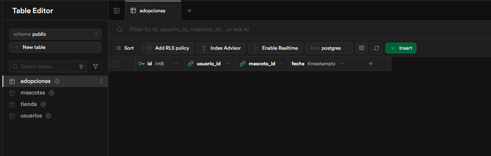

### 2. Configurar repositorio
```bash
git clone <tu-repo>
cp .env.example .env   # rellenar secretos en local para pruebas
```

### 3. Ejecutar en local
```bash
pip install -r requirements.txt
uvicorn app.main:app --reload
# Swagger UI: http://localhost:8000/docs
```

### 4. Despliegue en Render

Render despliega la aplicación leyendo el Blueprint `render.yaml` del repositorio (Infrastructure-as-Code): con cada push a `main` reconstruye el servicio con el mismo comando de build/start, evitando pasos manuales que puedan introducir variación entre entornos. Los secretos (`SUPABASE_URL`, `SUPABASE_KEY`) se marcan `sync: false` para que **no viajen en el repositorio** — se introducen a mano en el dashboard — y `JWT_SECRET` se genera automáticamente en Render con `generateValue: true`.

1. En [render.com](https://render.com) → `New` → `Blueprint`.
2. Apuntar al repositorio; Render detectará `render.yaml`.
3. En el dashboard, en **Environment**, rellenar `SUPABASE_URL` y `SUPABASE_KEY` (marcados `sync: false`). `JWT_SECRET` se genera automáticamente.
4. `Apply` → se construye y publica.

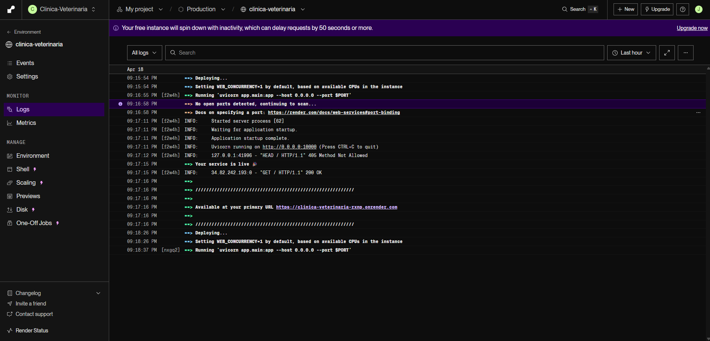

El endpoint `/health` es usado por Render como *healthcheck* (`healthCheckPath: /health`): si responde 200, el servicio se considera vivo; si falla, Render reinicia el contenedor automáticamente.

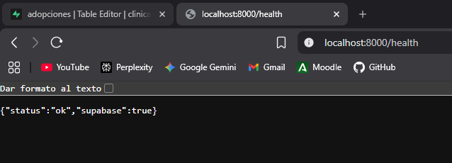

FastAPI expone `/docs` (Swagger UI) con el esquema OpenAPI, útil tanto para desarrollo local como para ejecutar escaneos automatizados (el propio ZAP puede importar `openapi.json`).

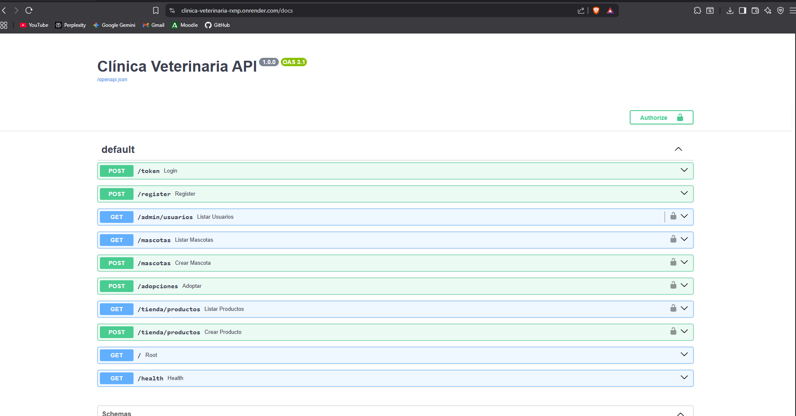

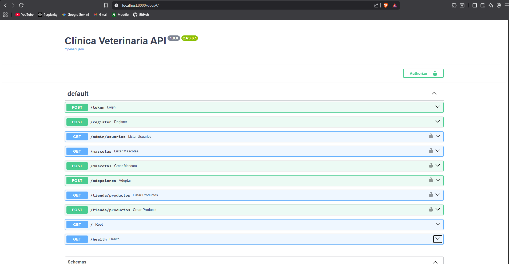

---

## 🔐 Autenticación y Autorización

La API implementa un flujo **OAuth2 Password + JWT**: el usuario intercambia credenciales por un token firmado con `JWT_SECRET` (HS256) que caduca a los 30 minutos, y cada endpoint protegido se valida con `Depends(get_current_user)`. Por encima se aplican dos modelos de control de acceso complementarios: **RBAC** (basado en el rol del usuario — admin, veterinario, ventas, clientela) y **ABAC** (basado en atributos — p. ej. si una clientela ha adoptado, se le aplica un descuento del 20 %).

### Registro (`POST /register`)

Crea un usuario con contraseña hasheada con bcrypt. Nunca se almacena la contraseña en claro.

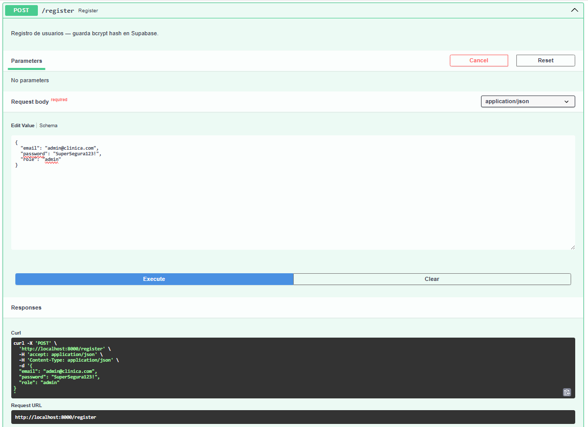
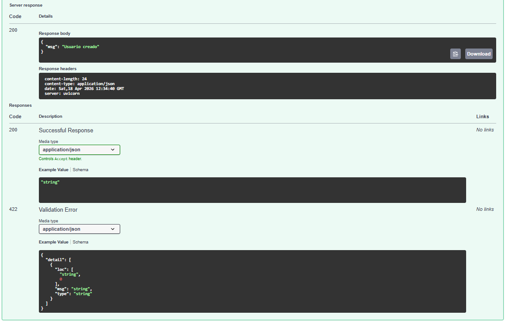

### Login y obtención de JWT (`POST /token`)

Endpoint compatible con el flujo `password` de OAuth2. Devuelve un `access_token` que debe enviarse en la cabecera `Authorization: Bearer <token>` en las siguientes peticiones.

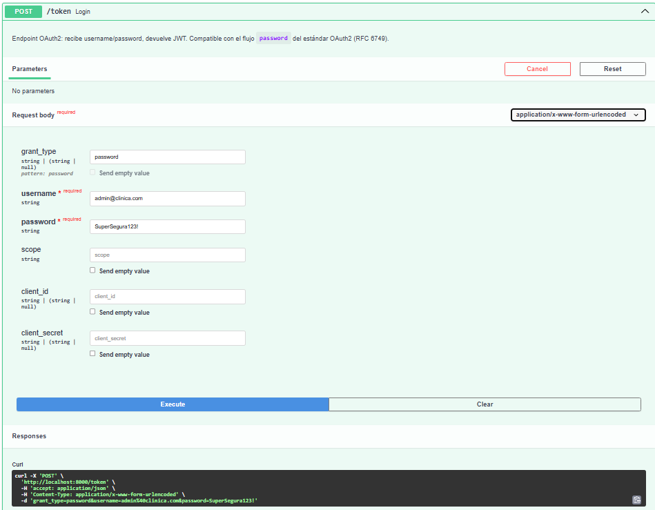
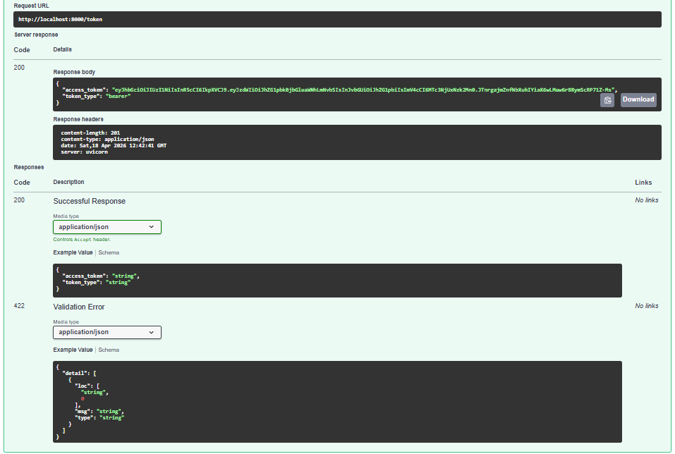

### RBAC — acceso denegado para rol insuficiente

El decorador `require_roles(...)` comprueba que el rol del JWT coincida con los autorizados para el endpoint. Si no, devuelve `403 Forbidden` (nunca 401, porque el usuario está autenticado pero no autorizado).

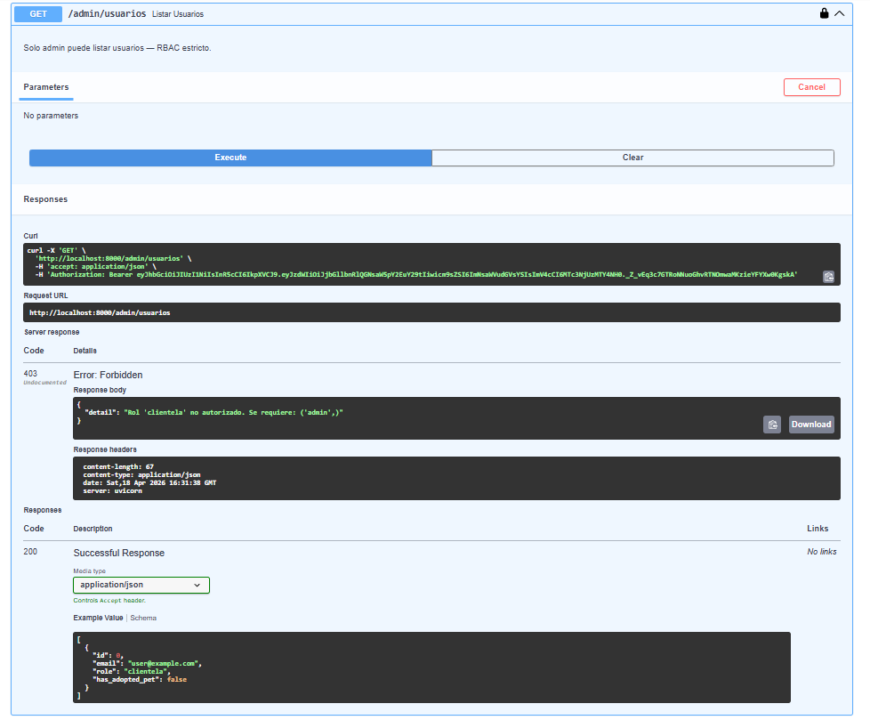
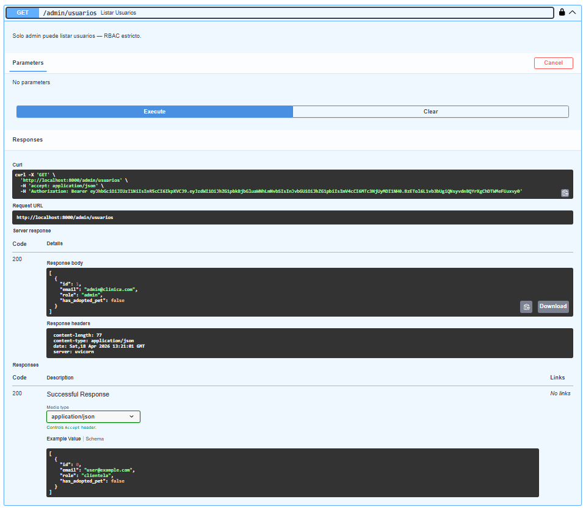

### Gestión de recursos (mascotas)

Demostración del CRUD protegido por RBAC: sólo `veterinario` y `admin` pueden crear mascotas; el resto recibe 403. El listado está disponible para todos los roles autenticados.

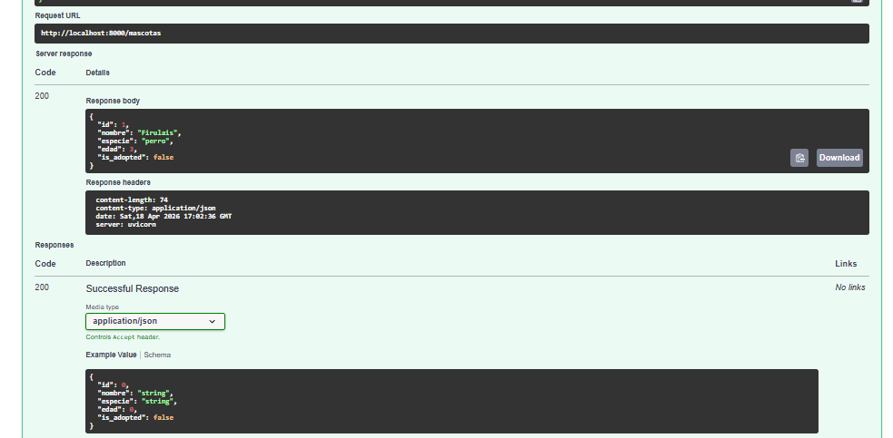
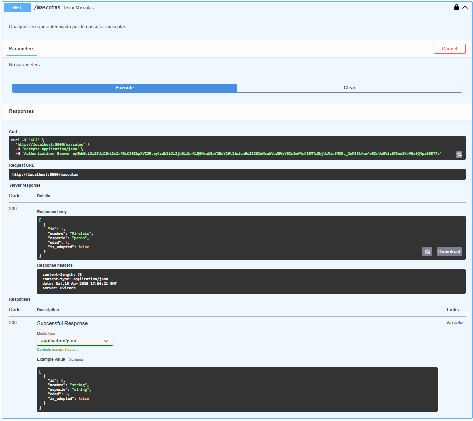
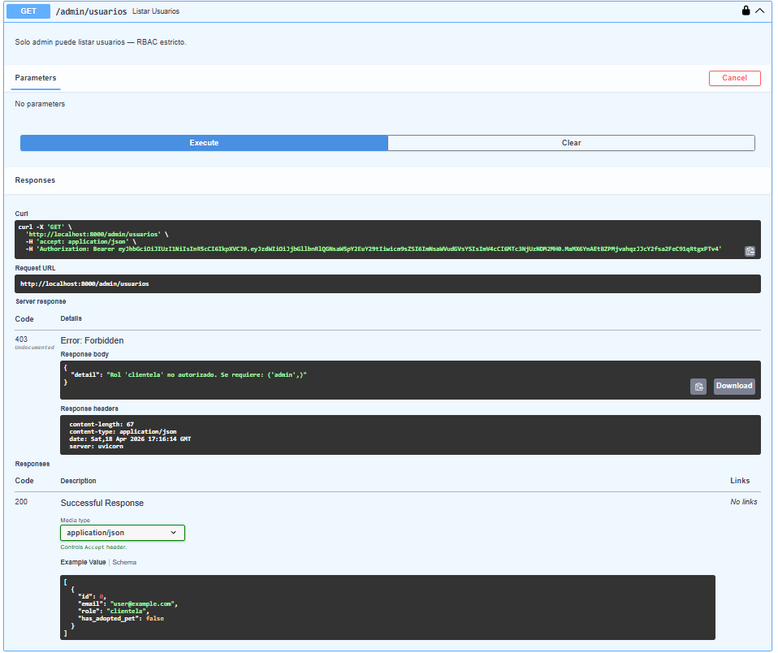

### Flujo de adopción

Sólo el rol `clientela` puede adoptar. La adopción registra al usuario como "adoptante" en la base de datos — este atributo se usa después por el motor ABAC.

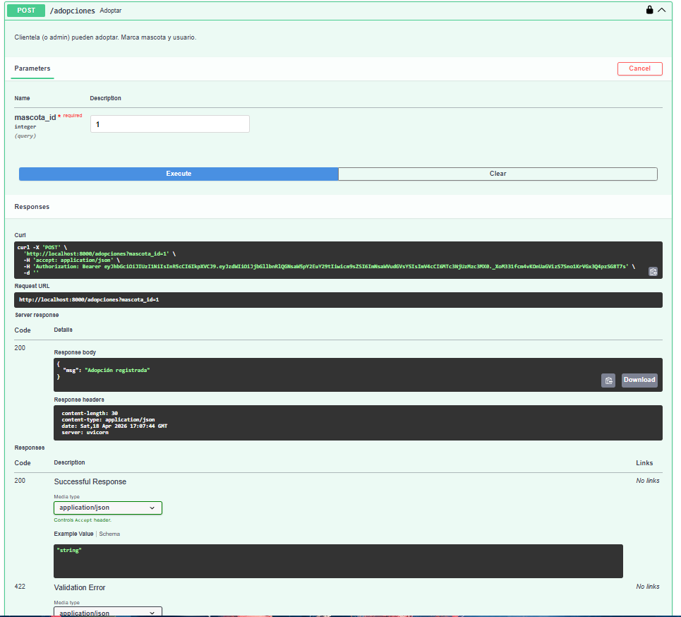

### ABAC — descuento del 20 % si la clientela ha adoptado

La función `aplicar_descuento_abac` inspecciona atributos del usuario (no sólo el rol) para decidir la política: si la clientela tiene al menos una adopción registrada, el precio del producto se reduce un 20 %. Es el caso típico ABAC: misma acción, distinto resultado según atributos dinámicos.

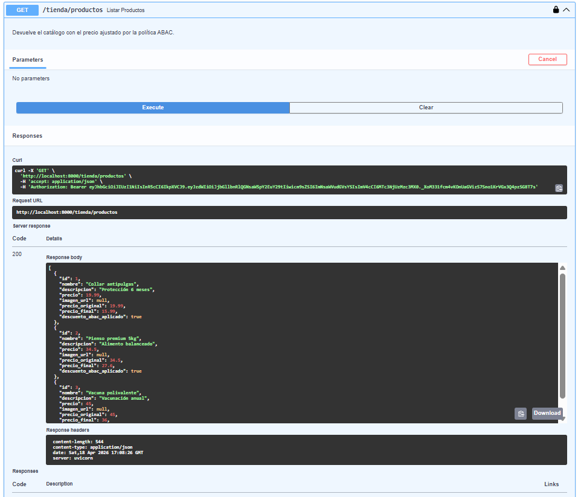

---

## 🔐 Mapa de Cumplimiento de Apartados

| Apartado | Ubicación |
|---|---|
| Modelos de datos + Supabase | `app/main.py` (sección MODELOS), `app/schema.sql` |
| Autenticación OAuth2 / JWT  | `app/main.py` (sección AUTENTICACIÓN OAUTH 2) |
| Autorización RBAC           | `app/main.py` (sección RBAC — `require_roles`) |
| Autorización ABAC           | `app/main.py` (función `aplicar_descuento_abac`) |
| Gestión de Secretos         | `.env.example` + `render.yaml` (`sync: false`) |
| SAST – SonarQube            | `sonar-project.properties` |
| SCA – OWASP Dependency Check| `.github/workflows/security.yml` |
| Despliegue – Render         | `render.yaml` |
| DAST – OWASP ZAP            | `.github/workflows/zap.yml` + sección DAST |
| Cabeceras de seguridad (opc.)| `SecurityHeadersMiddleware` en `app/main.py` |

---

## ⚙️ CI/CD — GitHub Actions

Dos pipelines de seguridad integrados en GitHub Actions automatizan los análisis cada vez que el código cambia o de forma programada, desplazando la detección de vulnerabilidades a la fase de integración (*shift-left security*).

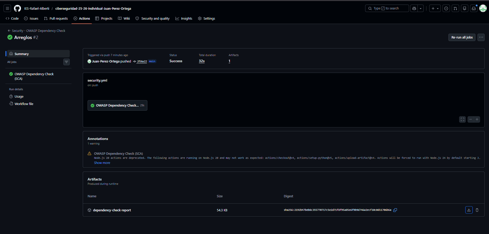

### SCA — OWASP Dependency-Check

**SCA** (*Software Composition Analysis*) consiste en analizar las dependencias de terceros del proyecto (`requirements.txt`) y cruzarlas con la base de datos pública de CVEs. Se ejecuta en cada push sobre `main` mediante `.github/workflows/security.yml` y publica un informe HTML como artifact descargable. Si alguna librería tiene una vulnerabilidad conocida, queda documentada en el reporte con su CVSS y enlace al CVE correspondiente.

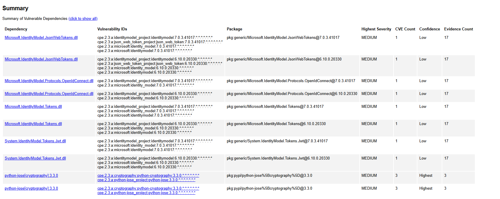

---

## 🛡️ APARTADO: DAST - OWASP ZAP

**DAST** (*Dynamic Application Security Testing*) analiza la aplicación en ejecución, sin acceso al código fuente, enviándole peticiones HTTP reales y evaluando las respuestas. A diferencia del SAST (estático) y del SCA (dependencias), el DAST detecta problemas que sólo son visibles en tiempo de ejecución: cabeceras de seguridad ausentes, configuración de TLS, fugas de información, cookies inseguras, XSS reflejado, etc. Usamos **OWASP ZAP Baseline** porque es pasivo (no intrusivo) y seguro de ejecutar sobre producción.

### Ejecución

El workflow se lanza manualmente desde la pestaña *Actions* → *Security - OWASP ZAP DAST* → `Run workflow`, o de forma programada (lunes 03:30 UTC). Invoca directamente la imagen Docker `ghcr.io/zaproxy/zaproxy:stable` con `zap-baseline.py` apuntando a la URL pública y sube el informe HTML/MD/JSON como artifact descargable desde GitHub.

### Resultado — escaneo inicial (sin cabeceras de seguridad)

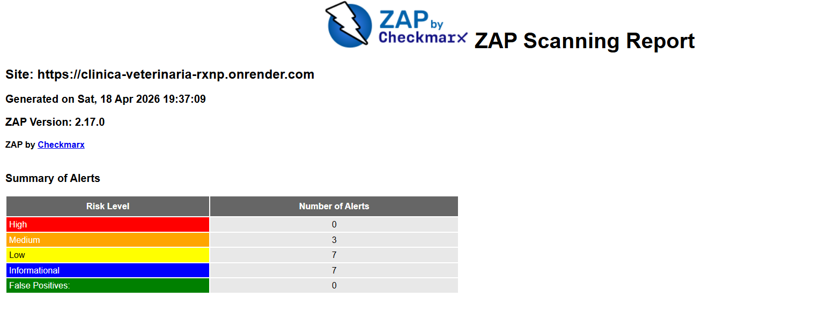
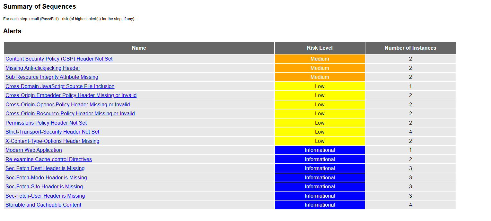

Resumen del baseline inicial:

| Riesgo | Alertas |
|---|---|
| High | 0 |
| Medium | 3 |
| Low | 7 |
| Informational | 7 |

Las alertas *Medium* correspondían a falta de **CSP**, ausencia de **Anti-Clickjacking** (`X-Frame-Options` / `frame-ancestors`) y falta de **Subresource Integrity**. Las *Low* incluían ausencia de HSTS, X-Content-Type-Options, Permissions-Policy y cabeceras COOP/COEP/CORP.

### Mitigación — `SecurityHeadersMiddleware`

Para corregir los hallazgos del primer escaneo se añade un middleware de Starlette que intercepta **todas** las respuestas de la aplicación e inyecta las cabeceras HTTP recomendadas por el **OWASP Secure Headers Project**. Se resuelve en una sola pieza de código (sin tocar endpoint por endpoint) y aprovecha que el navegador aplica estas cabeceras automáticamente como defensa en profundidad contra clickjacking, MIME-sniffing, XSS y fugas de referencias. Cabeceras añadidas:

- `Content-Security-Policy` (con origenes permitidos sólo los necesarios para Swagger)
- `X-Frame-Options: DENY`
- `X-Content-Type-Options: nosniff`
- `Referrer-Policy: strict-origin-when-cross-origin`
- `Permissions-Policy` restrictiva
- `Strict-Transport-Security` (HSTS)
- `Cross-Origin-Opener-Policy`, `Cross-Origin-Resource-Policy`, `Cross-Origin-Embedder-Policy`
- Elimina la cabecera `Server` (reducción de fingerprinting)

### Resultado — escaneo tras el middleware

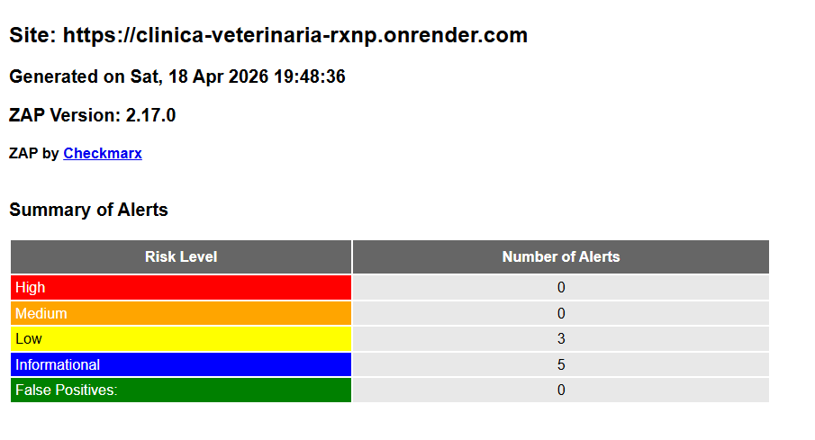
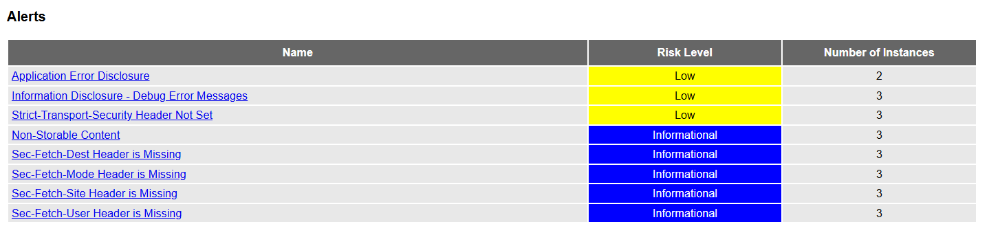

| Riesgo | Antes | Después | Δ |
|---|---|---|---|
| High | 0 | 0 | — |
| Medium | 3 | **0** | −3 ✅ |
| Low | 7 | 3 | −4 ✅ |
| Informational | 7 | 5 | −2 ✅ |

El middleware elimina todas las alertas *Medium* y reduce significativamente las *Low*, cerrando el ciclo DAST → mitigación → verificación.

---

## 🧪 Usuarios de prueba (roles RBAC)

| Rol | Capacidad |
|---|---|
| `admin`       | Acceso total |
| `veterinario` | Crear mascotas |
| `ventas`      | Crear productos |
| `clientela`   | Adoptar, ver catálogo (recibe 20% ABAC si ha adoptado) |
