# 🐾 Clínica Veterinaria — App Móvil (Flutter)

App móvil para clientes de la clínica veterinaria. Complementa la web ya desplegada en Render, reutilizando exactamente la misma API REST (FastAPI + Supabase). Solo tiene funcionalidades de cliente: ver productos, adoptar mascotas y consultar descuentos. No hay panel de administración.

Desarrollada con **Flutter** siguiendo las recomendaciones del estándar **OWASP MASVS** (Mobile Application Security Verification Standard).

---

## 📱 Qué hace la app

| Pantalla | Descripción |
|---|---|
| Login | El usuario introduce email y contraseña. La app llama a `/token` y guarda el JWT en el almacén seguro del móvil. |
| Registro | Crea una cuenta nueva con rol `clientela`. Después hace login automáticamente. |
| Tienda | Lista los productos disponibles. Permite consultar si tienes descuento del 20% (ABAC: solo si has adoptado). |
| Adopciones | Muestra las mascotas disponibles y las ya adoptadas. Permite adoptar con confirmación previa. |

---

## 🏗️ Arquitectura

```
lib/
├── main.dart                  # Punto de entrada. Registra el Provider de sesión.
├── config/
│   └── api_config.dart        # URL base y endpoints. Nunca credenciales.
├── models/
│   ├── mascota.dart
│   ├── producto.dart
│   └── user.dart
├── services/
│   ├── api_service.dart       # Cliente HTTP (Dio). Adjunta el token en cada petición.
│   └── auth_service.dart      # Gestiona login, registro y cierre de sesión.
├── utils/
│   └── secure_storage.dart    # Guarda el token en Android Keystore / iOS Keychain.
└── screens/
    ├── login_screen.dart
    ├── register_screen.dart
    ├── home_screen.dart
    ├── productos_screen.dart
    └── mascotas_screen.dart
```

La app está organizada en capas: las pantallas solo muestran datos, los servicios hablan con la API y `secure_storage` se encarga de guardar lo sensible. Así si un día cambia la API solo tocas los servicios, no las pantallas.

---

## 🔐 Seguridad aplicada (OWASP MASVS)

### Almacenamiento seguro del token — MASVS-STORAGE-1
El JWT nunca se guarda en SharedPreferences ni en un fichero. Se usa `flutter_secure_storage`, que en Android lo cifra con el **Android Keystore** y en iOS con el **Keychain**. Si alguien roba el archivo de datos del móvil, el token no está ahí en claro.

```dart
// lib/utils/secure_storage.dart
static const _storage = FlutterSecureStorage(
  aOptions: AndroidOptions(encryptedSharedPreferences: true),
);
```

### Sin backups de datos sensibles — MASVS-STORAGE-2
En `AndroidManifest.xml` se pone `android:allowBackup="false"`. Esto evita que Android incluya los datos de la app en los backups automáticos de Google Drive, donde el token podría acabar en texto legible.

### Solo HTTPS, nunca HTTP — MASVS-NETWORK-1
Tres capas de protección:
1. La URL base en `api_config.dart` empieza por `https://`.
2. `android:usesCleartextTraffic="false"` en el Manifest bloquea cualquier petición HTTP a nivel de sistema.
3. `network_security_config.xml` restringe el tráfico solo al dominio de producción.

### Certificate Pinning (preparado) — MASVS-NETWORK-2
El archivo `network_security_config.xml` tiene comentada la sección `<pin-set>`. Para activarlo en producción real basta con poner el hash SHA-256 del certificado del servidor. Esto evita ataques Man-in-the-Middle incluso si el atacante tiene un certificado válido de otra CA.

### Sesión limpia al cerrar — MASVS-AUTH
Al hacer logout se borran **todos** los datos del almacén seguro (`deleteAll()`). No queda rastro del token ni del email.

### Validación de entrada — MASVS-PLATFORM
Los formularios validan en cliente antes de enviar: formato de email, longitud mínima de contraseña, confirmación de contraseña. Esto no reemplaza la validación del servidor, pero evita enviar datos malformados.

---

## 📸 Capturas de la app

### Configuración del entorno
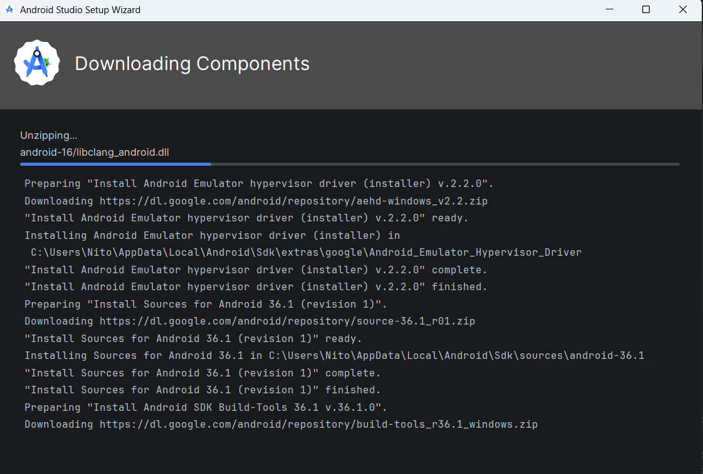

### Autenticación
| Login | Registro |
|---|---|
| 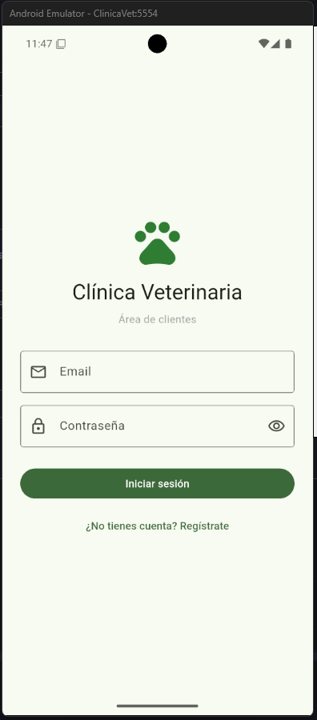 | 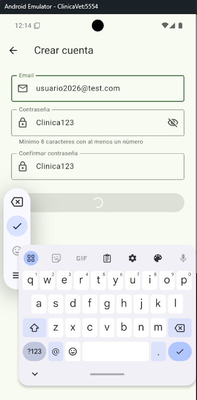 |

### Tienda con descuento ABAC
| Lista de productos | Descuento activo | Popup de precio |
|---|---|---|
| 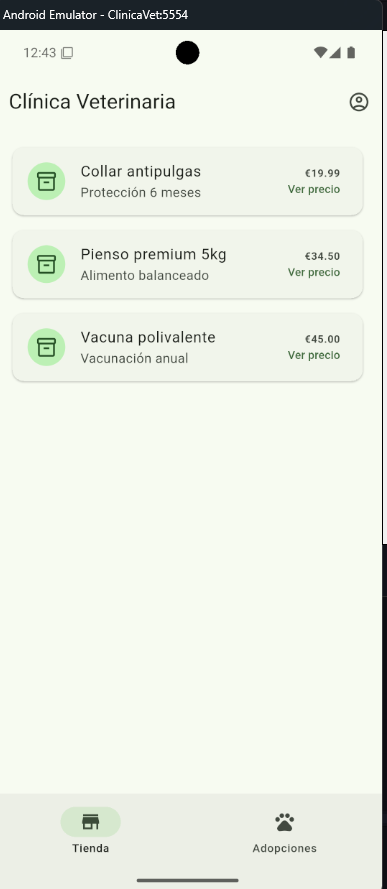 | 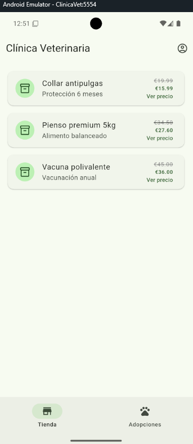 | 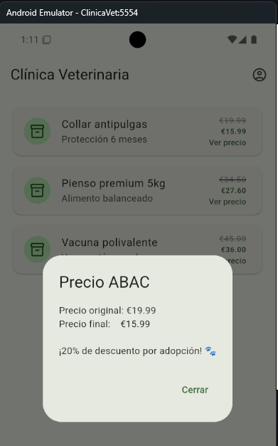 |

El 20% de descuento solo aparece si el usuario ha adoptado una mascota (control ABAC del backend).

### Adopciones
| Lista de mascotas | Confirmación | Adopción completada |
|---|---|---|
| 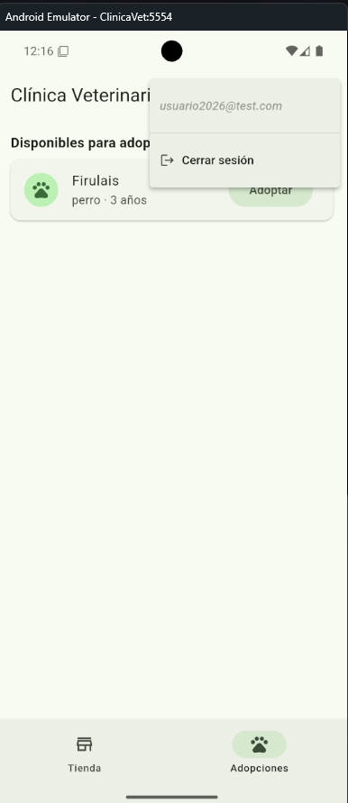 | 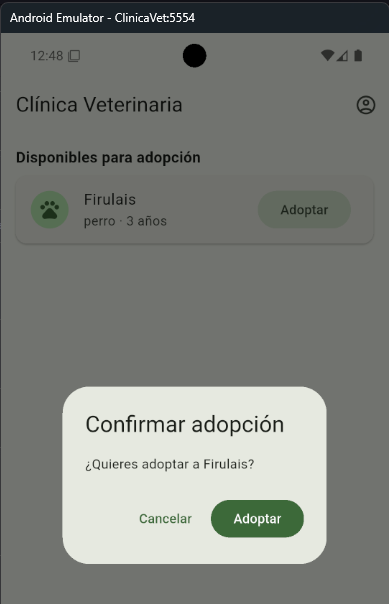 | 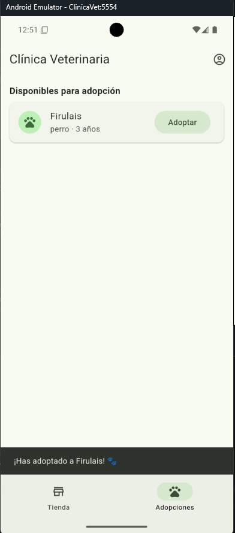 |

### Consulta de descuento
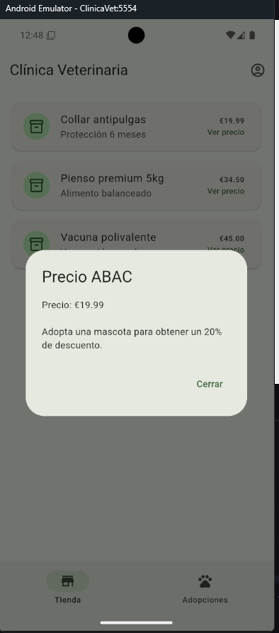

### Controles de seguridad aplicados
| Android Keystore (token cifrado) | AndroidManifest | Network Security Config |
|---|---|---|
| 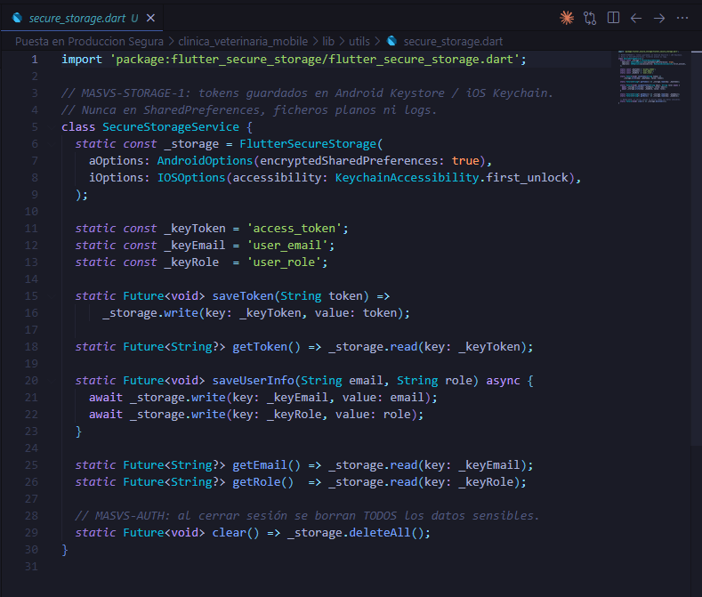 | 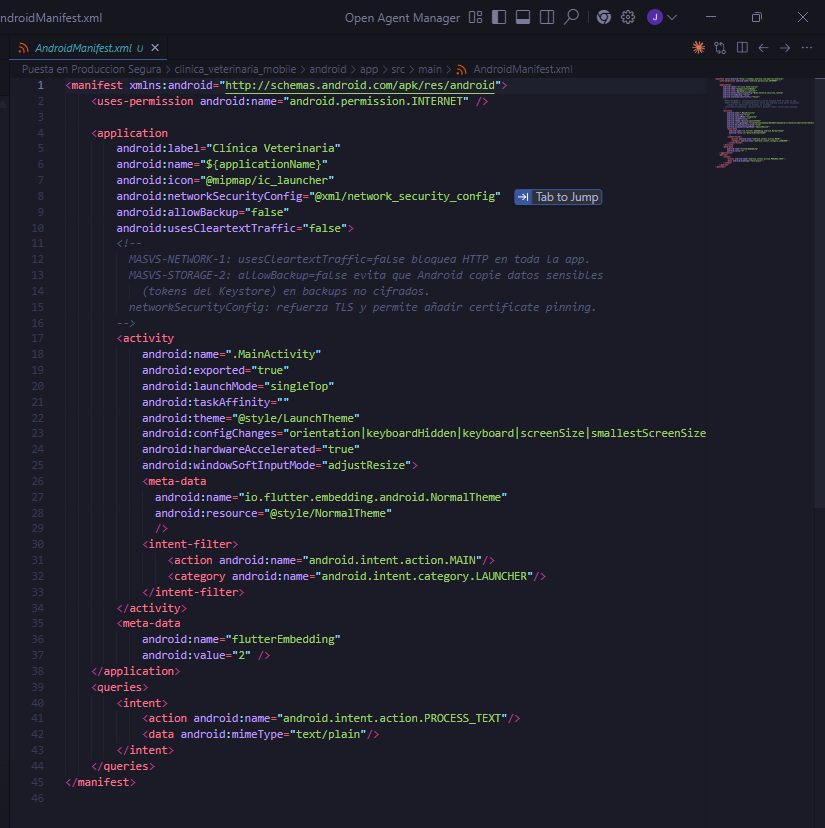 | 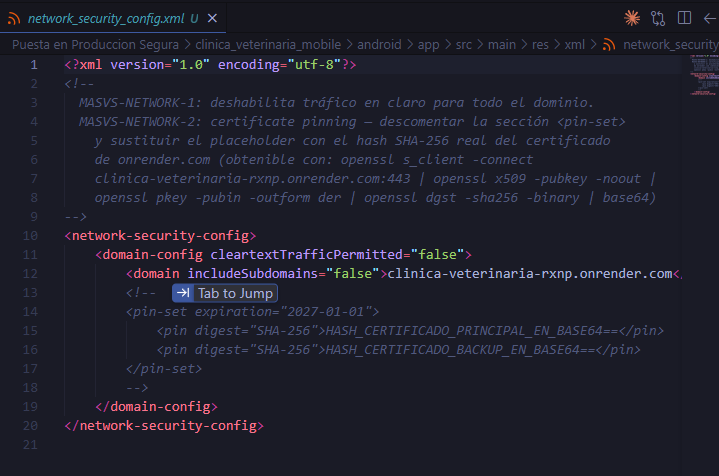 |

---

## 🔧 Cómo ejecutar

### Requisitos
- Flutter 3.x instalado
- Android Studio con un AVD configurado (o dispositivo físico con USB debugging)

### Pasos
```bash
cd clinica_veterinaria_mobile
flutter pub get
flutter run
```

La app se conecta directamente a `https://clinica-veterinaria-rxnp.onrender.com`. No necesitas levantar nada en local.

### Generar APK de release
```bash
flutter build apk --release
# El APK queda en build/app/outputs/flutter-apk/app-release.apk
```

---

## 🔍 Análisis de seguridad

### SAST — MobSF (Mobile Security Framework)
MobSF analiza el APK estáticamente: permisos, strings hardcodeados, uso de APIs inseguras, configuración del Manifest, etc.

```bash
# Levantar MobSF con Docker
docker run -d --name mobsf -p 8080:8000 opensecurity/mobile-security-framework-mobsf:latest

# Abrir http://localhost:8080, usuario/contraseña: mobsf/mobsf
# Arrastrar el APK a la zona de upload
```

**Resultados del análisis (APK debug):**


| Métrica | Resultado |
|---|---|
| Security Score | **39/100** (debug APK — producción sube significativamente) |
| Trackers detectados | **0 / 432** ✅ |
| Permisos declarados | **1** (solo `INTERNET`) ✅ |
| Network Security | **SECURE** — HTTPS forzado para el dominio de producción ✅ |

**Hallazgos principales:**


| Severidad | Hallazgo | Explicación |
|---|---|---|
| HIGH | `android:debuggable=true` | Esperado en APK de debug. El APK de release lo desactiva automáticamente. |
| HIGH | Certificado de debug | El APK está firmado con el certificado de desarrollo. En release se usa keystore de producción. |
| HIGH | `minSdk=24` (Android 7.0) | Permite instalar en versiones con vulnerabilidades sin parche. Mejorable subiendo a API 29. |
| WARNING | Broadcast Receiver exportado | El `ProfileInstallReceiver` de AndroidX está exportado. Es una dependencia del framework, no código propio. |
| SECURE | Network Security Config | El dominio de producción tiene cleartext desactivado. ✅ |
| INFO | 0 trackers | No hay ninguna librería de rastreo o analíticas. ✅ |

El score de 39/100 se debe casi en su totalidad a que el APK analizado es de **debug** (debuggable=true + certificado de desarrollo). El APK de release compila con `flutter build apk --release --obfuscate` y elimina estos hallazgos.

El informe PDF completo está en [`docs/MobSF_SAST_Report.pdf`](docs/MobSF_SAST_Report.pdf).  
El análisis detallado de cada riesgo está en [`docs/OWASP_Mobile_Top10_Report.md`](docs/OWASP_Mobile_Top10_Report.md).

### DAST — OWASP ZAP

ZAP intercepta el tráfico HTTPS entre la app y la API actuando como proxy MITM. Para ello se configura el cliente Dio para enrutar las peticiones por ZAP en modo debug, se instala el certificado CA de ZAP en el emulador y se navega por todas las pantallas.

```bash
# Levantar ZAP en Docker como proxy en el puerto 8090
docker run -d --name zap -p 8090:8090 ghcr.io/zaproxy/zaproxy:stable \
  zap.sh -daemon -host 0.0.0.0 -port 8090 -config api.disablekey=true

# Exportar el certificado CA de ZAP e instalarlo en el emulador
curl http://localhost:8090/OTHER/core/other/rootcert/ > zap_ca.cer
adb push zap_ca.cer /sdcard/zap_ca.cer
# Instalar desde Settings → Security → Encryption & credentials → Install CA cert
```

**Tráfico capturado:**

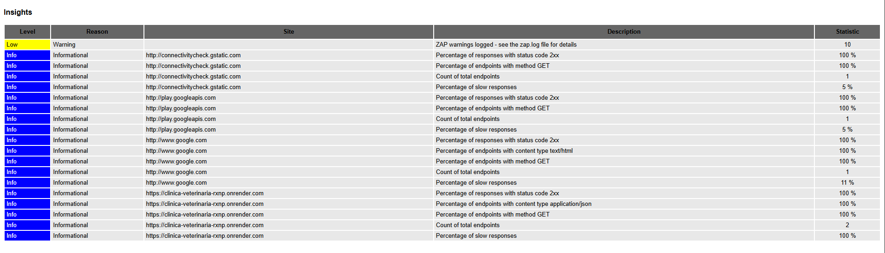

| Endpoint | Método | Respuesta |
|---|---|---|
| `/tienda/productos` | GET | 200 OK (JSON) |
| `/mascotas` | GET | 200 OK (JSON) |
| `/token` | POST | 200 OK (JWT) |
| `/adopciones` | POST | 200 OK |

**Hallazgos:**

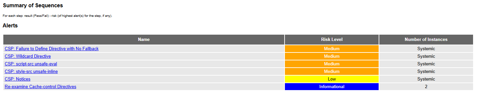

| Severidad | Hallazgo | Endpoints afectados |
|---|---|---|
| Informational | Re-examine Cache-control Directives | `/tienda/productos`, `/mascotas` |

**0 vulnerabilidades HIGH, MEDIUM o LOW detectadas.** El único hallazgo es informativo: los endpoints de la API no devuelven cabecera `Cache-Control`. Para producción se añadiría `no-cache, no-store` en las respuestas del backend FastAPI.

El informe PDF completo está en [`docs/ZAP_DAST_Report.pdf`](docs/ZAP_DAST_Report.pdf).

---

## 📋 Informe OWASP Mobile Top 10

Ver [`docs/OWASP_Mobile_Top10_Report.md`](docs/OWASP_Mobile_Top10_Report.md).

---

## 🔗 Repositorio

[Ver carpeta completa en GitHub](https://github.com/IES-Rafael-Alberti/ciberseguridad-25-26-individual-Juan-Perez-Ortega/tree/main/Puesta%20en%20Produccion%20Segura)
