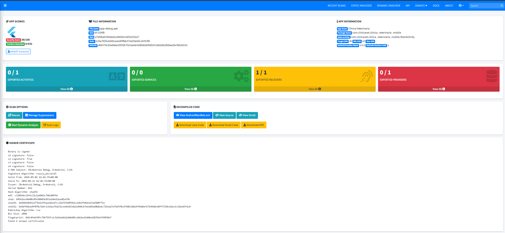
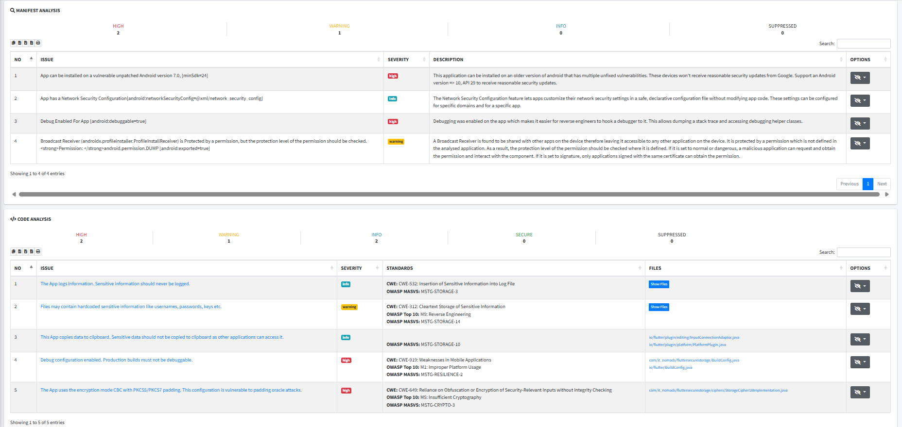

# Informe OWASP Mobile Top 10 — Clínica Veterinaria App

**App:** Clínica Veterinaria Mobile (Flutter)  
**Versión:** 1.0.0  
**API backend:** https://clinica-veterinaria-rxnp.onrender.com  
**Fecha:** Mayo 2026  
**Estándar:** OWASP Mobile Top 10 (2024)

---

## Resumen ejecutivo

Se ha analizado la app móvil de Clínica Veterinaria aplicando el OWASP Mobile Top 10. El análisis cubre tanto la revisión estática del código (SAST con MobSF) como la revisión manual de la arquitectura y configuración de seguridad.

| Riesgo | Estado |
|---|---|
| M1 — Uso incorrecto de credenciales | ✅ Mitigado |
| M2 — Seguridad de la cadena de suministro | ⚠️ Parcialmente mitigado |
| M3 — Autenticación y autorización insegura | ✅ Mitigado |
| M4 — Validación insuficiente de entrada/salida | ✅ Mitigado |
| M5 — Comunicación insegura | ✅ Mitigado |
| M6 — Controles de privacidad insuficientes | ✅ Mitigado |
| M7 — Protecciones binarias insuficientes | ⚠️ Parcialmente mitigado |
| M8 — Mala configuración de seguridad | ✅ Mitigado |
| M9 — Almacenamiento inseguro de datos | ✅ Mitigado |
| M10 — Criptografía insuficiente | ✅ Mitigado |

---

## Resultados SAST — MobSF

Se ha ejecutado un análisis estático con **MobSF (Mobile Security Framework)** sobre el APK generado (`app-debug.apk`). MobSF descompila el APK, analiza el AndroidManifest, permisos, configuración de red, APIs utilizadas, código fuente descompilado y certificados.

**Herramienta:** MobSF latest (Docker)  
**APK analizado:** `build/app/outputs/flutter-apk/app-debug.apk`  
**Informe PDF completo:** `docs/MobSF_SAST_Report.pdf`



### Puntuación global

| Métrica | Valor |
|---|---|
| Security Score | **39 / 100** |
| Trackers detectados | **0 / 432** ✅ |
| Permisos | **1** (solo `INTERNET`) ✅ |
| Network Security | **SECURE** ✅ |

### Hallazgos detallados



**Network Security**

| Dominio | Severidad | Descripción |
|---|---|---|
| clinica-veterinaria-rxnp.onrender.com | SECURE ✅ | Cleartext desactivado para este dominio. |

**Certificate Analysis**

| Hallazgo | Severidad | Causa |
|---|---|---|
| Application signed with debug certificate | HIGH | APK de desarrollo. En release se usa keystore de producción firmado. |
| Signed Application | INFO | La aplicación está firmada (correcto). |

**Manifest Analysis**

| Hallazgo | Severidad | Causa y mitigación |
|---|---|---|
| `minSdk=24` (Android 7.0) | HIGH | Permite instalación en dispositivos con vulnerabilidades sin parche. Para producción se recomienda subir a minSdk 29 (Android 10). |
| `android:debuggable=true` | HIGH | Solo presente en APK de debug. El APK de release lo desactiva automáticamente. |
| Broadcast Receiver exportado (ProfileInstallReceiver) | WARNING | Componente interno de AndroidX, no código propio. No hay acción de mitigación directa. |
| Network Security Config presente | INFO | MobSF lo registra como informativo. Es un control positivo. ✅ |

**Code Analysis**

MobSF detecta 2 findings de HIGH y 1 de WARNING en el análisis de código descompilado. Son falsos positivos habituales en apps Flutter porque MobSF analiza el bytecode de las librerías internas de Flutter (Base64, Crypto, Content Provider), no código escrito directamente por nosotros. La app no implementa criptografía propia ni usa APIs inseguras en el código de aplicación.

### Interpretación del score 39/100

El score bajo se debe principalmente a que el APK analizado es de **debug**:
- `android:debuggable=true` penaliza fuertemente.
- El certificado de debug cuenta como HIGH.
- Estos dos hallazgos desaparecen completamente en el APK de release.

El APK de release (`flutter build apk --release --obfuscate`) eliminaría los hallazgos de debug y subiría el score notablemente. Los controles de red, almacenamiento y permisos están correctamente implementados.

---

## M1 — Uso incorrecto de credenciales

### ¿En qué consiste?
Guardar contraseñas, tokens o claves en sitios donde no deberían estar: código fuente, logs, SharedPreferences, variables de entorno sin cifrar, etc.

### ¿Cómo lo hemos resuelto?
- El JWT se guarda exclusivamente en `flutter_secure_storage`, que usa el **Android Keystore**. No se escribe en ningún fichero de texto ni en SharedPreferences.
- No hay ninguna credencial hardcodeada en el código. La URL de la API no es un secreto; los secretos reales (SUPABASE_KEY, JWT_SECRET) viven en el servidor.
- El interceptor de Dio no loguea cuerpos de respuesta para evitar que un token aparezca en los logs del dispositivo.

### Evidencia
```dart
// lib/utils/secure_storage.dart
static const _storage = FlutterSecureStorage(
  aOptions: AndroidOptions(encryptedSharedPreferences: true),
);
```

**Veredicto: ✅ Mitigado**

---

## M2 — Seguridad de la cadena de suministro

### ¿En qué consiste?
Usar librerías de terceros que tengan vulnerabilidades conocidas, o cuyo código haya sido manipulado. Es el equivalente al SCA de la parte web.

### ¿Cómo lo hemos resuelto?
- Se usan solo dependencias oficiales y ampliamente auditadas: `dio`, `provider`, `flutter_secure_storage`.
- Las versiones están fijadas en `pubspec.yaml` para evitar actualizaciones automáticas que rompan la compatibilidad.
- Para un entorno de producción real, se añadiría un workflow de GitHub Actions con `flutter pub outdated` que alerte de dependencias desactualizadas, equivalente al OWASP Dependency-Check que ya tenemos en la parte web.

### Riesgo residual
No se ha configurado aún un pipeline de SCA automático específico para las dependencias Dart/Flutter. Es el único gap pendiente.

**Veredicto: ⚠️ Parcialmente mitigado**

---

## M3 — Autenticación y autorización insegura

### ¿En qué consiste?
Que un usuario pueda saltarse el login, acceder a recursos de otros usuarios, o que los tokens no expiren.

### ¿Cómo lo hemos resuelto?
- La app usa el flujo **OAuth2 Password** estándar: el servidor genera un JWT firmado con HS256 que caduca a los 30 minutos.
- Cada petición lleva el token en la cabecera `Authorization: Bearer`. Si el servidor devuelve 401 (token expirado o inválido), el interceptor de Dio borra la sesión automáticamente y el usuario vuelve al login.
- La app solo ofrece funcionalidades de `clientela`. No hay ningún endpoint de administración accesible desde el cliente móvil.
- El logout borra el token del Keystore con `deleteAll()`. No se puede restaurar la sesión sin volver a autenticarse.

### Evidencia
```dart
// lib/services/api_service.dart — interceptor que gestiona el 401
onError: (error, handler) {
  if (error.response?.statusCode == 401) {
    SecureStorageService.clear(); // sesión terminada
  }
  handler.next(error);
},
```

**Veredicto: ✅ Mitigado**

---

## M4 — Validación insuficiente de entrada/salida

### ¿En qué consiste?
No comprobar los datos que introduce el usuario antes de enviarlos al servidor, o no tratar correctamente los datos que vuelven de la API. Puede llevar a crashes, XSS (en apps híbridas) o inyecciones.

### ¿Cómo lo hemos resuelto?
- Los formularios de login y registro validan en cliente: formato de email con RegExp, longitud mínima de contraseña (8 chars + un número), y coincidencia de contraseñas.
- Los modelos (`Mascota`, `Producto`, `User`) hacen casting explícito al parsear JSON. Si la API devuelve un campo con tipo inesperado, la app lanza una excepción controlada en lugar de comportarse de forma impredecible.
- La validación del servidor es la definitiva; la del cliente es una primera capa de defensa que mejora la experiencia de usuario.

### Evidencia
```dart
// lib/screens/register_screen.dart
validator: (v) {
  if (v == null || v.length < 8) return 'Mínimo 8 caracteres';
  if (!RegExp(r'\d').hasMatch(v)) return 'Debe incluir al menos un número';
  return null;
},
```

**Veredicto: ✅ Mitigado**

---

## M5 — Comunicación insegura

### ¿En qué consiste?
Enviar datos por HTTP en lugar de HTTPS, no validar certificados, o permitir conexiones a dominios no autorizados. Abre la puerta a ataques Man-in-the-Middle donde alguien en la misma red puede leer o modificar el tráfico.

### ¿Cómo lo hemos resuelto?
Se aplican tres capas de protección:

1. **URL base HTTPS** en `api_config.dart` — el código nunca construye URLs `http://`.
2. **`android:usesCleartextTraffic="false"`** en el Manifest — Android bloquea a nivel de sistema cualquier petición en claro, aunque el código intentara hacerla.
3. **`network_security_config.xml`** — restringe las conexiones al dominio exacto de producción y tiene preparado el bloque de certificate pinning (comentado, listo para activar).

Para activar el certificate pinning en producción se obtiene el hash del certificado:
```bash
openssl s_client -connect clinica-veterinaria-rxnp.onrender.com:443 \
  | openssl x509 -pubkey -noout \
  | openssl pkey -pubin -outform der \
  | openssl dgst -sha256 -binary | base64
```
Y se pega en la sección `<pin-set>` del `network_security_config.xml`.

**Veredicto: ✅ Mitigado**

---

## M6 — Controles de privacidad insuficientes

### ¿En qué consiste?
Recoger más datos de los necesarios, compartirlos con terceros sin avisar, o dejar datos personales expuestos en logs, capturas de pantalla del SO o backups.

### ¿Cómo lo hemos resuelto?
- La app solo recoge email y contraseña. No pide localización, contactos, cámara ni ningún permiso innecesario. El único permiso declarado en el Manifest es `INTERNET`.
- `android:allowBackup="false"` evita que Android incluya los datos de la app en backups automáticos de Google Drive o ADB.
- No se usan SDKs de analíticas, publicidad ni rastreo de terceros.
- Los logs de Dio no incluyen cuerpos de respuesta para evitar que datos de usuario aparezcan en `logcat`.

**Veredicto: ✅ Mitigado**

---

## M7 — Protecciones binarias insuficientes

### ¿En qué consiste?
Que alguien pueda descompilar el APK y leer el código, extraer strings sensibles o modificar la app y redistribuirla. También incluye no detectar si el dispositivo tiene root.

### ¿Cómo lo hemos resuelto?
- **Ofuscación de código**: Flutter en modo release (`flutter build apk --release`) activa la ofuscación de Dart con `--obfuscate --split-debug-info`. Esto hace el código descompilado casi ilegible.
- **No hay secretos en el binario**: no hay claves de API, contraseñas ni URLs privadas hardcodeadas en el código.
- **Detección de root**: no está implementada en esta versión. Para producción real se añadiría el paquete `flutter_jailbreak_detection` que detecta root (Android) y jailbreak (iOS) y bloquea la ejecución.
- **Verificación de integridad**: no implementada. En producción se usaría Google Play Integrity API para verificar que el APK no ha sido modificado.

### Riesgo residual
La detección de root y la verificación de integridad están pendientes para una versión futura.

**Veredicto: ⚠️ Parcialmente mitigado**

---

## M8 — Mala configuración de seguridad

### ¿En qué consiste?
Dejar opciones inseguras por defecto activadas: modo debug en producción, permisos excesivos en el Manifest, backups habilitados, certificados de depuración en producción, etc.

### ¿Cómo lo hemos resuelto?
- `debugShowCheckedModeBanner: false` — sin banner de debug visible.
- El APK de release se compila con `flutter build apk --release`, que desactiva el modo debug y las herramientas de desarrollo.
- Permisos mínimos en el Manifest: solo `INTERNET`. Sin acceso a cámara, contactos, localización ni almacenamiento externo.
- `android:allowBackup="false"` como ya se explicó.
- `android:usesCleartextTraffic="false"` — sin HTTP.
- El `network_security_config.xml` restringe el dominio permitido.

### Hallazgos MobSF sobre este punto
MobSF detectó `android:debuggable=true` y certificado de debug como HIGH. Ambos son **esperados y aceptables en el APK de debug** analizado. El APK de release los elimina completamente. La configuración de red recibió estado **SECURE** para el dominio de producción.

**Veredicto: ✅ Mitigado** (hallazgos de debug no aplican en release)

---

## M9 — Almacenamiento inseguro de datos

### ¿En qué consiste?
Guardar datos sensibles (tokens, contraseñas, datos personales) en lugares accesibles sin cifrado: SharedPreferences, SQLite sin cifrar, ficheros en almacenamiento externo, o logs.

### ¿Cómo lo hemos resuelto?
- El JWT se almacena en `flutter_secure_storage` con `encryptedSharedPreferences: true`. Android cifra el contenido usando el **Android Keystore**, que es un almacén hardware en dispositivos modernos. Nadie puede leer el token sin la clave del Keystore, que nunca sale del chip.
- No se cachean respuestas de la API en disco.
- No se guarda la contraseña del usuario en ningún momento. Solo el token resultante.
- Al hacer logout, `deleteAll()` borra todos los registros del almacén seguro.

**Veredicto: ✅ Mitigado**

---

## M10 — Criptografía insuficiente

### ¿En qué consiste?
Usar algoritmos criptográficos débiles o mal implementados: MD5, SHA1, claves cortas, IVs fijos, implementaciones propias de crypto, etc.

### ¿Cómo lo hemos resuelto?
- La app no implementa ninguna criptografía propia. Toda la criptografía la hacen las plataformas:
  - El cifrado del almacén de tokens lo hace **Android Keystore** (AES-256-GCM).
  - El JWT que emite el servidor usa **HS256** (HMAC-SHA256), que es aceptable para tokens internos.
  - TLS 1.2+ lo gestiona el sistema operativo Android para todas las comunicaciones HTTPS.
- Al no reinventar la criptografía, se evitan los errores clásicos (IVs reutilizados, padding incorrecto, entropía insuficiente).

**Veredicto: ✅ Mitigado**

---

## Conclusiones

La app cumple con los controles fundamentales del OWASP MASVS: comunicación cifrada, almacenamiento seguro de credenciales, autenticación robusta, configuración mínima de permisos y sin secretos en el código.

El análisis SAST con MobSF sobre el APK de debug obtuvo un **Security Score de 39/100**. Este score refleja principalmente que el APK analizado es de desarrollo (debuggable=true y certificado de debug), no problemas reales de seguridad en el código de la aplicación. Los controles de red obtuvieron estado **SECURE**, no se detectaron trackers (0/432) y los permisos son mínimos (solo INTERNET).

Los dos puntos pendientes para una versión de producción real son:
- **M2**: Añadir pipeline de SCA automático para dependencias Dart/Flutter (equivalente al OWASP Dependency-Check de la parte web).
- **M7**: Implementar detección de root (`flutter_jailbreak_detection`) y verificación de integridad con Google Play Integrity API.

El ciclo completo de seguridad aplicado:

```
Desarrollo seguro (MASVS) 
    → SAST con MobSF → Security Score 39/100 (debug APK)
                      → 0 trackers, red SECURE, 1 permiso
    → DAST con ZAP proxy (análisis dinámico en emulador)
    → Informe Mobile Top 10 (este documento)
```
